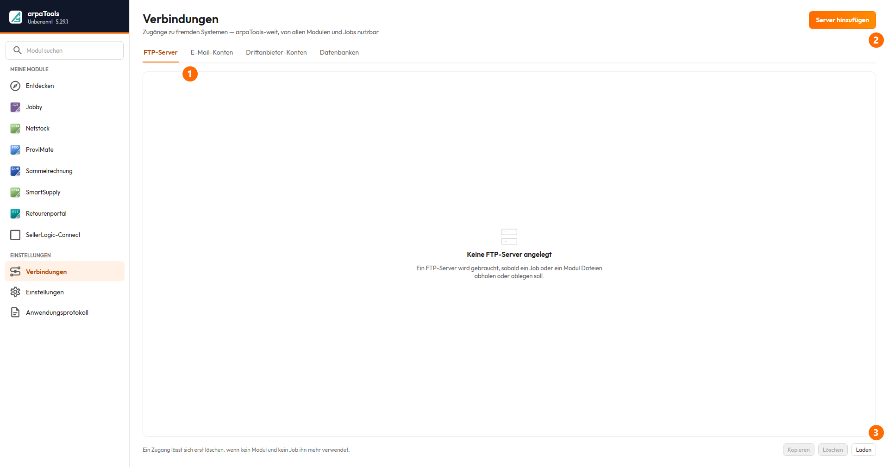
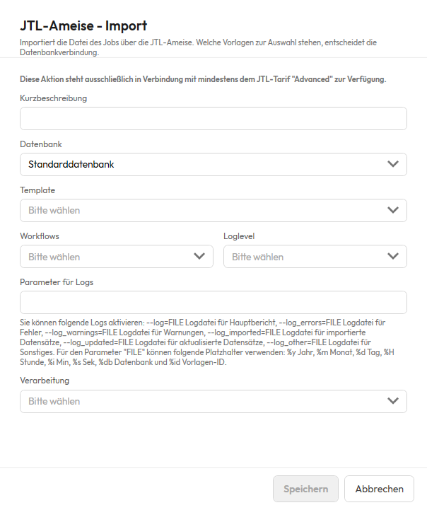
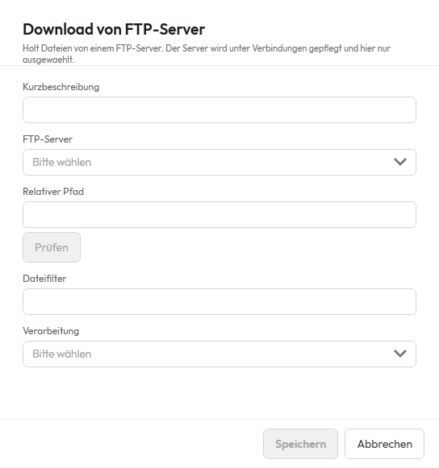

# Dokumentation arpaTools Jobby

## Einleitung

Willkommen bei Jobby, dem Automatisierungstool für Ihre JTL-Wawi. Jobby ist eine App im arpaTools
Client und bündelt wiederkehrende Aktionen in Jobs, die automatisiert oder auf Knopfdruck laufen. Das
spart Zeit und reduziert Fehlerquellen in den täglichen Prozessen.


① Suchfeld — filtert die Liste, hilfreich bei vielen Jobs. ② Job anlegen — legt einen neuen Job an.
③ Kennzahlen je Job — Anzahl der Aktionen, Zeitplan, Zeitpunkt des letzten und nächsten Laufs.
④ Starten — führt den Job sofort aus, unabhängig vom Zeitplan.

Jobby ergänzt die anderen arpaTools-Produkte wie Sammelrechnung, Retourenportal und ProviMate. Ein
Job besteht aus einer Reihe von Aktionen, die in beliebiger Reihenfolge konfiguriert werden, zum
Beispiel Importe, Exporte, Dateiübertragungen oder das Versenden von E-Mails. Jeder Job kann
zeitgesteuert oder manuell gestartet werden.

Diese Aufgaben decken typische Prozesse rund um Import, Export, Dateitransfer und Systemintegration ab.

**Import**
- **JTL-Ameise Import:** führt definierte Importvorlagen der JTL-Ameise aus. Ideal für Artikeldaten, Bestände, Preise.
- **Lieferantenbestand importieren:** importiert eine CSV-Datei mit Bestandsinformationen eines Lieferanten in die JTL-Wawi.
- **XML zu CSV / JSON zu CSV / Excel zu CSV:** wandelt Lieferantendateien in eine CSV, die die übrigen Importaktionen lesen können.
- **Sendungsdatenimport:** verarbeitet Trackinginformationen aus einer CSV-Datei und trägt sie in JTL-Wawi ein, sodass Sendungen als „versendet" markiert werden.

**Export**
- **JTL-Ameise Export:** steuert Exportvorlagen der JTL-Ameise an, z. B. für Artikel-, Auftrags- oder Kundendaten.
- **Lagerbewertung:** erzeugt eine Datei mit Bestand und Bestandswert je Artikel, aufgeschlüsselt nach Lager.

**Aufträge**
- **Lieferantenbestellung bestätigen:** verarbeitet und bestätigt Lieferantenbestellungen.
- **Lieferantenbestellung erstellen:** legt aus einer Datei neue Lieferantenbestellungen in JTL-Wawi an.
- **XML-Auftragsimport:** importiert Auftragsdaten im JTL-XML-Format in die JTL-Wawi.
- **Ohne Versand abschließen:** markiert Aufträge als komplett ausgeliefert, ohne einen Versand auszulösen.

**Einkauf**
- **Einkaufsliste schreiben:** trägt Artikel mit Menge aus einer Datei in die JTL-Einkaufsliste eines Benutzers ein.

**Dateitransfer**
- **Download vom FTP-Server:** lädt Dateien von einem FTP-Server in den internen Jobspeicher.
- **Upload zum FTP-Server:** überträgt Dateien aus dem Jobspeicher auf einen externen FTP-Server.

**Sonstiges**
- **Daten aus dem Web laden:** ruft eine Datei von einer URL ab und legt sie im Jobspeicher ab.
- **Daten aus Verzeichnis laden:** liest Dateien aus einem lokalen Verzeichnis ein, optional mit Löschen nach dem Laden.
- **Daten in Verzeichnis speichern:** speichert verarbeitete Dateien in einem Verzeichnis, optional mit automatischem Löschen nach X Tagen.
- **E-Mail senden:** versendet Benachrichtigungen oder Berichte, optional mit Anhang.
- **E-Mail via Brevo senden:** versendet transaktionale E-Mails über Brevo.
- **Prozess starten:** startet externe Programme oder Skripte mit Parametern.
- **Benutzerdefinierte Aktion:** startet ein beliebiges externes Programm oder Skript (.exe, PowerShell, Python, Batch, Jar) mit Zeitlimit, Zugangsdaten aus dem Vault und Rückgabe der erzeugten Dateien in die weitere Verarbeitung. Ein kurzes PowerShell-Skript können Sie auch direkt in der Aktion hinterlegen, statt eine Datei anzulegen. „Prozess starten" bleibt daneben unverändert bestehen.
- **Manuellen JTL-Wawi Workflow ausführen:** stößt manuelle Workflows in JTL-Wawi an.
- **Daten von MS-SQL Server laden:** führt eine lesende SQL-Abfrage aus und speichert das Ergebnis als Datei.
- **JTL-API abrufen:** ruft Stammdaten (Hersteller, Lager), gefilterte Artikel oder die Verbindungsinfo direkt über die Programmierschnittstelle der JTL-Wawi ab und reicht sie an die nächste Aktion weiter.
- **Daten per SQL einfügen/ändern:** führt ein schreibendes SQL-Statement aus.
- **Job ausführen:** übergibt den laufenden Job an einen anderen Job und beendet den aufrufenden Job.
- **Bedingung:** prüft einen Wert und steuert danach die Kette — normal weiterlaufen, beenden oder eine
  festgelegte Anzahl der folgenden Aktionen überspringen.

**Interne arpaTools Jobs** (siehe eigenen Abschnitt): ProviMate-Abrechnung, Querify, Retourenportal,
Sammelrechnung, Netstock.

Im Mittelpunkt steht Jobby als Schaltzentrale der Automatisierung: die zeitgesteuerte Planung und
automatische Ausführung sämtlicher Prozesse. Nutzer anderer Apps benötigen keine zusätzliche
Jobby-Lizenz; die Aktionen der jeweiligen App sind ohne separate Lizenz nutzbar.

## Beispiele für den Einsatz

### Beispiel: Automatischer Import der Bestände eines Dropshipping-Lieferanten

Ein Lieferant stellt mehrfach täglich eine CSV-Datei mit Lagerbeständen auf einem FTP-Server bereit.
Mit Jobby lässt sich der Import vollständig automatisieren:

1. **Download vom FTP-Server:** lädt die aktuelle Bestandsdatei in den Jobspeicher.
2. **Lieferantenbestand importieren:** verarbeitet die Datei und ordnet die Bestände den Artikeln zu.
3. **(Optional) Daten in Verzeichnis speichern:** legt die verarbeitete Datei zur Archivierung ab.
4. **(Optional) E-Mail senden:** informiert den Einkauf über den erfolgreichen Lauf.

### Beispiel: Übergabe einer Dropshipping-Bestellung an den Lieferanten

JTL-Wawi legt bei Auslieferung eine CSV-Datei mit den Bestellinformationen ab. Jobby übergibt sie an
den Lieferanten:

1. **Daten aus Verzeichnis laden:** lädt neue Dateien aus dem Verzeichnis und entfernt sie dort, um doppelte Verarbeitung zu vermeiden.
2. **Upload zum FTP-Server:** lädt die Datei auf den FTP-Server des Lieferanten.
3. **Daten in Verzeichnis speichern:** legt die Datei in einem Archiv ab (z. B. 30 Tage, danach automatisch gelöscht).

### Beispiel: Import von Tracking-Informationen vom Dropshipper

Nach dem Versand stellt der Lieferant eine Datei mit Sendungsdaten bereit:

1. **Download vom FTP-Server:** lädt die Datei mit den Sendungsdaten.
2. **Sendungsdatenimport:** ordnet die Trackingnummern den Lieferscheinen zu und markiert die Sendungen als „versendet".
3. **Daten in Verzeichnis speichern:** archiviert die Datei (z. B. 30 Tage).

## Jobby-Übersicht

Jobby gliedert sich oben in vier Bereiche: **Jobs**, **Verlauf**, **Vault** und **Dienst**. Verbindungen
zu FTP-Servern, E-Mail-Postfächern, Drittanbietern und weiteren Datenbanken liegen dagegen nicht bei
Jobby, sondern zentral unter **Verbindungen** in der Seitenleiste links (Bereich „Einstellungen") — von
dort erreichbar für jedes Modul und jeden Job, nicht nur für Jobby.

### Jobs

Die Ansicht **Jobs** ist die Hauptansicht. Hier werden alle Jobs konfiguriert; bei vielen Jobs hilft die
Suche. Neue Jobs legt man über **Job anlegen** an. **Starten** führt den ausgewählten Job direkt aus der
Liste aus; danach wird das Datum „zuletzt" aktualisiert.

Spalten bzw. Angaben je Job:
- **Aktionsanzahl:** Anzahl der Aktionen im Job.
- **Zeitplan:** ob und wie der Job per Zeitplan über den arpaTools Worker läuft.
- **Zuletzt:** Datum und Uhrzeit des letzten Laufs.
- **Nächster Lauf:** die nächste planmäßige Ausführung, sofern ein Zeitplan aktiv ist.

#### Zeitplan

Im Zeitplan-Dialog eines Jobs wählen Sie zuerst unter **Wiederholung** den Modus. Der Dialog zeigt
danach nur noch die Felder, die zu diesem Modus gehören:

| Modus | Wofür |
|---|---|
| Einmalig | Der Job läuft genau einmal, zum eingestellten Datum und zur Uhrzeit, und danach nicht mehr. |
| Alle X Minuten | Für sehr häufige Läufe, etwa ein Sendungsimport alle 15 Minuten. |
| Alle X Stunden | Für mehrere Läufe am Tag. |
| Täglich | Ein fester Zeitpunkt jeden Tag oder alle X Tage. |
| Wöchentlich | Ein fester Zeitpunkt an einem oder mehreren Wochentagen, etwa jeden Montag und Donnerstag. |
| Monatlich | Ein fester Zeitpunkt jeden Monat oder alle X Monate. |

In jedem Modus lässt sich der Startzeitpunkt weglassen: Schalter **Ab einem festen Zeitpunkt
starten** aus, und der Job läuft ab sofort im gewählten Takt, gerechnet vom Moment des Speicherns
an.

Bei **Täglich**, **Wöchentlich** und **Monatlich** legt dieser Moment zugleich die Uhrzeit fest:
speichern Sie um 14:20, läuft der Job um 14:20. Jedes erneute Speichern verschiebt ihn neu. Soll der
Job zu einer bestimmten Uhrzeit laufen, lassen Sie den Schalter an und tragen den Zeitpunkt ein —
so ist er vorbelegt.

Bei **Wöchentlich** wählen Sie zusätzlich die **Wochentage**, an denen der Job laufen soll — mehrere
sind möglich. Wählen Sie keinen Tag aus, läuft der Job am Wochentag des eingestellten Startdatums.

Bei **Monatlich** gilt: Startet der Job am Monatsende, wiederholt er sich automatisch am jeweiligen
Monatsende, auch wenn der Monat kürzer ist — ein Start am 31. läuft im Februar am 28. bzw. 29.

Unter den Feldern steht, wann der Job als Nächstes läuft, zum Beispiel „Nächste Ausführung: Montag,
31.08.2026 08:00". Diese Vorschau rechnet mit denselben Werten, die auch der arpaTools Worker beim
Prüfen verwendet, und zeigt deshalb immer den tatsächlich nächsten Lauf. Ist keiner mehr geplant,
steht dort „Keine weitere Ausführung geplant."

Stellen Sie beim Modus **Alle X Minuten** ein Intervall ein, das kürzer ist als die Prüfzeit des
arpaTools Worker, weist der Dialog darauf hin: Der Worker prüft standardmäßig alle 5 Minuten
(einstellbar unter **Dienst**), ein kürzeres Intervall greift erst ab diesem Wert. Bei den anderen
Modi erscheint dieser Hinweis nicht, ein zu kurzes Intervall ist dort in der Praxis aber ohnehin
nicht einstellbar.

> Diensttakthinweis)

Bricht ein geplanter Lauf mit einem Fehler ab, gilt er trotzdem als gelaufen: Der Job wartet auf
seinen nächsten regulären Termin, statt sofort erneut anzulaufen. Was schiefging, steht in der
Ansicht **Log**. Wer den Job vorher noch einmal versuchen will, startet ihn über **Starten** von
Hand.

**Einen Job duplizieren** geht über den Rechtsklick auf einen Job beziehungsweise über das Menü „⋮"
an der Job-Zeile. Die Kopie enthält alle Aktionen in derselben Reihenfolge und denselben Zeitplan und
öffnet sich sofort zum Anpassen. Sie heißt wie das Original mit einer angehängten Nummer — aus
„Bestellimport" wird „Bestellimport #1", beim nächsten Mal „Bestellimport #2". Zwei Jobs tragen nie
denselben Namen.

Die Kopie ist zunächst **nicht aktiv**. Das ist Absicht: Der Zeitplan wird mitkopiert, und eine
aktive Kopie liefe schon los, bevor Sie sie angepasst haben. Schalten Sie den Job aktiv, wenn er
fertig eingerichtet ist. Brechen Sie das Bearbeiten ab, bleibt die Kopie trotzdem in der Liste stehen
und lässt sich dort löschen.

Nicht mitkopiert werden E-Mail-Konten, Datenbankverbindungen, Drittanbieter-Konten und FTP-Zugänge:
Die Kopie benutzt dieselben Einträge wie das Original, Ihre Verbindungsliste bleibt also so kurz wie
vorher.

#### Reihenfolge der Liste

Über der Liste wählen Sie unter **Sortierung**, wonach die Jobs geordnet sind:

- **Name (A-Z)** und **Name (Z-A)** — alphabetisch. A-Z ist die Voreinstellung und die Reihenfolge,
  die die Liste auch bisher hatte.
- **Zuletzt angelegt** — die neuesten Jobs oben. Jobs, die vor dieser Version angelegt wurden, tragen
  kein Anlegedatum; sie stehen unten, untereinander nach ihrer Jobnummer.
- **Zuletzt geändert** — die zuletzt bearbeiteten Jobs oben. Ein Joblauf zählt nicht als Änderung,
  nur das Speichern im Job selbst.
- **Zuletzt ausgeführt** — die zuletzt gelaufenen Jobs oben, nie gelaufene unten.
- **Eigene Reihenfolge** — Sie bestimmen sie selbst, siehe unten.

Ihre Wahl bleibt erhalten: Beim nächsten Öffnen ist die Liste wieder so geordnet, wie Sie sie
verlassen haben. Die Einstellung gilt je Profil.

Bei **Eigene Reihenfolge** ziehen Sie eine Jobkarte mit der Maus an die Stelle, an der sie stehen
soll. Die Reihenfolge wird sofort gespeichert und gilt auch nach einem Neustart. In allen anderen
Sortierungen lässt sich nicht ziehen — dort würde die Karte beim nächsten Öffnen ohnehin wieder an
ihrem alten Platz stehen.

#### Jobs gruppieren

Gehören mehrere Jobs zusammen, geben Sie ihnen dieselbe **Gruppe**. In der Übersicht stehen sie dann
unter einer gemeinsamen Überschrift, die Sie zuklappen können — praktisch, wenn Sie viele Jobs haben
und gerade nur an einem Bereich arbeiten.

Die Gruppe legen Sie im Job selbst fest, im Feld **Gruppe** unter dem Namen. Sie können eine
vorhandene Gruppe aus der Liste wählen oder einfach einen neuen Namen eintippen — der wird beim
Speichern angelegt. Groß- und Kleinschreibung spielt keine Rolle: „Versand" und „versand" sind
dieselbe Gruppe.

Lassen Sie das Feld leer, gehört der Job zu keiner Gruppe. Solche Jobs sammeln sich in der Übersicht
unter **Ohne Gruppe**.

Solange kein einziger Job einer Gruppe zugeordnet ist, sieht die Übersicht aus wie bisher, ohne
Überschriften. Die Abschnitte erscheinen erst mit der ersten Gruppe und verschwinden wieder, wenn der
letzte Job sie verlässt.

**Umbenennen und löschen** geht über den Rechtsklick auf die Gruppenüberschrift in der Übersicht:

- **Gruppe umbenennen** öffnet ein kleines Fenster mit dem aktuellen Namen. Vergibt ein anderer
  Eintrag den Namen schon, erscheint der Hinweis sofort beim Tippen und **Speichern** bleibt aus.
- **Gruppe löschen** fragt nach und entfernt danach nur die Gruppe. **Die Jobs bleiben** und
  erscheinen anschließend unter „Ohne Gruppe" — Sie verlieren also nichts, wenn Sie sich vertun.

Die Überschrift **Ohne Gruppe** lässt sich weder umbenennen noch löschen: Dahinter steht keine
Gruppe, sondern nur die Jobs, die keiner angehören.

### Verbindungen

FTP-Server, E-Mail-Konten, Drittanbieter-Konten und Datenbankverbindungen liegen gemeinsam auf diesem
Bildschirm, je eine Registerkarte. Ein Grund: dieselben Verbindungen werden nicht nur von Jobby benutzt,
sondern zum Beispiel auch von Netstock, Sammelrechnung oder dem Retourenportal — deshalb stehen sie
zentral in der Seitenleiste und nicht mehr bei Jobby selbst. Löschen lässt sich ein Eintrag erst, wenn
kein Modul und kein Job ihn mehr verwendet.



① Registerkarten — wechselt zwischen den vier Verbindungsarten. ② Server hinzufügen (Beschriftung
wechselt je Registerkarte) — legt einen neuen Eintrag der gerade gewählten Art an. ③ Laden —
aktualisiert die Liste, falls ein Eintrag zwischenzeitlich anderswo geändert wurde.

#### Registerkarte FTP-Server

Für Download oder Upload wird eine FTP-Verbindung hinterlegt. Jede Verbindung braucht einen eindeutigen
Namen. Als Protokoll stehen FTP oder SFTP zur Verfügung, dazu FTP-Server-URL, Port, Benutzername und
Passwort. Der relative Pfad kann zusätzlich pro Aktion im Job angegeben werden. Mit **Prüfen** wird die
Verbindung getestet.

#### Registerkarte E-Mail-Konten

Eine mögliche Aktion ist der Versand von E-Mails, mit reinem Text oder mit Anhängen (z. B. Ergebnisse
aus SQL-Abfragen oder Dateien vom FTP-Server bzw. aus einem Verzeichnis).

Die Einstellungen entsprechen den SMTP-Daten des Hosters. Office-365- oder Google-Mail-Authentifizierung
werden nicht unterstützt. Einzutragen sind Server, Port, Verschlüsselung, die Absenderadresse und,
sofern das Postfach eine Anmeldung verlangt, Benutzername und Passwort. Mit **Prüfen** lassen sich die
Einstellungen testen.

- **Verschlüsselung:** „Keine", „STARTTLS" oder „SSL/TLS". Zu jeder Art gehört üblicherweise ein
  eigener Port: „Keine" Port 25, „STARTTLS" Port 587, „SSL/TLS" Port 465. Ändern Sie die
  Verschlüsselung, zieht der Port automatisch auf den passenden Standardwert mit, solange dort noch
  einer der drei Standardports oder gar kein Wert steht. Haben Sie selbst einen abweichenden Port
  eingetragen, bleibt er beim Wechsel der Verschlüsselung unangetastet.
- **Anmeldung erforderlich:** ausschalten, wenn das Postfach den Versand ohne Benutzername und
  Passwort annimmt, etwa weil es den Absender über die IP-Adresse freigibt. Ist der Schalter aus,
  sind Benutzername und Passwort nicht eingebbar und werden beim Speichern nicht verlangt.
  **Benutzername und Kennwort bleiben dabei gespeichert**, wenn Sie die Anmeldung ausschalten. Schalten
  Sie sie später wieder ein, finden Sie Ihre Zugangsdaten unverändert vor. Wollen Sie sie loswerden,
  schalten Sie die Anmeldung zunächst wieder ein, leeren Sie die beiden Felder von Hand und schalten
  Sie die Anmeldung danach wieder aus, bevor Sie speichern.
- Wählen Sie „Keine" Verschlüsselung, während die Anmeldung eingeschaltet bleibt, überträgt das
  Postfachkennwort ungeschützt über das Netz. Das ist keine verbotene Kombination, manche Postfächer
  im eigenen Netz verlangen genau das, aber arpaTools fragt beim Speichern ausdrücklich nach, ob das
  so gewollt ist.

Bestehende E-Mail-Konten aus einer Vorversion stehen nach der Aktualisierung auf „STARTTLS" mit
Anmeldung, dem bisherigen Verhalten. Niemand muss deswegen etwas umstellen.

#### Registerkarte Drittanbieter-Konten

Über Drittanbieter-Konten lassen sich API-Zugangsdaten in Jobby speichern und benennen. Die Daten
werden verschlüsselt gespeichert.

#### Registerkarte Datenbanken

Mit Jobby lassen sich mehrere JTL-Datenbanken hinterlegen. So bedient man mehrere Mandanten innerhalb
einer Jobby-Installation. Die Verbindung zur Haupt-JTL-Wawi-Datenbank liegt nicht hier, sondern unter
„Einstellungen" — die zusätzlichen Datenbanken auf dieser Registerkarte sind die, die ein Job daneben
noch lesen oder beschreiben soll.

### Vault

Der Vault ist ein Tresor für Zugangsdaten, die Sie in einem Job an ein externes Programm übergeben
möchten, zum Beispiel ein Passwort für ein Skript, das über die Aktion „Prozess starten" aufgerufen
wird. Sie legen dazu einen Schlüssel mit einem Wert an. Im Job selbst taucht nur der Schlüsselname auf,
nie der Wert.

- **Schlüssel:** wird zum Namen einer Umgebungsvariable des gestarteten Programms. Erlaubt sind
  Großbuchstaben, Ziffern und Unterstrich, das erste Zeichen muss ein Buchstabe sein. Kleinbuchstaben
  wandelt arpaTools beim Speichern automatisch in Großbuchstaben um.
- **Kurzbeschreibung:** optionaler Hinweistext, wofür der Eintrag gedacht ist.
- **Wert:** wird verschlüsselt gespeichert und lässt sich nach dem Speichern nicht mehr anzeigen. Wer
  den Wert vergessen hat, trägt einen neuen ein; einen bestehenden Wert wieder einsehen können Sie
  nicht.

Ein Schlüssel lässt sich nicht umbenennen. Möchten Sie einen Eintrag unter einem anderen Namen führen,
legen Sie einen neuen Schlüssel an und löschen den alten.

Die Spalte **Anzahl Verwendungen** soll zeigen, in wie vielen Jobs der Schlüssel eingesetzt wird. Solange
es noch keine Aktion gibt, die Vault-Werte tatsächlich benutzt, steht hier immer 0, selbst wenn Sie den
Schlüssel längst in einer Aktion eingetragen haben. Aus demselben Grund warnt arpaTools beim Löschen
heute noch nicht vor betroffenen Jobs: Löschen Sie einen Schlüssel, der in einer Aktion eingetragen ist,
gibt es dafür aktuell keine Rückfrage, und die Aktion schlägt beim nächsten Lauf ohne Vorwarnung fehl,
weil ihr die Zugangsdaten fehlen. Prüfen Sie vor dem Löschen deshalb selbst, ob und wo Sie den Schlüssel
noch verwenden. Sobald es eine Aktion gibt, die Vault-Schlüssel benutzen kann, zählt diese Spalte korrekt
mit, und das Löschen eines benutzten Schlüssels fragt dann vorher nach und nennt die betroffenen Jobs.

**Wichtig:** Geht in der Datenbank die Zeile mit dem Vault-Schlüssel verloren, mit dem alle Werte
verschlüsselt sind, sind sämtliche Vault-Einträge unbrauchbar. Sie lassen sich nicht wiederherstellen
und müssen komplett neu eingegeben werden.

### Dienst

Der Bereich **Dienst** legt fest, ob der arpaTools Worker verwendet wird und in welchem Intervall er
Jobs ausführt. Wir empfehlen mindestens fünf Minuten.

Oben im Bereich steht, wie es um den Dienst auf diesem Rechner bestellt ist: unter welchem Namen er
eingerichtet ist und ob er gerade läuft oder angehalten ist. Von dort aus richten Sie ihn auch ein,
starten und halten ihn an oder entfernen ihn wieder. Für jeden dieser vier Schritte fragt Windows
nach Administratorrechten; brechen Sie die Abfrage ab, bleibt alles wie es war. Steht dort „Nicht
eingerichtet", läuft noch kein Dienst, und geplante Jobs starten nur, solange arpaTools geöffnet ist.

Ist der Dienst eingerichtet, aber der Warnhinweis darunter sichtbar, läuft er zwar, bedient aber
diesen Mandanten nicht. Beides sind verschiedene Fragen: Der Zustand oben gilt für den Rechner, der
Hinweis darunter für den Mandanten, mit dem Sie gerade arbeiten.

Den Weg über die Eingabeaufforderung beschreibt weiterhin der Abschnitt
[arpaTools Worker installieren](#arpatools-worker-installieren).

## Einfachen Job erstellen

Ein Job besteht aus einer Abfolge von **Aktionen**, die nacheinander ausgeführt werden. Über den
arpaTools Worker kann die Ausführung auch zeitgesteuert erfolgen.

Links werden alle verfügbaren Aktionen angezeigt. Zum Hinzufügen wählt man eine Aktion aus und klickt
**Hinzufügen**; danach öffnen sich ihre Einstellungen. Hinzugefügte Aktionen erscheinen rechts und
lassen sich dort bearbeiten und in der Reihenfolge anpassen. Aktionen laufen immer von oben nach unten.

**Wichtig:** Aktionen, die mit Dateien arbeiten, speichern diese nicht automatisch ab, sondern laden
sie nur in die Laufzeitumgebung. Dazu gehören:
- Daten von MS-SQL Server laden (lesend)
- Daten aus Verzeichnis laden
- Datei aus Web laden
- Download vom FTP-Server

Nur die Aktion **JTL-Ameise Export** schreibt aufgrund der Ameisen-Struktur eine Datei, die im weiteren
Verlauf geladen werden muss. Erst die Aktion **Daten in Verzeichnis speichern** legt die Inhalte
dauerhaft ab.

**Einen Schritt vorübergehend stilllegen.** Über den Rechtsklick auf einen Schritt und **Status
ändern** schalten Sie ihn ab. Er bleibt in der Liste stehen, wird blass dargestellt und ist als
inaktiv beschriftet — und beim Lauf übersprungen. Der Job läuft mit den übrigen Schritten weiter und
endet als erfolgreich. Schalten Sie eine **Bedingung** ab, fällt mit ihr auch alles weg, was in
ihrem Dann- und ihrem Sonst-Block hängt. So legen Sie einen Schritt still, ohne ihn zu löschen und
später neu einrichten zu müssen.

> **Bitte einmal nachsehen, wenn Sie das Feld schon benutzt haben.** Bis zu dieser Version lief ein
> abgeschalteter Schritt trotz der Anzeige mit. Wer einen Schritt abgeschaltet hat und dessen
> Ergebnis seither trotzdem bekam, bekommt es ab jetzt nicht mehr. Prüfen Sie Ihre Jobs auf
> abgeschaltete Schritte und schalten Sie ein, was weiterlaufen soll.

### Den Ablauf als Zeichnung ansehen

> **Noch nicht allgemein verfügbar.** Die Ablaufansicht steht vorerst nur mit Entwicklerlizenz zur
> Verfügung. Ohne sie sieht die Ablauf-Karte aus wie bisher, mit der Schrittliste und sonst nichts.

Am rechten Rand der Überschrift **Ablauf**, über der Schrittliste, stehen zwei Schaltflächen. Zeigen
Sie mit der Maus darauf, nennen sie sich **Als Liste anzeigen** und **Als Ablauf anzeigen**. Die
linke zeigt die Schrittliste, so wie bisher; die rechte zeichnet denselben Ablauf auf. Die
Schaltfläche der Ansicht, die gerade zu sehen ist, ist farbig hervorgehoben — so ist auf einen Blick
zu erkennen, worauf Sie schauen. Es ist dieselbe Kette, nur anders dargestellt. Bei einem Job mit vielen Schritten ist auf einen Blick zu
sehen, was wohin führt, ohne dass Sie die Liste durchscrollen müssen. Und die Zeichnung lässt sich
einem Kollegen oder einem Kunden zeigen, ohne dass er die Liste erst lesen muss.

Die Zeichnung läuft von oben nach unten:

- Jeder Schritt ist ein **Kästchen** mit seiner Nummer und der Art der Aktion. Die Nummern sind
  dieselben wie in der Liste.
- Die **Linien** dazwischen zeigen, in welcher Reihenfolge die Schritte laufen.
- Bei einer **Bedingung** mit Dann- und Sonst-Block teilt sich der Weg in zwei Spalten nebeneinander.
  Über ihnen stehen **Dann** und **Sonst**. Hinter der Bedingung laufen beide Wege wieder zusammen,
  und der Job geht dort gemeinsam weiter. Genau das ist in der Liste am schwersten zu sehen.
- Steht eine Bedingung auf **Kette beenden**, hängt an ihrem einen Ausgang eine Marke. Dahinter
  folgt nichts mehr.
- Steht eine Bedingung auf **Die nächsten Aktionen überspringen**, bleiben die betroffenen Schritte
  stehen, und eine Linie führt seitlich an ihnen vorbei zum ersten Schritt dahinter. So ist zu
  sehen, welche Schritte gemeint sind.

**Zeigen Sie mit der Maus auf ein Kästchen**, erscheint zuerst die Art der Aktion in voller Länge —
im Kästchen selbst ist der Platz begrenzt, und ein langer Name wie *Sendungsdaten importieren
(JTLWawiExtern.dll)* endet dort in Pünktchen. Darunter stehen die Einzelheiten des Schritts:
dieselbe Zeile, die in der Liste unter dem Titel steht, also Ihre Kurzbeschreibung, der Ordner, das
Konto oder der Filter, je nachdem was der Schritt trägt. Trägt ein Schritt keine solche Angabe,
nennt die Kurzinfo nur die Art der Aktion.

Ein **abgeschalteter Schritt** ist blass gezeichnet, bleibt aber sichtbar. Er gehört zur Kette und
verschwindet nicht, nur weil er gerade nicht mitläuft.

**Bearbeitet wird weiterhin in der Liste.** Die Zeichnung ist zum Ansehen da: Ein Klick auf ein
Kästchen wählt den zugehörigen Schritt aus, damit Sie ihn nach dem Zurückschalten gleich wiederfinden.
Es öffnet sich kein Dialog, und es lässt sich dort nichts verschieben oder verbinden. Zum Ändern
schalten Sie über die linke Schaltfläche zurück auf die Liste.

Welche der beiden Ansichten Sie gewählt haben, gilt, solange die Job-Maske offen ist, und wird nicht
gespeichert. Beim nächsten Öffnen eines Jobs steht wieder die Liste da. Am Job selbst ändert das
Umschalten nichts.

### Eine einzelne Aktion testen

In der Maske einer Aktion gibt es einen Knopf **Ausführen**, der nur diese eine Aktion laufen lässt, mit
dem gespeicherten Ergebnis der vorherigen Aktion als Eingang. Die Kette davor läuft dabei ausdrücklich
nicht mit: Sonst löste das Ausprobieren einer hinteren Aktion zum Beispiel einen Bestandsimport aus, der
weiter vorn in der Kette steht. Gibt es keine vorherige Aktion oder kein gespeichertes Ergebnis, läuft
die Aktion ohne Eingangsdaten.

Zwei Dinge sind dabei zu wissen:

- **Ausgeführt wird der Stand, der gerade in der Maske steht**, nicht der zuletzt gespeicherte. Sie
  können also etwas ausprobieren, ohne vorher zu speichern.
- **Der Knopf ist gesperrt, bis die Aktion einmal gespeichert wurde.** Das Ergebnis wird an der Aktion
  hinterlegt, und dafür braucht sie eine gespeicherte Kennung.

Das Ergebnis erscheint darunter in drei Ansichten: **Struktur** (ein Baum, bei XML- und JSON-Ergebnissen),
**Rohdaten** (der reine Text, mit Hinweis, wenn nur ein Ausschnitt gezeigt wird) und **Tabelle** (nur bei
einem CSV-Ergebnis; bei JSON und XML fehlt dafür erst noch eine Spaltenzuordnung). Gehört die Aktion zu
einem Modul, für das keine gültige Lizenz vorliegt, lässt sie sich auch einzeln nicht ausführen.

Bislang steht der Knopf in der Aktion **JTL-API abrufen** zur Verfügung; weitere Aktionsmasken erhalten
ihn nach und nach.

## Jobs übertragen und fertige Vorlagen einspielen

Ein Job, der auf einer Installation läuft, lässt sich auf eine andere übertragen. Und für
wiederkehrende Aufgaben gibt es fertige Vorlagen, die sich mit wenigen Angaben einspielen lassen,
statt den Job von Hand nachzubauen.

Beides führt über dieselbe Stelle: Ein Paket beschreibt einen oder mehrere Jobs samt ihren Aktionen.
Was darin **nicht** steht, ist genauso wichtig wie das, was darin steht.

### Was ein Paket nicht mitnimmt

**Keine Kennwörter und keine Zugangsdaten.** Ein Job, der über ein E-Mail-Konto verschickt oder sich
an einem FTP-Server anmeldet, nimmt dieses Konto nicht mit. Im Paket steht nur, *dass* ein Postfach
gebraucht wird, nicht welches und schon gar nicht mit welchem Kennwort. Beim Einspielen wählen Sie
das Gegenstück auf Ihrer Installation aus.

**Keine internen Nummern.** Lager, Benutzer, Lieferanten, Datenbankverbindungen und Ameisenvorlagen
tragen auf jeder Wawi eigene Nummern. Ein Paket nennt sie beim Namen, und Sie ordnen sie beim
Einspielen zu. Genau dafür gibt es das Fenster, das nach dem Auswählen erscheint.

Ein Kennwort, das eine Aktion direkt braucht und nicht über ein Konto bezieht, wird beim Ausgeben
entfernt und beim Einspielen als Eingabefeld abgefragt. Ihr Wert landet verschlüsselt in der
Datenbank, nicht im Klartext.

### Einen Job ausgeben

Rechtsklick auf die Jobkarte, dann **Job exportieren**. Sind mehrere Jobs markiert, gehen alle in
*dieselbe* Datei — das ist wichtig, wenn ein Job einen anderen startet: Beide zusammen ergeben eine
Kette, die auch auf der Zielinstallation funktioniert. Einzeln ausgegeben zerfiele sie.

Die Datei trägt die Endung `.jobby.json` und lässt sich per Mail oder Dateiablage weitergeben.

Zeigt ein Job auf einen Datensatz, den es nicht mehr gibt — etwa ein gelöschtes Sprungziel —, bricht
die Ausgabe ab und nennt die Stelle. Es entsteht dann keine Datei. Das ist Absicht: Ein Paket, das
auf Lücken zeigt, wäre auf der Zielinstallation nicht einspielbar, und der Fehler fiele erst dort auf.

### Ein Paket einspielen

In der Jobs-Übersicht **Importieren**, dann die Datei wählen. Danach erscheint ein Fenster, das drei
Dinge sagt und eines fragt:

- **welche Jobs entstehen**, mit Namen
- **dass sie abgeschaltet ankommen** und erst laufen, wenn Sie sie einschalten
- **woher das Paket stammt**, wenn es aus der Vorlagenbibliothek kommt
- und es fragt nach den Zuordnungen und Eingaben, die das Paket braucht

Bringt ein Paket nichts davon mit, steht das ausdrücklich da — dann genügt ein Klick.

Pflichtangaben sind so lange offen, bis sie beantwortet sind; erst dann wird **Installieren** frei.
Eine Jobgruppe ist freiwillig, „ohne Gruppe" ist eine gültige Antwort.

Fehlt ein Datensatz auf Ihrer Installation, lässt er sich für die meisten Arten direkt aus dem
Fenster heraus anlegen. Für Datensätze der Wawi oder anderer Programme nennt die Zeile stattdessen,
wo sie entstehen; über **Aktualisieren** liest das Fenster die Listen danach neu ein, ohne Ihre
bisherigen Antworten zu verwerfen.

**Führt ein Paket Programme aus,** zeigt Jobby vor dem Einspielen im Klartext, welche das sind und
mit welchen Argumenten — bei einer benutzerdefinierten Aktion, einem Programmstart oder einer freien
SQL-Anweisung. Bringt eine benutzerdefinierte Aktion ihr PowerShell-Skript selbst mit, steht auch
dieses dort; bei einem langen Skript zeigt Jobby die ersten Zeilen und dahinter, wie viele es noch
sind. Sie bestätigen das ausdrücklich. Eine Paketdatei kommt von aussen, und was sie ausführt, läuft
mit den Rechten Ihres arpaTools.

**Nach dem Einspielen sind die Jobs abgeschaltet.** Prüfen Sie den Zeitplan und die Zuordnungen und
schalten Sie sie erst dann ein.

### Die Vorlagenbibliothek

Unter **Jobby → Vorlagen** stehen fertige Jobs, die arpaTools bereitstellt. Jede Karte zeigt Name,
Beschreibung, Kategorie, Schlagworte, die Fassung, wie viele Jobs die Vorlage anlegt und ab welcher
arpaTools- beziehungsweise Wawi-Fassung sie gedacht ist.

**Einspielen** holt genau die Fassung, die auf der Karte steht, und führt danach in dasselbe Fenster
wie eine Paketdatei. Ob die Vorlage auf Ihrer Installation läuft, entscheidet sich beim Einspielen:
Passt die Fassung nicht oder fehlt eine Lizenz für ein beteiligtes Modul, sagt Jobby das und legt
nichts an.

Das Suchfeld durchsucht Name, Beschreibung, Kategorie und Schlagworte der bereits geladenen Vorlagen.
**Aktualisieren** holt den Katalog neu.

Ist die Vorlagenablage gerade nicht erreichbar, bleibt der zuletzt geladene Stand stehen und ein
Hinweis nennt den Grund. Ihre eingerichteten Jobs sind davon nicht betroffen — die liegen in Ihrer
Datenbank, nicht in der Ablage.

## Jobby-Aktionen

### Import: JTL-Ameise - Import

Führt strukturierte Importe (Artikeldaten, Kundenlisten, Bestände) automatisiert oder manuell über eine
vorher definierte JTL-Ameise-Importvorlage aus. Grundlage ist eine in JTL-Ameise gespeicherte Vorlage.
Diese Aktion steht nur mit mindestens dem JTL-Tarif Advanced zur Verfügung.



- **Kurzbeschreibung:** eigener Name der Aktion, erscheint in der Aktionsliste des Jobs.
- **Datenbank:** die JTL-Datenbank, gegen die importiert wird. Standard ist die Standarddatenbank.
- **Template:** die zu verwendende Importvorlage (muss in JTL-Ameise eingerichtet sein).
- **Workflows:** bestimmt, ob während des Imports hinterlegte Workflows ausgeführt werden.
- **Loglevel:** Detailgrad der Protokollierung: Ausführlich, Kompakt, Fehler/Warnungen.
- **Parameter für Logs:** zusätzliche Einschränkung der Protokollierung. Der Parameter FILE gibt an, wohin die Logdatei geschrieben wird. Verfügbare Logarten: `--log` (Hauptbericht), `--log_errors`, `--log_warnings`, `--log_imported`, `--log_update`, `--log_other`. Platzhalter für den Dateinamen: `%y` (Jahr vierstellig), `%m` (Monat), `%d` (Tag), `%h` (Stunde), `%i` (Minute), `%s` (Sekunde), `%db` (Datenbankname), `%id` (Name der Importvorlage). Beispiel: `import_%y-%m-%d_%h-%i-%s_%id.log`.
- **Verarbeitung:** ob nur die neueste oder alle geladenen Dateien verarbeitet werden.

### Import: Lieferantenbestand importieren

Importiert Lieferantenbestände in JTL-Wawi. Der Bestand erscheint in den Artikeldetails im Reiter
Lieferanten und wird optional dem eigenen Lagerbestand hinzugefügt. Der Lieferant sollte regelmäßig eine
aktuelle CSV-Datei bereitstellen.

- **Lieferant:** für welchen Lieferanten die Bestände importiert werden.
- **Startzeile:** bei Dateien mit Überschriftszeile mindestens Zeile 2.
- **Identifizierungsart und Identifizierung:** woran ein Artikel eindeutig erkannt wird (Lieferantenartikelnummer oder GTIN/EAN) und in welcher Spalte dieser Wert steht.
- **Spalte Lieferantenbestand:** Spalte mit dem Bestandswert.
- **Verarbeitung:** eine große Datei oder mehrere Dateien.
- **Nicht gesendete Artikel + Bestimmten Bestand setzen:** setzt für Artikel, die nicht mehr in der Datei stehen, den Wert aus „Bestand für nicht gesendete Artikel". Andernfalls werden solche Artikel ignoriert.
- **Bestandskonvertierung:** wandelt Textwerte in Zahlen, wenn der Lieferant statt Zahlen z. B. „Verfügbar"/„Nicht verfügbar" sendet (Quelle = Text in der Datei, Ziel = Zahl, z. B. Verfügbar = 10, Nicht verfügbar = 0).

### Import: Sendungsdaten importieren (JTLWawiExtern.DLL)

Importiert Sendungs- bzw. Trackingdaten aus einer CSV-Datei und markiert Sendungen als versendet, ohne
dass JTL-Packtisch oder JTL-WMS aktiv im Vordergrund laufen müssen. Der Import läuft im Hintergrund über
den Windows-Dienst.

- **Importbenutzer:** der Benutzer, der den Lieferschein von Offen auf Versendet setzt.
- **Startzeile:** bei Überschriftszeile mindestens Zeile 2.
- **Identifizierung:** Spalte mit Auftrags- oder Lieferscheinnummer. Bei Teillieferungen empfehlen wir die Lieferscheinnummer, sonst würden alle Teillieferungen als versendet markiert.
- **Identifizierungsoption:** „Auftragsnummer" oder „Automatisch ohne Auftragsnummer" (nutzt die empfohlene Lieferscheinnummer).
- **Versanddatum:** Spalte mit dem Versanddatum.
- **Sendungsnummer:** Spalte mit der Trackingnummer.
- **Hinweis:** optionale Spalte mit einem Versandhinweis.
- **Import-Filter:** hilft bei mehrzeiligen Dateien (z. B. DESADV), in denen nicht jede Zeile eine Sendungsnummer enthält. Der Filter bestimmt, welcher Wert in einer Spalte vorhanden sein muss, damit eine Zeile berücksichtigt wird.

### Import: XML-Auftragsimport (JTLWawiExtern.DLL)

Importiert Auftragsdaten im JTL-XML-Format direkt in die JTL-Wawi, manuell oder zeitgesteuert. Die
Aktion verarbeitet die zuvor geladenen XML-Dateien.

- **Importbenutzer:** der Benutzer, unter dem die Aufträge angelegt werden.
- **Verarbeitung:** nur die neueste oder alle geladenen Dateien.

### Export: JTL-Ameise Export

Für regelmäßige Exporte über JTL-Ameise, z. B. einen Lagerbestandsexport für B2B-Kunden. Voraussetzung
ist eine in JTL-Ameise angelegte Exportvorlage.

- **Template:** die JTL-Ameise-Exportvorlage.
- **Zielverzeichnis:** wohin die Datei gespeichert wird.
- **Dateiname:** mit dynamischen Platzhaltern: Jahr (%y), Monat (%m), Tag (%d), Stunde (%H), Minute (%i), Sekunde (%s), Datenbankname (%db), Exportvorlagen-ID (%id).

Exportvorlagen setzen mindestens den JTL-Tarif Advanced voraus.

### Export: Lagerbewertung

Erstellt eine Datei mit dem Bestand und dem Bestandswert (Menge multipliziert mit Einkaufspreis) je
Artikel, aufgeschlüsselt nach Lager, inklusive Summenzeile.

- **Lager:** die Lager, die in die Bewertung einfließen (je Lager entsteht eine Spalte).
- **Header ausgeben:** ob Spaltenüberschriften mitgeschrieben werden.
- **Trennzeichen:** Semikolon oder Komma.
- **Dateiname:** mit Datumsplatzhaltern.
- **Dateiformat:** CSV oder TXT.

### Aufträge: Lieferantenbestellung bestätigen

Setzt die Bestätigungsoption einer Lieferantenbestellung in JTL-Wawi anhand einer geladenen Datei.

- **Startzeile:** ab welcher Zeile verarbeitet wird.
- **Identifizierungstyp:** Bestellnummer oder interne Bestellnummer.
- **Identifizierung:** in welcher Spalte die Nummer steht.
- **Spalte Bestätigungswert:** Spalte mit dem Bestätigungswert.
- **Verarbeitung:** nur die neueste oder alle geladenen Dateien.
- **Bestätigung konvertieren:** welcher Wert als Bestätigung gilt (z. B. Vergleichsart = ist gleich, Quelle = Y, Ziel = Bestätigung).

### Aufträge: Lieferantenbestellung erstellen

Legt aus einer geladenen Datei neue Lieferantenbestellungen in JTL-Wawi an. Die Zeilen werden je
Lieferant gruppiert, jede Gruppe wird zu einer Bestellung mit Positionen (Artikel und Menge).
Mindestbestellwert und Versandkostenfrei-ab werden dabei berücksichtigt.

- **Firma** und **Benutzer:** unter welcher Firma und welchem Benutzer die Bestellungen angelegt werden.
- **Startzeile:** ab welcher Zeile verarbeitet wird.
- **Lieferant-Identifizierung:** ob der Lieferant per interner Lieferanten-ID oder per Lieferantennummer erkannt wird, und in welcher Spalte er steht.
- **Artikel-Identifizierung:** ob der Artikel per Artikel-ID oder Artikelnummer erkannt wird, und in welcher Spalte er steht.
- **Spalte Menge:** Spalte mit der Bestellmenge.
- **Verarbeitung:** nur die neueste oder alle geladenen Dateien.

### Aufträge: Ohne Versand abschließen

Markiert Aufträge anhand einer geladenen Datei als komplett ausgeliefert, ohne einen Versand
auszulösen. Nützlich für Aufträge, die außerhalb des normalen Versandprozesses erledigt wurden.

- **Startzeile:** ab welcher Zeile verarbeitet wird.
- **Identifizierungstyp:** Auftragsnummer oder interne Auftragsnummer.
- **Identifizierung:** Spalte mit der Auftragsnummer.
- **Spalte Auslieferdatum:** Spalte mit dem Auslieferdatum.
- **Verarbeitung:** nur die neueste oder alle geladenen Dateien.

### Einkauf: Netstock: Lieferantenbestellung

Holt die Bestellvorschläge von Netstock ab und legt daraus Lieferantenbestellungen an — derselbe
Weg wie die Schaltfläche im Netstock-Bildschirm, nur zeitgesteuert.

Es gibt nichts einzustellen: FTP-Zugang, Firma, Bearbeiter und die Ameise-Vorlage stehen in den
Netstock-Einstellungen. Die Aktion holt die Datei selbst, sie braucht also keine vorgeschaltete
Download-Aktion.

Für diesen Weg ist die Aktion nötig, weil Netstock Lieferant und Lager als Schlüssel schreibt und
nicht als Namen. Eine allgemeine Ameise-Vorlage kann daraus nichts zuordnen.

### Einkauf: Einkaufsliste schreiben

Trägt Artikel mit Menge aus einer geladenen Datei in die JTL-Einkaufsliste eines Benutzers ein.

- **Benutzer:** für welchen Benutzer die Einkaufsliste befüllt wird.
- **Startzeile:** ab welcher Zeile verarbeitet wird.
- **Identifizierungstyp:** Artikel-ID oder Artikelnummer.
- **Spalte Identifizierung** und **Spalte Menge:** in welchen Spalten Artikel und Menge stehen.
- **Verarbeitung:** nur die neueste oder alle geladenen Dateien.

- **Trennzeichen:** *Automatisch erkennen* (Vorgabe), *Semikolon* oder *Komma*.

Normalerweise bleibt es beim automatischen Erkennen: Semikolon, Komma und Tabulator werden anhand
der ersten Zeilen bestimmt, und Dateien, die bisher verarbeitet wurden, laufen unverändert weiter —
auch solche mit Semikolon und Dezimalkomma wie `4711;3;7,95`.

Das Erkennen braucht mehrere Zeilen, um sicher zu sein. Enthält eine Datei nur eine einzige
Datenzeile **und** steht in einem Textfeld mehr als ein Komma, etwa `4711;Schraube, verzinkt, 5mm,
M8;3`, kann es danebengreifen. Dann wird das Trennzeichen hier fest eingestellt. Beide Angaben
gelten genauso für **Lieferantenbestellung schreiben**.

Importiert ein Lauf nichts, obwohl die Datei Zeilen enthält, steht im Anwendungsprotokoll eine
Warnung mit dem verwendeten Trennzeichen — das ist die erste Stelle zum Nachsehen.

### Dateitransfer: Download von FTP-Server

Lädt regelmäßig bereitgestellte Dateien von einem FTP-Server herunter, z. B. eine Bestands-CSV des
Lieferanten. Für Download und Upload muss eine FTP-Verbindung eingerichtet sein (siehe
[Jobby-Dokumentation](/doku/jobby), Abschnitt „Verbindungen").



- **Kurzbeschreibung:** eigener Name der Aktion, erscheint in der Aktionsliste des Jobs.
- **FTP-Server:** die konfigurierte Verbindung.
- **Relativer Pfad:** Unterverzeichnis auf dem Server, falls nötig.
- **Prüfen:** testet die gewählte Verbindung.
- **Dateifilter:** welche Dateien geladen werden (z. B. `*.csv`, nach MS-DOS-Filterregeln).
- **Verarbeitung:** ob die Datei nach dem Download gelöscht oder behalten wird.

### Dateitransfer: Upload zum FTP-Server

Überträgt Dateien aus dem Jobspeicher automatisch auf einen FTP-Server, z. B. Sendungsdaten für einen
Dropshipping-Kunden. Für Download und Upload muss eine FTP-Verbindung eingerichtet sein.

- **FTP-Server:** die konfigurierte Verbindung.
- **Relativer Pfad:** das Zielverzeichnis auf dem Server.
- **Existierende Datei:** Verhalten bei Namensgleichheit, z. B. „Überschreiben".

### Sonstiges: Datei aus Web laden

Lädt eine Datei (z. B. eine CSV eines Lieferanten) direkt über eine URL in den Jobspeicher.

- **URL:** Adresse der Datei.
- **Benutzername und Passwort:** optional, für passwortgeschützte Pfade.

### Sonstiges: Daten aus Verzeichnis laden

Liest mehrere Dateien aus einem Ordner zur Weiterverarbeitung ein.

- **Quellverzeichnis:** wo die Dateien liegen.
- **Dateifilter:** welche Dateien geladen werden (z. B. `*.csv`).
- **Verarbeitung:** „Nach dem Laden löschen" oder „Nach dem Laden nicht löschen".

### Sonstiges: Daten in Verzeichnis speichern

Speichert die verarbeiteten Dateien in einem Verzeichnis, z. B. zur Archivierung. Wahlweise landet die
Datei gar nicht dauerhaft auf der Platte, sondern bleibt nur für den Rest dieser Kette erhalten —
praktisch, wenn eine nachfolgende Aktion im selben Job die Datei kurz braucht, sie danach aber niemand
mehr finden soll.

- **Quelle:** „Dateien aus der Kette" (Vorgabe, unverändertes Verhalten) speichert Dateien, die eine
  vorherige Aktion abgelegt hat. „Ergebnis der vorherigen Aktion" speichert stattdessen ein Ergebnis,
  aus dem noch keine Datei geworden ist, zum Beispiel die Antwort der Aktion „JTL-API abrufen". Haben
  mehrere vorangegangene Aktionen ein Ergebnis geliefert, wählen Sie es über **Bestimmtes Ergebnis**
  aus; bleibt das Feld leer, wird das zuletzt erzeugte genommen.
- **Ziel:** ein Zielverzeichnis, oder „Nur für die Kette" — dann entfällt auch das automatische
  Löschen nach Tagen, weil nichts dauerhaft abgelegt wird.
- **Zielverzeichnis:** wohin gespeichert wird, wenn das Ziel ein Verzeichnis ist.
- **Dateiname:** wie die abgelegte Datei heißen soll. Bleibt das Feld leer, behält die Datei ihren
  bisherigen Namen. Die Platzhalter `##YEAR##`, `##MONTH##`, `##DAY##`, `##HOUR##`, `##MINUTE##`,
  `##SECOND##` sind auch hier möglich und werden beim Speichern durch das aktuelle Datum bzw. die
  aktuelle Uhrzeit ersetzt: aus `export_##YEAR####MONTH####DAY##.csv` wird am 28. August 2026 die
  Datei `export_20260828.csv`. Tragen Sie einen Namen ohne Dateiendung ein (z. B. `export_##YEAR##`),
  ergänzt arpaTools automatisch die Endung der Quelldatei, damit eine Datei entsteht, die sich öffnen
  lässt; ein Name mit eigener Endung wird unverändert übernommen.
  Bei „Alle Dateien" gilt derselbe eingetragene Name für jede ausgewählte Datei — dann bleibt am Ziel
  nur eine davon übrig, die anderen verschwinden. Wählen Sie in diesem Fall entweder „Nur die neueste
  Datei" oder lassen Sie das Feld leer, damit jede Datei ihren eigenen Namen behält.
- **Dateien nach Tagen löschen:** nach wie vielen Tagen automatisch gelöscht wird (z. B. 30). Gilt nur
  für ein Zielverzeichnis.
- **Existierende Datei:** „Überschreiben" oder „Ignorieren". Bei „Ignorieren" bleibt eine bereits
  vorhandene Datei unverändert — das trägt seit dieser Erweiterung eine Warnung ins
  Anwendungsprotokoll ein, statt unbemerkt zu bleiben.

Legt arpaTools das Zielverzeichnis selbst an, weil es noch nicht vorhanden ist, erhalten alle
Windows-Benutzer des Rechners darin das Recht „Ändern". Das ist nötig, wenn mehrere Personen
denselben Job von Hand starten: Ohne dieses Recht könnte nur derjenige die Datei überschreiben, der
sie beim ersten Lauf angelegt hat, und alle anderen bekämen beim Start eine Zugriffsmeldung. Ein
Verzeichnis, das Sie selbst angelegt haben, ändert arpaTools nicht — dort erhält stattdessen jede
geschriebene Datei dieses Recht.

Meldet ein Job trotzdem, dass eine Datei nicht überschrieben oder gelöscht werden konnte, nennt die
Meldung die Datei und das Verzeichnis. Geben Sie dann in den Windows-Eigenschaften dieses
Verzeichnisses unter *Sicherheit* allen Benutzern, die den Job ausführen, das Recht „Ändern". Das
gilt auch für Dateien, die vor der Umstellung entstanden sind.

### Sonstiges: E-Mail senden

Versendet eine E-Mail, optional mit Anhang aus einem vorangegangenen Schritt (JTL-Ameise Export,
lesendes SQL, Daten aus Verzeichnis laden, Datei aus Web laden, Download vom FTP-Server).

- **E-Mail-Konto:** das konfigurierte Konto für den Versand.
- **Empfänger:** Adresse des Empfängers.
- **Betreff** und **Nachricht:** Inhalt der E-Mail. Platzhalter `##YEAR##`, `##MONTH##`, `##DAY##`, `##HOUR##`, `##MINUTE##`, `##SECOND##` sind möglich und werden beim Versand durch das aktuelle Datum bzw. die aktuelle Uhrzeit ersetzt, zum Beispiel „Bericht vom ##DAY##.##MONTH##.##YEAR##".

  Empfänger, Betreff und Nachricht fassen jeweils 500 Zeichen. Das Feld nimmt nicht mehr an, sobald
  die Grenze erreicht ist — so fällt sie beim Schreiben auf und nicht erst beim Speichern.
- **Anhang:** ob ein Anhang aus einem der genannten Schritte mitgesendet wird. Bei
  *E-Mail nur mit Anhang senden* wird nichts verschickt, solange kein Anhang zustande kommt —
  etwa wenn der Download keine passende Datei gefunden oder die Abfrage keine Zeilen geliefert
  hat. Der Job gilt trotzdem als erfolgreich gelaufen; im Anwendungsprotokoll steht, dass der
  Versand mangels Anhang ausgelassen wurde. Die beiden anderen Einstellungen verschicken die
  E-Mail wie bisher, auch ohne Anhang.

### Sonstiges: E-Mail via Brevo senden

Versendet transaktionale E-Mails über Brevo (Sendinblue). Die Steuerung erfolgt über JSON-Dateien in
einem festgelegten Verzeichnis. Jede Datei enthält Empfänger, Template, Anhänge und Variablen.

**Funktionsweise**
1. **JSON-Dateien erstellen:** z. B. aus einem JTL-Workflow über die Aktion „Datei schreiben".
2. **Ablage im Verzeichnis:** z. B. `C:\goetools\MAILDATA\`.
3. **Automatischer Versand:** Jobby liest die Dateien und versendet die E-Mails über Brevo. Nach dem Versand kann die Datei gelöscht oder verschoben werden.

**JSON-Grundaufbau**

```json
{
  "to": [
    { "email": "kunde@example.de", "name": "{{ Vorgang.Auftrag.Kunde.Vorname }} {{ Vorgang.Auftrag.Kunde.Name }}" }
  ],
  "templateId": 12,
  "params": {
    "kundename": "{{ Vorgang.Auftrag.Kunde.Vorname }}",
    "ordernumber": "{{ Vorgang.Auftrag.ExterneAuftragsnummer }}",
    "trackinglink": "{{ Vorgang.Tracking-URL }}"
  },
  "attachment": {
    "files": [ { "file": "C:\\goetools\\INVOICE\\{{ Rechnungen.Rechnungsnummer }}.pdf" } ]
  }
}
```

**Felder im Überblick**

| Feld | Beschreibung |
|---|---|
| `to` | Liste der Empfänger mit E-Mail-Adresse und optionalem Namen. |
| `templateId` | ID des in Brevo erstellten Templates. |
| `params` | Beliebige Variablen für das Brevo-Template. |
| `attachment` | Anhänge als einzelne Dateien, Verzeichnisse oder Web-Dateien. |

**Anhänge**

Einzelne Dateien:
```json
{ "attachment": { "files": [ { "file": "C:\\goetools\\INVOICE\\12345.pdf" }, { "file": "C:\\goetools\\LIEFERSCHEIN\\12345.pdf" } ] } }
```
Ganze Verzeichnisse (alle Dateien werden angehängt):
```json
{ "attachment": { "folders": [ { "folder": "C:\\testverzeichnis" } ] } }
```
Dateien aus dem Web:
```json
{ "attachment": { "files": [ { "url": "https://arpatools.com/wp-content/uploads/2022/04/arpatools-top.png" } ] } }
```

**Hinweise**
- Die JSON-Dateien müssen syntaktisch korrekt sein.
- `params` kann beliebige Felder enthalten und wird in Brevo als Variablenquelle genutzt.
- Pro JSON-Datei wird genau eine E-Mail erzeugt.
- Die Erstellung der JSON-Dateien ist z. B. über einen JTL-Workflow mit der Aktion „Datei schreiben" möglich.
- Tipp: sprechende Dateinamen im Ablageverzeichnis erleichtern Verarbeitung und Monitoring.

### Sonstiges: Prozess starten

Führt eine ausführbare Datei aus, z. B. ein PowerShell-Skript oder eine Batch-Datei, mit individuellen
Parametern.

- **Ausführbare Datei:** Pfad zur auszuführenden Datei.
- **Parameter-Aufbau:** Parameter mit Platzhaltern, z. B. `##file##`, um die während der Laufzeit verarbeitete Datei zu übergeben.

### Sonstiges: Benutzerdefinierte Aktion

Startet ein beliebiges externes Programm oder Skript, wertet dessen Rückgabewert aus und kann die
Dateien, die es in ein Ausgabeverzeichnis schreibt, an die folgenden Aktionen weitergeben. Die Aktion
„Prozess starten" bleibt daneben unverändert bestehen und eignet sich weiter für den einfachen Fall
einer ausführbaren Datei ohne Skript und ohne Zugangsdaten.

Die vier Pfadfelder – Programm, Interpreter, Arbeitsverzeichnis und Ausgabeverzeichnis – haben rechts
daneben je eine Schaltfläche, über die Sie die Datei beziehungsweise den Ordner auswählen. Nutzen Sie
sie: die Prüfung, ob arpaTools das Programm und den Interpreter findet, hängt an der Genauigkeit des
Pfads, und ein Tippfehler fällt sonst erst beim Lauf auf.

- **PowerShell-Skript in dieser Aktion:** ein Schalter über den Feldern. Ohne ihn starten Sie wie
  bisher eine Programmdatei, die auf dem ausführenden Rechner liegt. Mit ihm tritt an die Stelle des
  Pfads ein Eingabefeld, in das Sie das Skript direkt schreiben. Das lohnt sich für kurze Skripte:
  Sie müssen keine Datei anlegen, pflegen und auf den Server mitnehmen, und beim Export eines Jobs
  reist das Skript mit. Arbeitsverzeichnis, Zeitlimit, Rückgabewert, Ausgabeverzeichnis und die
  Zugangsdaten aus dem Vault gelten unverändert weiter.
  Zugangsdaten stehen im Skript als Umgebungsvariablen bereit, also `$env:NAME`; Platzhalter wie
  `##VAULT:NAME##` werden im Skripttext selbst **nicht** ersetzt.
- **Programm oder Skript:** Pfad zur Datei, zum Beispiel eine `.exe`, `.ps1`, `.py`, `.bat`/`.cmd` oder
  `.jar`. arpaTools erkennt anhand der Endung, womit gestartet wird. Steht der Schalter oben auf
  Skript, entfällt dieses Feld.
- **Interpreter:** überschreibt die automatische Erkennung, zum Beispiel für PowerShell 7 statt der
  mitgelieferten Windows-PowerShell oder eine bestimmte Python-Installation. Ist die automatische
  Erkennung erfolglos, ist das Feld Pflicht.
- **Pfad gilt für die ausführende Maschine:** nötig, wenn Sie den Job an Ihrem Arbeitsplatz einrichten,
  der eingetragene Interpreterpfad aber nur auf dem Server existiert, auf dem der Job später läuft.
  Sobald Sie das Häkchen setzen, verlangt arpaTools im Feld „Interpreter" einen **absoluten** Pfad, also
  zum Beispiel `C:\Python311\python.exe` und nicht `python.exe` oder einen relativen Pfad. Mit einem
  solchen unvollständigen Pfad lässt sich die Aktion nicht speichern: auf dem Server würde er gegen ein
  Verzeichnis aufgelöst, das Sie nicht kennen, und der Job würde nachts scheitern.
- **Parameter:** die Kommandozeilenparameter für das Programm, mit den Platzhaltern unten.
- **Arbeitsverzeichnis:** optional, Standard ist der Ordner des Programms.
- **Ausgabeverzeichnis:** optional. Bleibt es leer, hat die Aktion nur einen Nebeneffekt und reicht die
  eingehenden Dateien unverändert weiter.
- **Ausgabeverzeichnis vorher leeren:** standardmäßig an, damit Dateien eines früheren Laufs nicht als
  Ergebnis des aktuellen Laufs gelten.
- **Zeitlimit in Sekunden:** ein Häkchen und daneben ein Zahlenfeld. **Ohne Häkchen wartet arpaTools
  unbegrenzt** auf das Ende des Programms; das Zahlenfeld ist dann ausgegraut und sein Inhalt wird nicht
  gespeichert. Mit Häkchen gilt die eingetragene Zahl: läuft die Zeit ab, wird der Prozess beendet und
  die Aktion bricht ab. Wenn Sie ein einmal gesetztes Zeitlimit wieder loswerden wollen, entfernen Sie
  das Häkchen – die Zahl im Feld dürfen Sie stehen lassen.
- **Rückgabewert ignorieren:** für Programme, die auch im Erfolgsfall etwas anderes als 0 liefern.
- **Ausgabe protokollieren:** schreibt Konsolenausgabe und Fehlerausgabe des Programms ins arpaTools-Log.
- **Vault-Schlüssel:** die Zugangsdaten aus dem [Vault](#vault), die das Programm bekommen soll.

**Die Meldung unter dem Interpreterfeld.** Sobald ein Programm eingetragen ist, sucht arpaTools den
passenden Interpreter und zeigt das Ergebnis direkt darunter an:

| Meldung | Bedeutung |
|---|---|
| „Gefunden: …" | Alles in Ordnung, der genannte Pfad wird zum Starten benutzt. |
| „Kein Interpreter gefunden…" | Der Interpreter fehlt. Die Meldung nennt alle Pfade, an denen gesucht wurde. Tragen Sie einen absoluten Pfad im Feld „Interpreter" ein. Speichern ist bis dahin gesperrt. |
| „Es wurde nur der Windows-Store-Platzhalter gefunden…" | Windows liefert für `python.exe` einen Platzhalter mit, der beim Aufruf nur den Microsoft Store öffnet. Installieren Sie Python richtig oder tragen Sie einen absoluten Pfad ein. |
| „Das Programm liegt auf diesem Rechner nicht…" | Nur das Programm selbst fehlt hier, mit dem Interpreter ist alles in Ordnung. Das ist der Normalfall, wenn Sie einen Job an Ihrem Arbeitsplatz für einen Server einrichten. **Speichern ist hier erlaubt**, denn der Pfad muss nur auf der ausführenden Maschine stimmen. |

**Platzhalter im Parameterfeld**

| Platzhalter | Bedeutung |
|---|---|
| `##FILE##` | Startet das Programm einmal je eingehender Datei, ersetzt durch deren vollen Pfad. |
| `##INPUTFOLDER##` | Startet das Programm einmal, alle eingehenden Dateien liegen in diesem Ordner. |
| `##OUTPUTFOLDER##` | Pfad des eingetragenen Ausgabeverzeichnisses. |
| `##VAULT:SCHLUESSEL##` | Wird durch den Wert des Vault-Schlüssels ersetzt. |

`##FILE##` und `##INPUTFOLDER##` lassen sich nicht kombinieren.

**Zugangsdaten.** Angehakte Vault-Schlüssel bekommt das Programm als Umgebungsvariable mit dem
Schlüsselnamen als Namen. Ein PowerShell-Skript liest sie über `$env:NAME`, ein Python-Skript über
`os.environ["NAME"]`, eine Batch-Datei über `%NAME%`.

**Beispiel PowerShell**

Das Skript liest einen API-Schlüssel aus dem Vault, holt Daten von einer Schnittstelle und schreibt das
Ergebnis in das Ausgabeverzeichnis.

Einstellungen: Programm `C:\Skripte\export.ps1`, Parameter `-Ausgabe "##OUTPUTFOLDER##"`,
Vault-Schlüssel `API_KEY` angehakt.

```powershell
param(
    [string]$Ausgabe
)

$apiKey = $env:API_KEY
$antwort = Invoke-RestMethod -Uri "https://beispiel-lieferant.de/api/bestand" -Headers @{ Authorization = "Bearer $apiKey" }
$antwort | ConvertTo-Json | Out-File -FilePath (Join-Path $Ausgabe "bestand.json") -Encoding utf8
```

**Beispiel Python**

Dasselbe Beispiel als Python-Skript, der Ausgabepfad kommt hier als Kommandozeilenargument statt als
benannter Parameter.

Einstellungen: Programm `C:\Skripte\export.py`, Parameter `"##OUTPUTFOLDER##"`,
Vault-Schlüssel `API_KEY` angehakt.

```python
import json
import os
import sys
import urllib.request

api_key = os.environ["API_KEY"]
ausgabe = sys.argv[1]

request = urllib.request.Request(
    "https://beispiel-lieferant.de/api/bestand",
    headers={"Authorization": f"Bearer {api_key}"},
)
with urllib.request.urlopen(request) as response:
    daten = json.load(response)

with open(os.path.join(ausgabe, "bestand.json"), "w", encoding="utf-8") as datei:
    json.dump(daten, datei)
```

**Achtung bei `##VAULT:...##` im Parameterfeld.** Ein Vault-Wert, der als `##VAULT:SCHLUESSEL##` direkt
im Parameterstring steht, landet in der Kommandozeile des gestarteten Programms und ist dort für jeden
lokalen Benutzer ohne besondere Rechte einsehbar, zum Beispiel über die Prozessliste. Über die
Umgebungsvariable (angehakte Vault-Schlüssel) ist er das nicht. Setzen Sie `##VAULT:...##` deshalb nur
ein, wenn das Programm keine Umgebungsvariablen lesen kann.

**Empfehlung für Jobs im Dienstbetrieb: absoluten Interpreterpfad eintragen.** Läuft ein Job über den
arpaTools Worker, führt ihn das Dienstkonto aus, nicht Ihr angemeldeter Benutzer. Das Dienstkonto sieht
einen anderen `PATH` als Sie: Eine Python- oder PowerShell-Installation „nur für mich" ist für den
Dienst unsichtbar, selbst wenn sie an Ihrem Arbeitsplatz einwandfrei funktioniert. Tragen Sie für Jobs,
die über den Dienst laufen sollen, deshalb einen absoluten Pfad im Feld „Interpreter" ein, statt sich auf
die automatische Erkennung zu verlassen.

**Der Testlauf beweist nichts über den Dienst.** Starten Sie einen Job zum Testen aus der Jobübersicht,
läuft er im Kontext der Oberfläche, also unter Ihrem angemeldeten Benutzer. Gelingt der Testlauf, heißt
das nicht, dass derselbe Job auch über den arpaTools Worker läuft: das Dienstkonto kann einen anderen
`PATH` sehen und den Interpreter dort nicht finden. Prüfen Sie einen Job, der zeitgesteuert über den
Dienst laufen soll, deshalb zusätzlich über einen echten geplanten Lauf.

**Grenzen, die Sie kennen sollten**

- Das Zeitlimit lässt sich auf höchstens 86400 Sekunden (24 Stunden) setzen.
- Hält ein vom gestarteten Programm selbst gestartetes weiteres Programm die Ausgabe offen, wartet
  arpaTools nach dem Ende nur kurz nach und protokolliert dann, was bis dahin angekommen ist, statt
  unbegrenzt zu warten.
- Von der protokollierten Ausgabe werden je Konsolen- und Fehlerausgabe nur die letzten 200 Zeilen
  gespeichert. Wird gekürzt, steht das ausdrücklich im Protokoll.

**Empfohlene Kette.** Ein externes Programm kann beliebig lange laufen und beliebig wenig liefern.
Verarbeiten Sie sein Ergebnis deshalb nicht im selben Job weiter, sondern übergeben Sie es an einen
Sub-Job:

1. Eine Aktion beschafft die Ausgangsdaten, zum Beispiel Download vom FTP-Server.
2. **Benutzerdefinierte Aktion:** startet das Programm mit einem Ausgabeverzeichnis. Das Programm
   schreibt sein Ergebnis dort hinein, die Aktion sammelt die Dateien ein.
3. **Job ausführen:** übergibt genau diese Dateien an einen Sub-Job, der mit „Daten aus Verzeichnis
   laden" beginnt und sie weiterverarbeitet.

### Sonstiges: Manuellen JTL-Wawi Workflow ausführen

Stößt manuelle Workflows in JTL-Wawi an. Die Aktion kann nur laufen, wenn zuvor eine Datei geladen
wurde, die die interne ID des gewählten Bereichs enthält.

- **Benutzer:** wer den Workflow ausführt.
- **Bereich:** z. B. Angebote, Artikel, Aufträge, Beschaffung, Kunden, Picklisten, Rechnungen, Versand.
- **Event:** das auslösende Event im gewählten Bereich.
- **Trennzeichen:** Komma oder Semikolon in der Datei.
- **Startzeile:** ab welcher Zeile eingelesen wird.
- **Identifizierung:** Spalte mit dem eindeutigen Wert (z. B. kArtikel).

Voraussetzung ist seitens JTL mindestens der Tarif JTL-Wawi Advanced.

### Sonstiges: Daten von MS-SQL Server laden

Führt eine lesende SQL-Abfrage aus und speichert das Ergebnis als Datei zur Weiterverarbeitung in
folgenden Aktionen.

- **MS-SQL Statement:** die Abfrage. Mit **Prüfen** wird die Gültigkeit getestet.
- **Werte der Abfrage:** siehe unten. Erscheint nur, wenn die Abfrage Variablen deklariert.
- **Header ausgeben:** ob Spaltenüberschriften mitgeschrieben werden.
- **Trennzeichen:** Semikolon oder Komma.
- **Dateiname:** Platzhalter `##year##`, `##month##`, `##day##`, `##hour##`, `##minute##`, `##second##` sind möglich.
- **Dateiformat:** CSV oder TXT.

#### Grenzwerte ändern, ohne die Abfrage anzufassen

Beginnt Ihre Abfrage mit einer `DECLARE`-Zeile, erscheint der Wert nach dem Speichern als eigenes
Feld über der Abfrage. Sie ändern ihn dort, statt die passende Stelle im Text zu suchen.

Ein Beispiel: Diese Abfrage findet Aufträge, die länger als drei Tage offen sind.

```sql
DECLARE @VerzugTage int = 3;

SELECT cAuftragsNr
FROM Verkauf.tAuftrag
WHERE nKomplettAusgeliefert = 0
  AND dErstellt < DATEADD(day, -@VerzugTage, GETDATE());
```

Nach dem Speichern steht über der Abfrage ein Feld **VerzugTage (int)** mit dem Wert 3. Tragen Sie
dort 10 ein, rechnet der Job mit 10 — der Abfragetext bleibt unverändert. Er ist also weiterhin das,
was Sie geschrieben haben, und der Wert liegt daneben.

Zwei Dinge sind zu wissen:

- **Der Typ wird geprüft.** In ein Feld einer als `int` deklarierten Variablen gehören nur ganze
  Zahlen; Speichern bleibt gesperrt, solange etwas anderes darin steht. Zahlen und Datumsangaben
  dürfen Sie in der gewohnten Schreibweise eingeben, also `12,5` und `24.12.2026`.
- **Eine Variable ohne Wert im Text ist ein Pflichtfeld.** Schreiben Sie `DECLARE @artikel int;`
  ohne Zuweisung, müssen Sie das Feld ausfüllen. Bliebe es leer, liefe die Abfrage mit einem
  leeren Wert und fände nie etwas — der Job liefe jede Nacht durch und meldete nichts, ohne dass
  ein Fehler sichtbar würde.

Lassen Sie ein Feld leer, dessen Variable im Text bereits einen Wert zugewiesen bekommt, gilt der
Wert aus dem Text. Bestehende Abfragen ohne `DECLARE`-Zeile ändern sich durch all das nicht.

### Sonstiges: JTL-API abrufen

Ruft Stammdaten oder Artikel direkt über die eigene Programmierschnittstelle der JTL-Wawi ab, statt
über eine Datei oder eine JTL-Ameise-Vorlage. Das Ergebnis geht unmittelbar an die nächste Aktion
weiter: Sie können es zum Beispiel mit **Daten in Verzeichnis speichern** ablegen, mit **JSON zu
CSV** in eine CSV umwandeln oder per E-Mail verschicken.

- **Zugänge:** der eingerichtete Zugang zur JTL-Wawi-Programmierschnittstelle.
- **Was abgerufen wird:** Hersteller, Lager, Artikel oder Verbindungsinfo. Die Verbindungsinfo liefert
  Version und Mandant der angebundenen Wawi. Anders als die Aktion „JTL-API-Status", die dasselbe nur
  ins Protokoll schreibt, wird die Auskunft hier an die nächste Aktion weitergereicht und lässt sich
  damit speichern, prüfen oder verschicken.
- **Nur bei Artikeln — vier Eingrenzungen, alle optional und miteinander kombinierbar:**
  Suchbegriff (durchsucht Artikelname und Artikelnummer), Kategorie, Hersteller und geändert seit
  einem bestimmten Datum. Über „geändert seit" lässt sich ein Job auf das beschränken, was sich seit
  dem letzten Lauf geändert hat, statt jedes Mal den gesamten Artikelbestand zu ziehen.
- **Höchstens X Artikel:** bricht den Abruf nach der angegebenen Anzahl ab, auch wenn mehr Artikel
  zur Auswahl stünden. Leer lassen holt alle passenden Artikel. Praktisch, um beim Einrichten schnell
  ein Ergebnis zu sehen, ohne gleich den ganzen Bestand abzurufen.
- **Name für das Ergebnis:** wie das Ergebnis in der Kette heißt, damit eine folgende Aktion genau
  dieses auswählen kann. Nur nötig, wenn mehrere Aktionen davor ein Ergebnis liefern; bleibt das Feld
  leer, nimmt eine folgende Aktion ohne eigene Auswahl das zuletzt erzeugte.

Bei einer umfangreichen Artikelliste liefert die Aktion ihr Ergebnis direkt als Datei statt als
Ergebnis, das erst noch zu einer Datei werden müsste. Verwenden Sie in diesem Fall bei **Daten in
Verzeichnis speichern** die Quelle „Dateien aus der Kette" statt „Ergebnis der vorherigen Aktion",
damit die nachfolgende Aktion die Artikeldaten sicher findet; bei Herstellern und Lagern, die immer
klein bleiben, ändert sich nichts.

Voraussetzung ist ein eingerichteter Zugang zur JTL-Wawi-Programmierschnittstelle (Modul JTL-API).

### Sonstiges: Daten per SQL einfügen/ändern

Führt ein schreibendes SQL-Statement aus (INSERT/UPDATE). Anders als „Daten von MS-SQL Server laden"
erzeugt diese Aktion keine Datei, sondern verändert Daten direkt.

- **MS-SQL Statement:** das auszuführende Statement.
- **Datenbank:** optional eine hinterlegte Datenbankverbindung, sonst die Standardverbindung.

Diese Aktion greift direkt schreibend in die Datenbank ein. Nur mit geprüften Statements einsetzen.

### Sonstiges: Job ausführen

Übergibt den laufenden Job an einen anderen, bereits eingerichteten Job und startet diesen.

Die Aktion beendet den aufrufenden Job: Aktionen, die in der Liste danach stehen, laufen nicht mehr.
Sie gehört deshalb ans Ende der Aktionsliste.

- **Auszuführender Job:** der Job, der übernimmt.
- **Übergabeordner:** optional. Bleibt das Feld leer, startet der Ziel-Job ohne Dateien.
- **Übergabeordner vorher leeren:** standardmäßig an. Löscht vor dem Kopieren alles, was noch im
  Übergabeordner liegt, damit Reste eines vorherigen oder abgebrochenen Laufs nicht in den neuen
  hineingeraten. Teilen Sie den Ordner mit anderen Dateien, schalten Sie die Option aus.

**Übergabevertrag.** Damit der Ziel-Job die Dateien wirklich bekommt, müssen zwei Seiten
zusammenpassen, und das stellen Sie selbst her, es entsteht nicht von selbst:

1. Der aufrufende Job schreibt seine Dateien über den Übergabeordner dieser Aktion.
2. Der Ziel-Job beginnt mit der Aktion **Daten aus Verzeichnis laden** auf genau denselben Pfad.

Fehlt die passende erste Aktion im Ziel-Job, liegen die Dateien zwar im Übergabeordner, werden dort
aber nie abgeholt.

Ist der Ziel-Job zwischenzeitlich gelöscht oder deaktiviert worden, schlägt der aufrufende Job fehl.
Prüfen Sie das nach Umbauten an Ihren Jobs, bevor Sie sich auf die Übergabe verlassen.

Eine Kette aus mehr als fünf Ebenen wird abgebrochen. Übergibt Job A an B, B an C, C an D, D an E und
E an F, läuft das noch durch, denn das sind fünf Ebenen unter A. Erst die nächste Übergabe, von F an
G, wird abgewiesen. Das verhindert, dass sich Jobs versehentlich gegenseitig endlos weiterreichen.

Lädt eine vorangehende Aktion **Daten aus Verzeichnis laden** mehr als 1000 Dateien, werden diese in
Blöcken zu je 1000 verarbeitet. Die Übergabe passiert dann nur beim ersten Block: der Ziel-Job startet
genau einmal. Die Dateien der übrigen Blöcke bleiben liegen und werden erst beim nächsten Lauf abgeholt.

### Sonstiges: Bedingung

Prüft einen Wert und entscheidet danach, wie es weitergeht: entweder läuft der Job normal weiter, oder
die Kette endet, oder es laufen die Schritte, die Sie in den **Dann**- und **Sonst**-Block der
Bedingung gelegt haben. Die Aktion selbst lädt keine Datei und verändert keine Daten.

- **Quelle:** woher der geprüfte Wert kommt — **Eigene Abfrage** (eine eigene, nur lesende
  SQL-Abfrage) oder **Ergebnis der vorherigen Aktion** (das, was die Aktion davor geliefert hat).
- **Datenbank** und **Abfrage:** nur bei „Eigene Abfrage" sichtbar.
- **Messgröße:** was geprüft wird — **Anzahl Zeilen** (bei beiden Quellen), **Erster Wert** (nur bei
  eigener Abfrage: der Inhalt der ersten Spalte der ersten Zeile) oder **Anzahl Dateien** (nur beim
  Ergebnis der vorherigen Aktion).
- **Vergleich:** ist gleich, ist ungleich, ist kleiner als, ist größer als, ist kleiner oder gleich,
  ist größer oder gleich.
- **Wert:** der Vergleichswert. Sind Messgröße und Wert beide Zahlen, wird numerisch verglichen, dabei
  **ohne** Tausendertrennzeichen — „1,5" gilt dann als Text, nicht als Zahl 15. Ist mindestens eine
  Seite keine Zahl, wird als Text verglichen, ohne Unterscheidung von Groß- und Kleinschreibung.
- **Wenn nicht erfüllt:** **Kette beenden** oder **Dann- und Sonst-Block verwenden**.

Trifft die Bedingung nicht zu, gilt der Job trotzdem als **erfolgreich abgeschlossen**, nicht als
fehlgeschlagen. Das Anwendungsprotokoll vermerkt aber, was die Bedingung entschieden hat, mit dem
gemessenen Wert und der eingestellten Regel.

#### Der Dann- und der Sonst-Block

Wählen Sie **Dann- und Sonst-Block verwenden**, bekommt die Bedingung in der Schrittliste zwei
Abschnitte: **Dann** und **Sonst**. Was im Dann-Block liegt, läuft, wenn die Prüfung zutrifft; was im
Sonst-Block liegt, läuft, wenn sie nicht zutrifft. Der jeweils andere Block wird übergangen. Danach
geht der Job in beiden Fällen hinter der Bedingung weiter, mit den Schritten, die unter den beiden
Blöcken stehen.

Ein leerer Block ist erlaubt. Trifft die Prüfung zu und der Dann-Block ist leer, passiert an dieser
Stelle einfach nichts, und der Job läuft weiter.

**Einen Schritt in einen Block legen.** Legen Sie den Schritt zunächst wie gewohnt an; er landet
unterhalb der Bedingung. Öffnen Sie dann sein Punktemenü (die drei Punkte am rechten Rand der Zeile)
und wählen Sie:

- **In den Dann-Block** — der Schritt rückt in den Dann-Block der nächsten Bedingung, die auf seiner
  Ebene darüber steht, und zwar ans Ende des Blocks.
- **In den Sonst-Block** — dasselbe für den Sonst-Block.
- **Aus dem Block lösen** — der Schritt verlässt seinen Block wieder und steht danach auf der Ebene
  seiner bisherigen Bedingung, also hinter ihr.

Die beiden ersten Einträge sind nur wählbar, wenn über dem Schritt tatsächlich eine Bedingung steht,
in deren Block er passt; der dritte nur, wenn der Schritt in einem Block liegt. Eine Bedingung
selbst lässt sich nur so lange in einen Block legen, wie dabei keine dritte Ebene entstünde.

Schritte in einem Block sind eingerückt dargestellt, damit auf einen Blick zu sehen ist, wozu sie
gehören. Die Nummern laufen über den ganzen Job durch, von oben nach unten, so wie die Liste steht.

**Hoch und Runter bleiben im Block.** Die beiden Pfeile verschieben einen Schritt nur innerhalb
seines Blocks beziehungsweise innerhalb der Hauptkette. Ein Schritt springt damit nie versehentlich
in einen Block hinein oder aus einem heraus; dafür gibt es allein die drei Einträge im Punktemenü.
Steht eine Bedingung mit gefüllten Blöcken im Weg, wandert sie beim Verschieben mit ihrem ganzen
Inhalt vorbei.

**Eine Bedingung in einem Block ist erlaubt, eine Bedingung in deren Block nicht.** Sie können also
innerhalb eines Dann- oder Sonst-Blocks noch einmal verzweigen, aber nicht noch eine Ebene tiefer.
Wird ein Job doch tiefer verschachtelt, etwa durch ein von Hand gebautes Vorlagenpaket, laufen die
zu tief liegenden Schritte in der Hauptkette mit, statt verloren zu gehen; das Anwendungsprotokoll
vermerkt es.

**Eine Bedingung mit Inhalt löschen.** Löschen Sie eine Bedingung, in deren Blöcken noch Schritte
liegen, fragt arpaTools nach, weil mehr als eine Zeile betroffen ist:

- **Ja** — die Schritte bleiben erhalten und rücken an die Stelle der gelöschten Bedingung in die
  Hauptkette. Nur die Bedingung selbst verschwindet.
- **Nein** — die Schritte werden zusammen mit der Bedingung gelöscht.
- **Abbrechen** — es passiert nichts.

Wirksam wird beides erst, wenn Sie den Job speichern. Eine Bedingung mit leeren Blöcken und jeder
andere Schritt werden wie bisher ohne Nachfrage entfernt.

#### Der Überspringzähler bestehender Bedingungen

Vor den Blöcken gab es einen dritten Weg: **Die nächsten Aktionen überspringen**, mit einer Anzahl
von 1 bis 999. Bestehende Bedingungen, die so eingestellt sind, laufen unverändert weiter, und die
Maske zeigt ihnen die Einstellung samt Anzahl weiterhin an. **Neu angelegte Bedingungen bekommen sie
nicht mehr angeboten**, weil die beiden Blöcke dasselbe sagen, nur direkt an den Schritten statt in
einer Zahl.

Unter dem Zahlenfeld einer solchen Bedingung steht deshalb ein Hinweis und darunter der Knopf **Auf
Dann-/Sonst-Blöcke umstellen**. Er stellt die Bedingung verlustfrei um: Die Schritte, die bisher
übersprungen wurden, wandern in den Dann-Block. Der Job tut danach genau dasselbe wie vorher, denn
„bei Nichterfüllung die nächsten drei überspringen" heißt nichts anderes als „diese drei laufen nur
bei Erfüllung". Der Sonst-Block bleibt leer; der Zähler kannte keinen zweiten Weg.

Stellen Sie eine Bedingung umgekehrt von den Blöcken zurück auf „Kette beenden" oder auf den Zähler,
und in ihren Blöcken liegen noch Schritte, fragt arpaTools nach: **Ja** hebt die Schritte in die
Hauptkette, wo sie weiterlaufen, **Nein** behält Blöcke und Blockmodus. In den anderen Modi führt
der Job Blockinhalte nämlich nicht aus, und die Schritte stünden sonst in der Liste, ohne je zu
laufen.

**Wenn/Sonst mit zwei Bedingungen (der alte Weg).** Vor den Blöcken ließ sich eine Verzweigung nur
mit zwei Bedingungen mit entgegengesetzter Regel nachbauen, von denen jede den Block der anderen
überspringt:

1. Daten von MS-SQL Server laden
2. Bedingung: Anzahl Zeilen ist größer als 0, sonst überspringe 2
3. E-Mail senden „es gibt etwas zu tun"
4. Daten in Verzeichnis speichern
5. Bedingung: Anzahl Zeilen ist gleich 0, sonst überspringe 1
6. E-Mail senden „nichts zu tun"

Liefert die Abfrage Zeilen, laufen die Aktionen 3 und 4, Aktion 6 entfällt. Liefert sie keine Zeilen,
entfallen die Aktionen 3 und 4, nur Aktion 6 läuft.

Das gilt so nur, solange E-Mail und Speichern die Abfrage unverändert durchreichen. Steht im
Dann-Block stattdessen ein Schritt, der neue Dateien erzeugt — etwa **XML zu CSV**, **JSON zu CSV**
oder **Excel zu CSV** —, ist die Zeilenzahl danach nicht mehr die der ursprünglichen Abfrage. Die
zweite Bedingung misst dann 0 Zeilen, trifft ebenfalls zu, und es laufen **beide** Zweige statt nur
einem. Setzen Sie einen solchen Schritt deshalb erst nach der zweiten Bedingung ein, nicht davor.

Eine Bedingung, die selbst innerhalb des übersprungenen Bereichs einer vorherigen Bedingung liegt,
wird trotzdem ausgewertet — sie wird nicht mit übersprungen, sondern setzt die laufende
Überspringen-Anzahl neu. Beim Wenn/Sonst-Nachbau ist das folgenlos, solange die zweite Bedingung wie
im Beispiel hinter dem Dann-Block steht statt darin; eine dritte Bedingung mitten im übersprungenen
Block würde dagegen den Zähler der ersten überschreiben.

Mit den beiden Blöcken entfällt dieser Nachbau. Eine Bedingung reicht, und beide Fälle stehen
sichtbar untereinander.

### XML zu CSV, JSON zu CSV und Excel zu CSV

Viele Lieferanten liefern ihre Daten als XML, JSON oder Excel-Mappe. Die Importaktionen der Wawi erwarten
aber CSV. Diese drei Aktionen wandeln beliebige XML-, JSON- und Excel-Dateien in eine CSV, die Sie selbst
zusammenstellen. Danach greift jede nachgelagerte Aktion, zum Beispiel Lieferantenbestand importieren,
Einkaufsliste schreiben oder JTL-Ameise Import.

Eine typische Kette sieht so aus: Dateien vom FTP-Server laden, XML zu CSV, Lieferantenbestand
importieren, E-Mail mit Protokoll versenden.

Excel zu CSV liest sowohl `.xlsx` als auch das alte `.xls`. Beide ergeben dieselbe CSV.

**Woher die Struktur kommt**

Wurde die vorherige Aktion in der Kette bereits einmal über [Ausführen](#eine-einzelne-aktion-testen)
getestet und passt ihr Ergebnis zum Format dieser Maske (JSON bei „JSON zu CSV", XML bei „XML zu CSV"),
baut arpaTools die Struktur zuerst aus diesem Ergebnis auf, ohne dass Sie eine Beispieldatei suchen
müssen. Über dem Baum steht dann, woher die Struktur stammt, samt Datum des Probelaufs. Wählen Sie
danach selbst eine Beispieldatei, gewinnt sie: Die Struktur wird von da an aus der Datei aufgebaut, bis
Sie erneut eine andere wählen. Bei „Excel zu CSV" gibt es das nicht, dort bleibt die Beispieldatei der
einzige Weg.

**So richten Sie das Mapping ein**

Nach dem Laden der Beispieldatei ist die Aktion bereits fertig konfiguriert: das Programm erkennt, was ein
Datensatz ist, hakt alle Felder an und zeigt unten die fertige CSV. Meist prüfen Sie nur noch und speichern.

1. Beispieldatei auswählen (nur nötig, wenn keine passende Struktur aus der vorherigen Aktion vorliegt).
   Nehmen Sie eine echte Datei des Lieferanten. Links erscheint die Struktur mit Häufigkeiten und
   Beispielwerten, etwa `product (250x)` und `qty "42"`.
2. Datensatz-Ebene prüfen. Die grün markierte Ebene ist eine CSV-Zeile. Vorbelegt ist die äußerste Ebene,
   die sich wiederholt. Passt das nicht, wählen Sie im Baum eine andere Ebene und klicken **Als
   Zeilen-Ebene setzen**. Bei einer Preisliste ist das der Artikel, bei einer Bestellung die Position.
3. Felder anhaken. Jeder Wert im Baum hat ein Kästchen: Haken setzen erzeugt eine Spalte, Haken entfernen
   löscht sie wieder. **Alle Felder vorschlagen** hakt alles an, was direkt zum Datensatz gehört.
4. Werte oberhalb des Datensatzes, also im Kopf der Datei, haken Sie einfach mit an. Das Programm erkennt,
   dass sie außerhalb des Datensatzes liegen, und wiederholt sie in jeder Zeile. Typisch sind Währung,
   Gültigkeitsdatum und Lieferantennummer.
5. Unten prüfen Sie die Vorschau. Sie zeigt die ersten Zeilen als Tabelle, genau so, wie die Datei
   geschrieben wird. Darüber steht, wie viele Zeilen, Felder und CSV-Spalten entstehen.

Wählen Sie später eine andere Datei, wird das Mapping neu bestimmt. Selbst angelegte Spalten bleiben dabei
erhalten, weil sie nicht zur Datei gehören.

**Worauf Sie achten sollten**

- **Preise mit Punkt.** Liefert der Lieferant `19.90`, stellen Sie für diese Spalte das Zahlformat auf
  Dezimalkomma. Ohne das kann die Wawi den Wert falsch lesen. Bei Zahlen erkennt das Programm das meist
  selbst und stellt es vor, prüfen Sie es trotzdem in der Vorschau.
- **Mehrfache Werte.** Hat ein Artikel mehrere Varianten oder Staffelpreise, legen Sie in der Spalte
  fest, wie viele davon geschrieben werden (1 bis 50). Aus drei Varianten werden dann drei Spalten
  `Variante1;Variante2;Variante3`. Alternativ schreiben Sie alle Werte in eine Zelle, indem Sie ein
  Trennzeichen wie `|` eintragen.
- **Spaltennummern.** In der Spalte CSV steht, an welcher Stelle die Spalte in der Datei landet. Wenn Sie
  die Anzahl der Wiederholungen ändern oder Spalten verschieben, verrutschen alle folgenden Spalten. Die
  nachgelagerte Aktion arbeitet mit festen Spaltennummern, prüfen Sie sie also nach solchen Änderungen.
- **Spalte Belegt.** Sie zeigt, in wie vielen gelesenen Datensätzen eine Spalte einen Wert hatte, etwa
  `30/30` oder `1/30`. Steht dort `1/30`, kommt das Feld nur in einem einzigen Datensatz vor und gehört
  meist nicht in die CSV. Das ist die schnellste Prüfung bei einer unbekannten Datei.
- **Eigene Spalten.** Über **Eigene Spalte** fügen Sie eine Spalte hinzu, die es in der Datei nicht gibt,
  etwa eine Lieferantennummer. Den Spaltennamen bestimmen Sie in jedem Fall frei, unabhängig vom Namen in
  der Quelldatei. Mit der Quelle **Textvorlage** setzen Sie einen Wert aus mehreren zusammen,
  zum Beispiel `{marke} {name}`.
- **Sehr verschachtelte Dateien.** Vorgeschlagen werden Felder bis drei Ebenen unter dem Datensatz und
  höchstens 30 Stück. Wie viele Felder übrig bleiben, steht unter der Vorschau; sie bleiben im Baum und
  lassen sich anhaken.
- **Zeichensatz.** Für Lieferantenbestand, Einkaufsliste, Bestellung und Trackingdaten nehmen Sie UTF-8.
  Für den JTL-Ameise Import ist meist ISO-8859-1 richtig. Die Auswahl ist entsprechend beschriftet.

**Zusätzlich bei Excel zu CSV**

- **Kopfzeile.** Tragen Sie die Zeilennummer der Spaltenüberschriften ein, meist `1`. Steht über den
  Überschriften noch ein Briefkopf, ist es zum Beispiel `3`. Die Spalten heißen dann so wie in der
  Überschrift, und Sie erkennen sie im Baum wieder. Hat das Blatt überhaupt keine Überschriften, tragen Sie
  `0` ein; die Spalten heißen dann `#A`, `#B`, `#C` wie in Excel.
- **Zellen über der Kopfzeile** sind Kopfdaten und lassen sich wie bei XML einfach mitanhaken, etwa der
  Lieferantenname aus `B1`. Sie stehen dann in jeder Zeile.
- **Tabellenblatt.** Der Zeilen-Pfad ist der Name des Blattes, zum Beispiel `Tabelle1`. Wird das Blatt jeden
  Monat umbenannt, etwa `Preisliste Feb 2026`, tragen Sie besser die Position ein: `#1` für das erste Blatt.
  Dann läuft der geplante Job auch nach der Umbenennung weiter.
- **Prozentzellen.** Eine als Prozent formatierte Zelle zeigt `19 %`, gespeichert ist aber `0,19`.
  arpaTools schreibt hier `19`. Prüfen Sie den Wert in der Vorschau, wenn es um Steuersätze oder Rabatte
  geht.
- **Sehr lange Zahlen.** Excel speichert nur 15 Stellen. Eine EAN oder NVE mit 18 Stellen hat ihre letzten
  Ziffern also schon in der Excel-Datei verloren, bevor arpaTools sie liest. Sie finden dann eine Warnung im
  Protokoll. Bitten Sie den Lieferanten, die Spalte in Excel als **Text** zu formatieren, dann bleibt der
  Wert vollständig.
- **Vor dem Anlegen aktualisieren.** Diese Aktion ist neu. Ein Arbeitsplatz mit einer älteren arpaTools-
  Version kann einen Job mit dieser Aktion nicht öffnen, und ein älterer Dienst überspringt sie ohne
  Meldung. Aktualisieren Sie deshalb erst alle Arbeitsplätze und den Dienst, dann legen Sie die Aktion an.
- **Sicherheitsnetz.** Unter Ausgabe können Sie eine Mindestanzahl Zeilen festlegen und wie viele
  ungültige Zeilen erlaubt sind. Liefert der Lieferant plötzlich eine geänderte Struktur, bricht der Job
  dann mit einer klaren Meldung ab, statt unvollständige Daten zu importieren. Lassen Sie diese Werte
  gesetzt, gerade bei Beständen.
- **Pflichtfeld.** Die Spalte mit der Artikelnummer sollte als Pflicht markiert sein. Zeilen ohne diesen
  Wert werden dann übersprungen und protokolliert.
- **Quelldatei behalten.** Die Original-XML wird nicht weitergereicht. Wenn Sie sie archivieren möchten,
  setzen Sie **In Ordner speichern** vor die Umwandlung.
- **Änderungen beim Lieferanten bemerken.** Bleibt eine Spalte in allen Zeilen leer, steht das als
  Warnung im Protokoll. Aktivieren Sie **Zusammenfassung schreiben**, dann können Sie das Protokoll per
  E-Mail-Aktion mitversenden.

## Jobby-Interne arpaTools Jobs

Interne Jobs verarbeiten weitere arpaTools-Tools. Statt für jedes Tool einen eigenen Worker zu
installieren, übernimmt Jobby die automatische Verarbeitung. Besitzen Sie z. B. das Tool
Sammelrechnung, erstellt Jobby automatisch Sammelrechnungen pro Kunde. Nutzer anderer Apps benötigen
dafür keine zusätzliche Jobby-Lizenz; die Aktionen der jeweiligen App sind ohne separate Lizenz nutzbar.

### ProviMate-Abrechnung

Da ProviMate Provisionsabrechnungen automatisch erstellen kann, lässt sich in Jobby ein Job anlegen, der
diese regelmäßig ausführt. Für jeden Provisionsberechtigten, der abgerechnet werden soll, wird eine
eigene Aktion angelegt. Zuerst wird der Provisionsberechtigte ausgewählt, dann die Art der Verarbeitung:

- **Keine Verarbeitung:** die Aktion ist inaktiv.
- **Verarbeiten:** erzeugt für provisionsberechtigte Kunden eine Rechnungskorrektur bzw. Provisionsgutschrift.
- **Verarbeiten und exportieren:** erzeugt das Dokument und exportiert es zusätzlich.
- **Manuell abschließen:** kein Dokument, kein Export; die Abrechnung gilt als abgeschlossen.
- **Manuell abschließen und exportieren:** kein Dokument, aber ein Export; die Abrechnung gilt als abgeschlossen.

### Querify

Die Aktion Querify steht ausschließlich Kunden unseres Partners go eCommerce zur Verfügung. Sie ist auf
die gemeinsam realisierten Integrationen zugeschnitten und nur im Rahmen dieser Partnerschaft nutzbar.

### Retourenportal

Die Aktion Retourenportal richtet einen Job ein, der regelmäßig neue Lieferscheine an das Retourenportal
überträgt und neu angelegte Retouren aus dem Portal in JTL-Wawi importiert. Die Aktion arbeitet
vollständig automatisiert und benötigt keine weiteren Einstellungen.

### Sammelrechnung

Die Aktion Sammelrechnung sorgt dafür, dass für jeden eingerichteten Sammelabrechnungskunden in einem
festgelegten Intervall automatisch Sammelrechnungen erzeugt werden. Details zur Sammelrechnung selbst in
der [Sammelrechnung-Dokumentation](/doku/sammelrechnung).

- **Sammelrechnungs-Profil:** welches Profil (welche Konfiguration) verwendet wird.
- **Kunde:** ein bestimmter Kunde oder alle Sammelabrechnungskunden.
- **Intervall ignorieren:** führt den Lauf sofort aus, ohne das Kundenintervall zu prüfen.

### Netstock

Die Aktion Netstock stößt den Datenexport an das externe Bestandsplanungssystem Netstock an. Details zum
Tool in der [Netstock-Dokumentation](/doku/netstock).

- **Datenarten:** welche Datenpakete gesendet werden (z. B. Stammdaten, Bestände, Verkäufe).
- **Lager:** welche Lager einfließen, inklusive optionaler FBA-Lager.
- **Weitere Optionen:** Retouren senden, Verkaufszeitraum, Stücklisten-Verhalten, Lieferantenartikelnummer/HAN/Warengruppe mitsenden.

### SellerLogic

Die Aktion SellerLogic stößt den Preisexport an den Amazon-Repricing-Dienst SellerLogic an. Details zum
Tool in der [SellerLogic-Dokumentation](/doku/sellerlogic). Welcher Übertragungsweg genutzt wird (SFTP oder
API), legen Sie in den SellerLogic-Moduleinstellungen fest; die Aktion übernimmt ihn automatisch und
zeigt nur die dazu passenden Felder:

- **FTP-Server:** nur beim Übertragungsweg SFTP sichtbar. Optional, weicht vom Standard-Server aus den
  SellerLogic-Moduleinstellungen ab.
- **SellerLogic-Konto:** nur beim Übertragungsweg API sichtbar und dann Pflicht. Das
  Drittanbieter-Konto (Kunden-ID und geheimer Schlüssel, siehe Abschnitt „Drittanbieter-Konten"), mit
  dem sich arpaTools bei SellerLogic anmeldet.

## arpaTools Worker installieren

Der arpaTools Worker ist eine Windows-Anwendung, die in einem festgelegten Intervall läuft (siehe
Einstellungen). Bei jedem Durchlauf prüft der Worker, ob auszuführende Jobs vorhanden sind, und arbeitet
sie nacheinander ab. Der Worker wird als Windows-Dienst installiert und läuft im Hintergrund.

**Neuere Fassungen richten den Dienst beim Installieren selbst ein.** Sie müssen dafür nichts
mehr tun: Ein Update hält den Dienst kurz an, tauscht die Dateien und startet ihn wieder. Haben
Sie den Dienst früher von Hand eingerichtet, übernimmt das Installationsprogramm ihn samt seiner
Startart.

**Wenn Sie ihn selbst steuern wollen:** in arpaTools zeigt der Bereich **Dienst**, ob er
eingerichtet ist und ob er läuft, und dort schalten Sie ihn ein und aus. Windows fragt dabei nach
Administratorrechten. Die folgenden Befehle brauchen Sie nur noch im Ausnahmefall, etwa wenn der
Dienst entfernt wurde und arpaTools gerade nicht zur Hand ist.

Dienst installieren (Eingabeaufforderung als Administrator):
```
sc.exe create "arpaTools Worker Service" binpath="C:\Program Files (x86)\arpaTools\arpaTools\ArpaToolsWorker.exe" start=auto
```
Dienst deinstallieren:
```
sc.exe delete "arpaTools Worker Service"
```