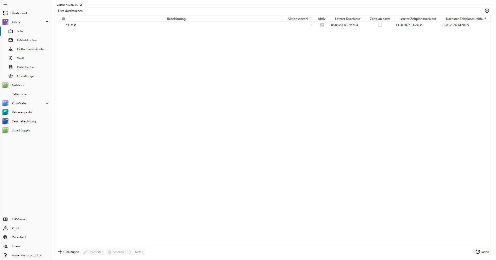

# Dokumentation arpaTools Jobby

## Einleitung

Willkommen bei Jobby, dem Automatisierungstool für Ihre JTL-Wawi. Jobby ist eine App im arpaTools
Client und bündelt wiederkehrende Aktionen in Jobs, die automatisiert oder auf Knopfdruck laufen. Das
spart Zeit und reduziert Fehlerquellen in den täglichen Prozessen.



Jobby ergänzt die anderen arpaTools-Produkte wie Sammelrechnung, Retourenportal und ProviMate. Ein
Job besteht aus einer Reihe von Aktionen, die in beliebiger Reihenfolge konfiguriert werden, zum
Beispiel Importe, Exporte, Dateiübertragungen oder das Versenden von E-Mails. Jeder Job kann
zeitgesteuert oder manuell gestartet werden.

Diese Aufgaben decken typische Prozesse rund um Import, Export, Dateitransfer und Systemintegration ab.

**Import**
- **JTL-Ameise Import:** führt definierte Importvorlagen der JTL-Ameise aus. Ideal für Artikeldaten, Bestände, Preise.
- **Lieferantenbestand importieren:** importiert eine CSV-Datei mit Bestandsinformationen eines Lieferanten in die JTL-Wawi.
- **XML zu CSV / JSON zu CSV / Excel zu CSV:** wandelt Lieferantendateien in eine CSV, die die übrigen Importaktionen lesen können.
- **Sendungsdatenimport:** verarbeitet Trackinginformationen aus einer CSV-Datei und trägt sie in JTL-Wawi ein, sodass Sendungen als „versendet" markiert werden.

**Export**
- **JTL-Ameise Export:** steuert Exportvorlagen der JTL-Ameise an, z. B. für Artikel-, Auftrags- oder Kundendaten.
- **Lagerbewertung:** erzeugt eine Datei mit Bestand und Bestandswert je Artikel, aufgeschlüsselt nach Lager.

**Aufträge**
- **Lieferantenbestellung bestätigen:** verarbeitet und bestätigt Lieferantenbestellungen.
- **Lieferantenbestellung erstellen:** legt aus einer Datei neue Lieferantenbestellungen in JTL-Wawi an.
- **XML-Auftragsimport:** importiert Auftragsdaten im JTL-XML-Format in die JTL-Wawi.
- **Ohne Versand abschließen:** markiert Aufträge als komplett ausgeliefert, ohne einen Versand auszulösen.

**Einkauf**
- **Einkaufsliste schreiben:** trägt Artikel mit Menge aus einer Datei in die JTL-Einkaufsliste eines Benutzers ein.

**Dateitransfer**
- **Download vom FTP-Server:** lädt Dateien von einem FTP-Server in den internen Jobspeicher.
- **Upload zum FTP-Server:** überträgt Dateien aus dem Jobspeicher auf einen externen FTP-Server.

**Sonstiges**
- **Daten aus dem Web laden:** ruft eine Datei von einer URL ab und legt sie im Jobspeicher ab.
- **Daten aus Verzeichnis laden:** liest Dateien aus einem lokalen Verzeichnis ein, optional mit Löschen nach dem Laden.
- **Daten in Verzeichnis speichern:** speichert verarbeitete Dateien in einem Verzeichnis, optional mit automatischem Löschen nach X Tagen.
- **E-Mail senden:** versendet Benachrichtigungen oder Berichte, optional mit Anhang.
- **E-Mail via Brevo senden:** versendet transaktionale E-Mails über Brevo.
- **Prozess starten:** startet externe Programme oder Skripte mit Parametern.
- **Benutzerdefinierte Aktion:** startet ein beliebiges externes Programm oder Skript (.exe, PowerShell, Python, Batch, Jar) mit Zeitlimit, Zugangsdaten aus dem Vault und Rückgabe der erzeugten Dateien in die weitere Verarbeitung. „Prozess starten" bleibt daneben unverändert bestehen.
- **Manuellen JTL-Wawi Workflow ausführen:** stößt manuelle Workflows in JTL-Wawi an.
- **Daten von MS-SQL Server laden:** führt eine lesende SQL-Abfrage aus und speichert das Ergebnis als Datei.
- **Daten per SQL einfügen/ändern:** führt ein schreibendes SQL-Statement aus.
- **Job ausführen:** übergibt den laufenden Job an einen anderen Job und beendet den aufrufenden Job.

**Interne arpaTools Jobs** (siehe eigenen Abschnitt): ProviMate-Abrechnung, Querify, Retourenportal,
Sammelrechnung, Netstock.

Im Mittelpunkt steht Jobby als Schaltzentrale der Automatisierung: die zeitgesteuerte Planung und
automatische Ausführung sämtlicher Prozesse. Nutzer anderer Apps benötigen keine zusätzliche
Jobby-Lizenz; die Aktionen der jeweiligen App sind ohne separate Lizenz nutzbar.

## Beispiele für den Einsatz

### Beispiel: Automatischer Import der Bestände eines Dropshipping-Lieferanten

Ein Lieferant stellt mehrfach täglich eine CSV-Datei mit Lagerbeständen auf einem FTP-Server bereit.
Mit Jobby lässt sich der Import vollständig automatisieren:

1. **Download vom FTP-Server:** lädt die aktuelle Bestandsdatei in den Jobspeicher.
2. **Lieferantenbestand importieren:** verarbeitet die Datei und ordnet die Bestände den Artikeln zu.
3. **(Optional) Daten in Verzeichnis speichern:** legt die verarbeitete Datei zur Archivierung ab.
4. **(Optional) E-Mail senden:** informiert den Einkauf über den erfolgreichen Lauf.

### Beispiel: Übergabe einer Dropshipping-Bestellung an den Lieferanten

JTL-Wawi legt bei Auslieferung eine CSV-Datei mit den Bestellinformationen ab. Jobby übergibt sie an
den Lieferanten:

1. **Daten aus Verzeichnis laden:** lädt neue Dateien aus dem Verzeichnis und entfernt sie dort, um doppelte Verarbeitung zu vermeiden.
2. **Upload zum FTP-Server:** lädt die Datei auf den FTP-Server des Lieferanten.
3. **Daten in Verzeichnis speichern:** legt die Datei in einem Archiv ab (z. B. 30 Tage, danach automatisch gelöscht).

### Beispiel: Import von Tracking-Informationen vom Dropshipper

Nach dem Versand stellt der Lieferant eine Datei mit Sendungsdaten bereit:

1. **Download vom FTP-Server:** lädt die Datei mit den Sendungsdaten.
2. **Sendungsdatenimport:** ordnet die Trackingnummern den Lieferscheinen zu und markiert die Sendungen als „versendet".
3. **Daten in Verzeichnis speichern:** archiviert die Datei (z. B. 30 Tage).

## Jobby-Übersicht

### Jobs

Die Ansicht **Jobs** ist die Hauptansicht. Hier werden alle Jobs konfiguriert; bei vielen Jobs hilft die
Suche. Neue Jobs legt man über **Hinzufügen** an, bestehende ändert man über **Bearbeiten** (oder per
Doppelklick), **Löschen** entfernt sie. **Starten** führt den ausgewählten Job aus; danach wird in der
Liste das Datum „Letzter Durchlauf" aktualisiert.

**Laden** aktualisiert die Ansicht. Das ist nützlich, wenn Jobs über den arpaTools Worker automatisch
laufen: nach dem Laden zeigt „Letzter Zeitplandurchlauf", ob und wann die letzte planmäßige Ausführung
stattfand.

Spalten in der Liste:
- **Aktionsanzahl:** Anzahl der Aktionen pro Job.
- **Aktiv:** Häkchen, wenn der Job aktiv ist.
- **Zeitplan aktiv:** aktiv, wenn der Job per Zeitplan über den arpaTools Worker läuft.

### E-Mail-Konten

Eine mögliche Aktion ist der Versand von E-Mails, mit reinem Text oder mit Anhängen (z. B. Ergebnisse
aus SQL-Abfragen oder Dateien vom FTP-Server bzw. aus einem Verzeichnis).

Die Einstellungen entsprechen den SMTP-Daten des Hosters. Office-365- oder Google-Mail-Authentifizierung
werden nicht unterstützt. Einzutragen sind Server, Port, Verschlüsselung, die Absenderadresse und,
sofern das Postfach eine Anmeldung verlangt, Benutzername und Passwort. Mit **Prüfen** lassen sich die
Einstellungen testen.

- **Verschlüsselung:** „Keine", „STARTTLS" oder „SSL/TLS". Zu jeder Art gehört üblicherweise ein
  eigener Port: „Keine" Port 25, „STARTTLS" Port 587, „SSL/TLS" Port 465. Ändern Sie die
  Verschlüsselung, zieht der Port automatisch auf den passenden Standardwert mit, solange dort noch
  einer der drei Standardports oder gar kein Wert steht. Haben Sie selbst einen abweichenden Port
  eingetragen, bleibt er beim Wechsel der Verschlüsselung unangetastet.
- **Anmeldung erforderlich:** ausschalten, wenn das Postfach den Versand ohne Benutzername und
  Passwort annimmt, etwa weil es den Absender über die IP-Adresse freigibt. Ist der Schalter aus,
  sind Benutzername und Passwort nicht eingebbar und werden beim Speichern nicht verlangt.
  **Benutzername und Kennwort bleiben dabei gespeichert**, wenn Sie die Anmeldung ausschalten. Schalten
  Sie sie später wieder ein, finden Sie Ihre Zugangsdaten unverändert vor. Wollen Sie sie loswerden,
  schalten Sie die Anmeldung zunächst wieder ein, leeren Sie die beiden Felder von Hand und schalten
  Sie die Anmeldung danach wieder aus, bevor Sie speichern.
- Wählen Sie „Keine" Verschlüsselung, während die Anmeldung eingeschaltet bleibt, überträgt das
  Postfachkennwort ungeschützt über das Netz. Das ist keine verbotene Kombination, manche Postfächer
  im eigenen Netz verlangen genau das, aber arpaTools fragt beim Speichern ausdrücklich nach, ob das
  so gewollt ist.

Bestehende E-Mail-Konten aus einer Vorversion stehen nach der Aktualisierung auf „STARTTLS" mit
Anmeldung, dem bisherigen Verhalten. Niemand muss deswegen etwas umstellen.

### Drittanbieter-Konten

Über Drittanbieter-Konten lassen sich API-Zugangsdaten in Jobby speichern und benennen. Die Daten
werden verschlüsselt gespeichert.

### Vault

Der Vault ist ein Tresor für Zugangsdaten, die Sie in einem Job an ein externes Programm übergeben
möchten, zum Beispiel ein Passwort für ein Skript, das über die Aktion „Prozess starten" aufgerufen
wird. Sie legen dazu einen Schlüssel mit einem Wert an. Im Job selbst taucht nur der Schlüsselname auf,
nie der Wert.

- **Schlüssel:** wird zum Namen einer Umgebungsvariable des gestarteten Programms. Erlaubt sind
  Großbuchstaben, Ziffern und Unterstrich, das erste Zeichen muss ein Buchstabe sein. Kleinbuchstaben
  wandelt arpaTools beim Speichern automatisch in Großbuchstaben um.
- **Kurzbeschreibung:** optionaler Hinweistext, wofür der Eintrag gedacht ist.
- **Wert:** wird verschlüsselt gespeichert und lässt sich nach dem Speichern nicht mehr anzeigen. Wer
  den Wert vergessen hat, trägt einen neuen ein; einen bestehenden Wert wieder einsehen können Sie
  nicht.

Ein Schlüssel lässt sich nicht umbenennen. Möchten Sie einen Eintrag unter einem anderen Namen führen,
legen Sie einen neuen Schlüssel an und löschen den alten.

Die Spalte **Anzahl Verwendungen** soll zeigen, in wie vielen Jobs der Schlüssel eingesetzt wird. Solange
es noch keine Aktion gibt, die Vault-Werte tatsächlich benutzt, steht hier immer 0, selbst wenn Sie den
Schlüssel längst in einer Aktion eingetragen haben. Aus demselben Grund warnt arpaTools beim Löschen
heute noch nicht vor betroffenen Jobs: Löschen Sie einen Schlüssel, der in einer Aktion eingetragen ist,
gibt es dafür aktuell keine Rückfrage, und die Aktion schlägt beim nächsten Lauf ohne Vorwarnung fehl,
weil ihr die Zugangsdaten fehlen. Prüfen Sie vor dem Löschen deshalb selbst, ob und wo Sie den Schlüssel
noch verwenden. Sobald es eine Aktion gibt, die Vault-Schlüssel benutzen kann, zählt diese Spalte korrekt
mit, und das Löschen eines benutzten Schlüssels fragt dann vorher nach und nennt die betroffenen Jobs.

**Wichtig:** Geht in der Datenbank die Zeile mit dem Vault-Schlüssel verloren, mit dem alle Werte
verschlüsselt sind, sind sämtliche Vault-Einträge unbrauchbar. Sie lassen sich nicht wiederherstellen
und müssen komplett neu eingegeben werden.

### FTP-Server

Für Download oder Upload wird eine FTP-Verbindung hinterlegt. Jede Verbindung braucht einen eindeutigen
Namen. Als Protokoll stehen FTP oder SFTP zur Verfügung, dazu FTP-Server-URL, Port, Benutzername und
Passwort. Der relative Pfad kann zusätzlich pro Aktion im Job angegeben werden. Mit **Prüfen** wird die
Verbindung getestet.


### Datenbanken

Mit Jobby lassen sich mehrere JTL-Datenbanken hinterlegen. So bedient man mehrere Mandanten innerhalb
einer Jobby-Installation.

### Einstellungen

Die Einstellungen legen fest, ob der arpaTools Worker verwendet wird und in welchem Intervall er Jobs
ausführt. Wir empfehlen mindestens fünf Minuten. Die Installation des Windows-Dienstes „arpaTools
Worker" ist im Abschnitt [arpaTools Worker installieren](#arpatools-worker-installieren) beschrieben.

## Einfachen Job erstellen

Ein Job besteht aus einer Abfolge von **Aktionen**, die nacheinander ausgeführt werden. Über den
arpaTools Worker kann die Ausführung auch zeitgesteuert erfolgen.

Links werden alle verfügbaren Aktionen angezeigt. Zum Hinzufügen wählt man eine Aktion aus und klickt
**Hinzufügen**; danach öffnen sich ihre Einstellungen. Hinzugefügte Aktionen erscheinen rechts und
lassen sich dort bearbeiten und in der Reihenfolge anpassen. Aktionen laufen immer von oben nach unten.

**Wichtig:** Aktionen, die mit Dateien arbeiten, speichern diese nicht automatisch ab, sondern laden
sie nur in die Laufzeitumgebung. Dazu gehören:
- Daten von MS-SQL Server laden (lesend)
- Daten aus Verzeichnis laden
- Datei aus Web laden
- Download vom FTP-Server

Nur die Aktion **JTL-Ameise Export** schreibt aufgrund der Ameisen-Struktur eine Datei, die im weiteren
Verlauf geladen werden muss. Erst die Aktion **Daten in Verzeichnis speichern** legt die Inhalte
dauerhaft ab.

## Jobby-Aktionen

### Import: JTL-Ameise Import

Führt strukturierte Importe (Artikeldaten, Kundenlisten, Bestände) automatisiert oder manuell über eine
vorher definierte JTL-Ameise-Importvorlage aus. Grundlage ist eine in JTL-Ameise gespeicherte Vorlage.

- **Template:** die zu verwendende Importvorlage (muss in JTL-Ameise eingerichtet sein).
- **Workflows:** bestimmt, ob während des Imports hinterlegte Workflows ausgeführt werden.
- **Log Level:** Detailgrad der Protokollierung: Ausführlich, Kompakt, Fehler/Warnungen.
- **Log-Parameter:** zusätzliche Einschränkung der Protokollierung. Der Parameter FILE gibt an, wohin die Logdatei geschrieben wird. Verfügbare Logarten: `--log` (Hauptbericht), `--log_errors`, `--log_warnings`, `--log_imported`, `--log_update`, `--log_other`.
- **Platzhalter im Dateinamen:** `%y` (Jahr vierstellig), `%m` (Monat), `%d` (Tag), `%h` (Stunde), `%i` (Minute), `%s` (Sekunde), `%db` (Datenbankname), `%id` (Name der Importvorlage). Beispiel: `import_%y-%m-%d_%h-%i-%s_%id.log`.

### Import: Lieferantenbestand importieren

Importiert Lieferantenbestände in JTL-Wawi. Der Bestand erscheint in den Artikeldetails im Reiter
Lieferanten und wird optional dem eigenen Lagerbestand hinzugefügt. Der Lieferant sollte regelmäßig eine
aktuelle CSV-Datei bereitstellen.

- **Lieferant:** für welchen Lieferanten die Bestände importiert werden.
- **Startzeile:** bei Dateien mit Überschriftszeile mindestens Zeile 2.
- **Identifizierungsart und Identifizierung:** woran ein Artikel eindeutig erkannt wird (Lieferantenartikelnummer oder GTIN/EAN) und in welcher Spalte dieser Wert steht.
- **Spalte Lieferantenbestand:** Spalte mit dem Bestandswert.
- **Verarbeitung:** eine große Datei oder mehrere Dateien.
- **Nicht gesendete Artikel + Bestimmten Bestand setzen:** setzt für Artikel, die nicht mehr in der Datei stehen, den Wert aus „Bestand für nicht gesendete Artikel". Andernfalls werden solche Artikel ignoriert.
- **Bestandskonvertierung:** wandelt Textwerte in Zahlen, wenn der Lieferant statt Zahlen z. B. „Verfügbar"/„Nicht verfügbar" sendet (Quelle = Text in der Datei, Ziel = Zahl, z. B. Verfügbar = 10, Nicht verfügbar = 0).

### Import: Sendungsdaten importieren (JTLWawiExtern.DLL)

Importiert Sendungs- bzw. Trackingdaten aus einer CSV-Datei und markiert Sendungen als versendet, ohne
dass JTL-Packtisch oder JTL-WMS aktiv im Vordergrund laufen müssen. Der Import läuft im Hintergrund über
den Windows-Dienst.

- **Importbenutzer:** der Benutzer, der den Lieferschein von Offen auf Versendet setzt.
- **Startzeile:** bei Überschriftszeile mindestens Zeile 2.
- **Identifizierung:** Spalte mit Auftrags- oder Lieferscheinnummer. Bei Teillieferungen empfehlen wir die Lieferscheinnummer, sonst würden alle Teillieferungen als versendet markiert.
- **Identifizierungsoption:** „Auftragsnummer" oder „Automatisch ohne Auftragsnummer" (nutzt die empfohlene Lieferscheinnummer).
- **Versanddatum:** Spalte mit dem Versanddatum.
- **Sendungsnummer:** Spalte mit der Trackingnummer.
- **Hinweis:** optionale Spalte mit einem Versandhinweis.
- **Import-Filter:** hilft bei mehrzeiligen Dateien (z. B. DESADV), in denen nicht jede Zeile eine Sendungsnummer enthält. Der Filter bestimmt, welcher Wert in einer Spalte vorhanden sein muss, damit eine Zeile berücksichtigt wird.

### Import: XML-Auftragsimport (JTLWawiExtern.DLL)

Importiert Auftragsdaten im JTL-XML-Format direkt in die JTL-Wawi, manuell oder zeitgesteuert. Die
Aktion verarbeitet die zuvor geladenen XML-Dateien.

- **Importbenutzer:** der Benutzer, unter dem die Aufträge angelegt werden.
- **Verarbeitung:** nur die neueste oder alle geladenen Dateien.

### Export: JTL-Ameise Export

Für regelmäßige Exporte über JTL-Ameise, z. B. einen Lagerbestandsexport für B2B-Kunden. Voraussetzung
ist eine in JTL-Ameise angelegte Exportvorlage.

- **Template:** die JTL-Ameise-Exportvorlage.
- **Zielverzeichnis:** wohin die Datei gespeichert wird.
- **Dateiname:** mit dynamischen Platzhaltern: Jahr (%y), Monat (%m), Tag (%d), Stunde (%H), Minute (%i), Sekunde (%s), Datenbankname (%db), Exportvorlagen-ID (%id).

Exportvorlagen setzen mindestens den JTL-Tarif Advanced voraus.

### Export: Lagerbewertung

Erstellt eine Datei mit dem Bestand und dem Bestandswert (Menge multipliziert mit Einkaufspreis) je
Artikel, aufgeschlüsselt nach Lager, inklusive Summenzeile.

- **Lager:** die Lager, die in die Bewertung einfließen (je Lager entsteht eine Spalte).
- **Header ausgeben:** ob Spaltenüberschriften mitgeschrieben werden.
- **Trennzeichen:** Semikolon oder Komma.
- **Dateiname:** mit Datumsplatzhaltern.
- **Dateiformat:** CSV oder TXT.

### Aufträge: Lieferantenbestellung bestätigen

Setzt die Bestätigungsoption einer Lieferantenbestellung in JTL-Wawi anhand einer geladenen Datei.

- **Startzeile:** ab welcher Zeile verarbeitet wird.
- **Identifizierungstyp:** Bestellnummer oder interne Bestellnummer.
- **Identifizierung:** in welcher Spalte die Nummer steht.
- **Spalte Bestätigungswert:** Spalte mit dem Bestätigungswert.
- **Verarbeitung:** nur die neueste oder alle geladenen Dateien.
- **Bestätigung konvertieren:** welcher Wert als Bestätigung gilt (z. B. Vergleichsart = ist gleich, Quelle = Y, Ziel = Bestätigung).

### Aufträge: Lieferantenbestellung erstellen

Legt aus einer geladenen Datei neue Lieferantenbestellungen in JTL-Wawi an. Die Zeilen werden je
Lieferant gruppiert, jede Gruppe wird zu einer Bestellung mit Positionen (Artikel und Menge).
Mindestbestellwert und Versandkostenfrei-ab werden dabei berücksichtigt.

- **Firma** und **Benutzer:** unter welcher Firma und welchem Benutzer die Bestellungen angelegt werden.
- **Startzeile:** ab welcher Zeile verarbeitet wird.
- **Lieferant-Identifizierung:** ob der Lieferant per interner Lieferanten-ID oder per Lieferantennummer erkannt wird, und in welcher Spalte er steht.
- **Artikel-Identifizierung:** ob der Artikel per Artikel-ID oder Artikelnummer erkannt wird, und in welcher Spalte er steht.
- **Spalte Menge:** Spalte mit der Bestellmenge.
- **Verarbeitung:** nur die neueste oder alle geladenen Dateien.

### Aufträge: Ohne Versand abschließen

Markiert Aufträge anhand einer geladenen Datei als komplett ausgeliefert, ohne einen Versand
auszulösen. Nützlich für Aufträge, die außerhalb des normalen Versandprozesses erledigt wurden.

- **Startzeile:** ab welcher Zeile verarbeitet wird.
- **Identifizierungstyp:** Auftragsnummer oder interne Auftragsnummer.
- **Identifizierung:** Spalte mit der Auftragsnummer.
- **Spalte Auslieferdatum:** Spalte mit dem Auslieferdatum.
- **Verarbeitung:** nur die neueste oder alle geladenen Dateien.

### Einkauf: Einkaufsliste schreiben

Trägt Artikel mit Menge aus einer geladenen Datei in die JTL-Einkaufsliste eines Benutzers ein.

- **Benutzer:** für welchen Benutzer die Einkaufsliste befüllt wird.
- **Startzeile:** ab welcher Zeile verarbeitet wird.
- **Identifizierungstyp:** Artikel-ID oder Artikelnummer.
- **Spalte Identifizierung** und **Spalte Menge:** in welchen Spalten Artikel und Menge stehen.
- **Verarbeitung:** nur die neueste oder alle geladenen Dateien.

### Dateitransfer: Download vom FTP-Server

Lädt regelmäßig bereitgestellte Dateien von einem FTP-Server herunter, z. B. eine Bestands-CSV des
Lieferanten. Für Download und Upload muss eine FTP-Verbindung eingerichtet sein.

- **FTP-Server:** die konfigurierte Verbindung.
- **Dateifilter:** welche Dateien geladen werden (z. B. `*.csv`, nach MS-DOS-Filterregeln).
- **Verarbeitung:** ob die Datei nach dem Download gelöscht oder behalten wird.
- **Relativer Pfad:** Unterverzeichnis auf dem Server, falls nötig.

### Dateitransfer: Upload zum FTP-Server

Überträgt Dateien aus dem Jobspeicher automatisch auf einen FTP-Server, z. B. Sendungsdaten für einen
Dropshipping-Kunden. Für Download und Upload muss eine FTP-Verbindung eingerichtet sein.

- **FTP-Server:** die konfigurierte Verbindung.
- **Relativer Pfad:** das Zielverzeichnis auf dem Server.
- **Existierende Datei:** Verhalten bei Namensgleichheit, z. B. „Überschreiben".

### Sonstiges: Datei aus Web laden

Lädt eine Datei (z. B. eine CSV eines Lieferanten) direkt über eine URL in den Jobspeicher.

- **URL:** Adresse der Datei.
- **Benutzername und Passwort:** optional, für passwortgeschützte Pfade.

### Sonstiges: Daten aus Verzeichnis laden

Liest mehrere Dateien aus einem Ordner zur Weiterverarbeitung ein.

- **Quellverzeichnis:** wo die Dateien liegen.
- **Dateifilter:** welche Dateien geladen werden (z. B. `*.csv`).
- **Verarbeitung:** „Nach dem Laden löschen" oder „Nach dem Laden nicht löschen".

### Sonstiges: Daten in Verzeichnis speichern

Speichert die verarbeiteten Dateien in einem Verzeichnis, z. B. zur Archivierung.

- **Zielverzeichnis:** wohin gespeichert wird.
- **Dateien nach Tagen löschen:** nach wie vielen Tagen automatisch gelöscht wird (z. B. 30).
- **Existierende Datei:** „Überschreiben" oder „Ignorieren".

### Sonstiges: E-Mail senden

Versendet eine E-Mail, optional mit Anhang aus einem vorangegangenen Schritt (JTL-Ameise Export,
lesendes SQL, Daten aus Verzeichnis laden, Datei aus Web laden, Download vom FTP-Server).

- **E-Mail-Konto:** das konfigurierte Konto für den Versand.
- **Empfänger:** Adresse des Empfängers.
- **Betreff** und **Nachricht:** Inhalt der E-Mail.
- **Anhang:** ob ein Anhang aus einem der genannten Schritte mitgesendet wird.

### Sonstiges: E-Mail via Brevo senden

Versendet transaktionale E-Mails über Brevo (Sendinblue). Die Steuerung erfolgt über JSON-Dateien in
einem festgelegten Verzeichnis. Jede Datei enthält Empfänger, Template, Anhänge und Variablen.

**Funktionsweise**
1. **JSON-Dateien erstellen:** z. B. aus einem JTL-Workflow über die Aktion „Datei schreiben".
2. **Ablage im Verzeichnis:** z. B. `C:\goetools\MAILDATA\`.
3. **Automatischer Versand:** Jobby liest die Dateien und versendet die E-Mails über Brevo. Nach dem Versand kann die Datei gelöscht oder verschoben werden.

**JSON-Grundaufbau**

```json
{
  "to": [
    { "email": "kunde@example.de", "name": "{{ Vorgang.Auftrag.Kunde.Vorname }} {{ Vorgang.Auftrag.Kunde.Name }}" }
  ],
  "templateId": 12,
  "params": {
    "kundename": "{{ Vorgang.Auftrag.Kunde.Vorname }}",
    "ordernumber": "{{ Vorgang.Auftrag.ExterneAuftragsnummer }}",
    "trackinglink": "{{ Vorgang.Tracking-URL }}"
  },
  "attachment": {
    "files": [ { "file": "C:\\goetools\\INVOICE\\{{ Rechnungen.Rechnungsnummer }}.pdf" } ]
  }
}
```

**Felder im Überblick**

| Feld | Beschreibung |
|---|---|
| `to` | Liste der Empfänger mit E-Mail-Adresse und optionalem Namen. |
| `templateId` | ID des in Brevo erstellten Templates. |
| `params` | Beliebige Variablen für das Brevo-Template. |
| `attachment` | Anhänge als einzelne Dateien, Verzeichnisse oder Web-Dateien. |

**Anhänge**

Einzelne Dateien:
```json
{ "attachment": { "files": [ { "file": "C:\\goetools\\INVOICE\\12345.pdf" }, { "file": "C:\\goetools\\LIEFERSCHEIN\\12345.pdf" } ] } }
```
Ganze Verzeichnisse (alle Dateien werden angehängt):
```json
{ "attachment": { "folders": [ { "folder": "C:\\testverzeichnis" } ] } }
```
Dateien aus dem Web:
```json
{ "attachment": { "files": [ { "url": "https://arpatools.com/wp-content/uploads/2022/04/arpatools-top.png" } ] } }
```

**Hinweise**
- Die JSON-Dateien müssen syntaktisch korrekt sein.
- `params` kann beliebige Felder enthalten und wird in Brevo als Variablenquelle genutzt.
- Pro JSON-Datei wird genau eine E-Mail erzeugt.
- Die Erstellung der JSON-Dateien ist z. B. über einen JTL-Workflow mit der Aktion „Datei schreiben" möglich.
- Tipp: sprechende Dateinamen im Ablageverzeichnis erleichtern Verarbeitung und Monitoring.

### Sonstiges: Prozess starten

Führt eine ausführbare Datei aus, z. B. ein PowerShell-Skript oder eine Batch-Datei, mit individuellen
Parametern.

- **Ausführbare Datei:** Pfad zur auszuführenden Datei.
- **Parameter-Aufbau:** Parameter mit Platzhaltern, z. B. `##file##`, um die während der Laufzeit verarbeitete Datei zu übergeben.

### Sonstiges: Benutzerdefinierte Aktion

Startet ein beliebiges externes Programm oder Skript, wertet dessen Rückgabewert aus und kann die
Dateien, die es in ein Ausgabeverzeichnis schreibt, an die folgenden Aktionen weitergeben. Die Aktion
„Prozess starten" bleibt daneben unverändert bestehen und eignet sich weiter für den einfachen Fall
einer ausführbaren Datei ohne Skript und ohne Zugangsdaten.

Die vier Pfadfelder – Programm, Interpreter, Arbeitsverzeichnis und Ausgabeverzeichnis – haben rechts
daneben je eine Schaltfläche, über die Sie die Datei beziehungsweise den Ordner auswählen. Nutzen Sie
sie: die Prüfung, ob arpaTools das Programm und den Interpreter findet, hängt an der Genauigkeit des
Pfads, und ein Tippfehler fällt sonst erst beim Lauf auf.

- **Programm oder Skript:** Pfad zur Datei, zum Beispiel eine `.exe`, `.ps1`, `.py`, `.bat`/`.cmd` oder
  `.jar`. arpaTools erkennt anhand der Endung, womit gestartet wird.
- **Interpreter:** überschreibt die automatische Erkennung, zum Beispiel für PowerShell 7 statt der
  mitgelieferten Windows-PowerShell oder eine bestimmte Python-Installation. Ist die automatische
  Erkennung erfolglos, ist das Feld Pflicht.
- **Pfad gilt für die ausführende Maschine:** nötig, wenn Sie den Job an Ihrem Arbeitsplatz einrichten,
  der eingetragene Interpreterpfad aber nur auf dem Server existiert, auf dem der Job später läuft.
  Sobald Sie das Häkchen setzen, verlangt arpaTools im Feld „Interpreter" einen **absoluten** Pfad, also
  zum Beispiel `C:\Python311\python.exe` und nicht `python.exe` oder einen relativen Pfad. Mit einem
  solchen unvollständigen Pfad lässt sich die Aktion nicht speichern: auf dem Server würde er gegen ein
  Verzeichnis aufgelöst, das Sie nicht kennen, und der Job würde nachts scheitern.
- **Parameter:** die Kommandozeilenparameter für das Programm, mit den Platzhaltern unten.
- **Arbeitsverzeichnis:** optional, Standard ist der Ordner des Programms.
- **Ausgabeverzeichnis:** optional. Bleibt es leer, hat die Aktion nur einen Nebeneffekt und reicht die
  eingehenden Dateien unverändert weiter.
- **Ausgabeverzeichnis vorher leeren:** standardmäßig an, damit Dateien eines früheren Laufs nicht als
  Ergebnis des aktuellen Laufs gelten.
- **Zeitlimit in Sekunden:** ein Häkchen und daneben ein Zahlenfeld. **Ohne Häkchen wartet arpaTools
  unbegrenzt** auf das Ende des Programms; das Zahlenfeld ist dann ausgegraut und sein Inhalt wird nicht
  gespeichert. Mit Häkchen gilt die eingetragene Zahl: läuft die Zeit ab, wird der Prozess beendet und
  die Aktion bricht ab. Wenn Sie ein einmal gesetztes Zeitlimit wieder loswerden wollen, entfernen Sie
  das Häkchen – die Zahl im Feld dürfen Sie stehen lassen.
- **Rückgabewert ignorieren:** für Programme, die auch im Erfolgsfall etwas anderes als 0 liefern.
- **Ausgabe protokollieren:** schreibt Konsolenausgabe und Fehlerausgabe des Programms ins arpaTools-Log.
- **Vault-Schlüssel:** die Zugangsdaten aus dem [Vault](#vault), die das Programm bekommen soll.

**Die Meldung unter dem Interpreterfeld.** Sobald ein Programm eingetragen ist, sucht arpaTools den
passenden Interpreter und zeigt das Ergebnis direkt darunter an:

| Meldung | Bedeutung |
|---|---|
| „Gefunden: …" | Alles in Ordnung, der genannte Pfad wird zum Starten benutzt. |
| „Kein Interpreter gefunden…" | Der Interpreter fehlt. Die Meldung nennt alle Pfade, an denen gesucht wurde. Tragen Sie einen absoluten Pfad im Feld „Interpreter" ein. Speichern ist bis dahin gesperrt. |
| „Es wurde nur der Windows-Store-Platzhalter gefunden…" | Windows liefert für `python.exe` einen Platzhalter mit, der beim Aufruf nur den Microsoft Store öffnet. Installieren Sie Python richtig oder tragen Sie einen absoluten Pfad ein. |
| „Das Programm liegt auf diesem Rechner nicht…" | Nur das Programm selbst fehlt hier, mit dem Interpreter ist alles in Ordnung. Das ist der Normalfall, wenn Sie einen Job an Ihrem Arbeitsplatz für einen Server einrichten. **Speichern ist hier erlaubt**, denn der Pfad muss nur auf der ausführenden Maschine stimmen. |

**Platzhalter im Parameterfeld**

| Platzhalter | Bedeutung |
|---|---|
| `##FILE##` | Startet das Programm einmal je eingehender Datei, ersetzt durch deren vollen Pfad. |
| `##INPUTFOLDER##` | Startet das Programm einmal, alle eingehenden Dateien liegen in diesem Ordner. |
| `##OUTPUTFOLDER##` | Pfad des eingetragenen Ausgabeverzeichnisses. |
| `##VAULT:SCHLUESSEL##` | Wird durch den Wert des Vault-Schlüssels ersetzt. |

`##FILE##` und `##INPUTFOLDER##` lassen sich nicht kombinieren.

**Zugangsdaten.** Angehakte Vault-Schlüssel bekommt das Programm als Umgebungsvariable mit dem
Schlüsselnamen als Namen. Ein PowerShell-Skript liest sie über `$env:NAME`, ein Python-Skript über
`os.environ["NAME"]`, eine Batch-Datei über `%NAME%`.

**Beispiel PowerShell**

Das Skript liest einen API-Schlüssel aus dem Vault, holt Daten von einer Schnittstelle und schreibt das
Ergebnis in das Ausgabeverzeichnis.

Einstellungen: Programm `C:\Skripte\export.ps1`, Parameter `-Ausgabe "##OUTPUTFOLDER##"`,
Vault-Schlüssel `API_KEY` angehakt.

```powershell
param(
    [string]$Ausgabe
)

$apiKey = $env:API_KEY
$antwort = Invoke-RestMethod -Uri "https://beispiel-lieferant.de/api/bestand" -Headers @{ Authorization = "Bearer $apiKey" }
$antwort | ConvertTo-Json | Out-File -FilePath (Join-Path $Ausgabe "bestand.json") -Encoding utf8
```

**Beispiel Python**

Dasselbe Beispiel als Python-Skript, der Ausgabepfad kommt hier als Kommandozeilenargument statt als
benannter Parameter.

Einstellungen: Programm `C:\Skripte\export.py`, Parameter `"##OUTPUTFOLDER##"`,
Vault-Schlüssel `API_KEY` angehakt.

```python
import json
import os
import sys
import urllib.request

api_key = os.environ["API_KEY"]
ausgabe = sys.argv[1]

request = urllib.request.Request(
    "https://beispiel-lieferant.de/api/bestand",
    headers={"Authorization": f"Bearer {api_key}"},
)
with urllib.request.urlopen(request) as response:
    daten = json.load(response)

with open(os.path.join(ausgabe, "bestand.json"), "w", encoding="utf-8") as datei:
    json.dump(daten, datei)
```

**Achtung bei `##VAULT:...##` im Parameterfeld.** Ein Vault-Wert, der als `##VAULT:SCHLUESSEL##` direkt
im Parameterstring steht, landet in der Kommandozeile des gestarteten Programms und ist dort für jeden
lokalen Benutzer ohne besondere Rechte einsehbar, zum Beispiel über die Prozessliste. Über die
Umgebungsvariable (angehakte Vault-Schlüssel) ist er das nicht. Setzen Sie `##VAULT:...##` deshalb nur
ein, wenn das Programm keine Umgebungsvariablen lesen kann.

**Empfehlung für Jobs im Dienstbetrieb: absoluten Interpreterpfad eintragen.** Läuft ein Job über den
arpaTools Worker, führt ihn das Dienstkonto aus, nicht Ihr angemeldeter Benutzer. Das Dienstkonto sieht
einen anderen `PATH` als Sie: Eine Python- oder PowerShell-Installation „nur für mich" ist für den
Dienst unsichtbar, selbst wenn sie an Ihrem Arbeitsplatz einwandfrei funktioniert. Tragen Sie für Jobs,
die über den Dienst laufen sollen, deshalb einen absoluten Pfad im Feld „Interpreter" ein, statt sich auf
die automatische Erkennung zu verlassen.

**Der Testlauf beweist nichts über den Dienst.** Starten Sie einen Job zum Testen aus der Jobübersicht,
läuft er im Kontext der Oberfläche, also unter Ihrem angemeldeten Benutzer. Gelingt der Testlauf, heißt
das nicht, dass derselbe Job auch über den arpaTools Worker läuft: das Dienstkonto kann einen anderen
`PATH` sehen und den Interpreter dort nicht finden. Prüfen Sie einen Job, der zeitgesteuert über den
Dienst laufen soll, deshalb zusätzlich über einen echten geplanten Lauf.

**Grenzen, die Sie kennen sollten**

- Das Zeitlimit lässt sich auf höchstens 86400 Sekunden (24 Stunden) setzen.
- Hält ein vom gestarteten Programm selbst gestartetes weiteres Programm die Ausgabe offen, wartet
  arpaTools nach dem Ende nur kurz nach und protokolliert dann, was bis dahin angekommen ist, statt
  unbegrenzt zu warten.
- Von der protokollierten Ausgabe werden je Konsolen- und Fehlerausgabe nur die letzten 200 Zeilen
  gespeichert. Wird gekürzt, steht das ausdrücklich im Protokoll.

**Empfohlene Kette.** Ein externes Programm kann beliebig lange laufen und beliebig wenig liefern.
Verarbeiten Sie sein Ergebnis deshalb nicht im selben Job weiter, sondern übergeben Sie es an einen
Sub-Job:

1. Eine Aktion beschafft die Ausgangsdaten, zum Beispiel Download vom FTP-Server.
2. **Benutzerdefinierte Aktion:** startet das Programm mit einem Ausgabeverzeichnis. Das Programm
   schreibt sein Ergebnis dort hinein, die Aktion sammelt die Dateien ein.
3. **Job ausführen:** übergibt genau diese Dateien an einen Sub-Job, der mit „Daten aus Verzeichnis
   laden" beginnt und sie weiterverarbeitet.

### Sonstiges: Manuellen JTL-Wawi Workflow ausführen

Stößt manuelle Workflows in JTL-Wawi an. Die Aktion kann nur laufen, wenn zuvor eine Datei geladen
wurde, die die interne ID des gewählten Bereichs enthält.

- **Benutzer:** wer den Workflow ausführt.
- **Bereich:** z. B. Angebote, Artikel, Aufträge, Beschaffung, Kunden, Picklisten, Rechnungen, Versand.
- **Event:** das auslösende Event im gewählten Bereich.
- **Trennzeichen:** Komma oder Semikolon in der Datei.
- **Startzeile:** ab welcher Zeile eingelesen wird.
- **Identifizierung:** Spalte mit dem eindeutigen Wert (z. B. kArtikel).

Voraussetzung ist seitens JTL mindestens der Tarif JTL-Wawi Advanced.

### Sonstiges: Daten von MS-SQL Server laden

Führt eine lesende SQL-Abfrage aus und speichert das Ergebnis als Datei zur Weiterverarbeitung in
folgenden Aktionen.

- **MS-SQL Statement:** die Abfrage. Mit **Prüfen** wird die Gültigkeit getestet.
- **Header ausgeben:** ob Spaltenüberschriften mitgeschrieben werden.
- **Trennzeichen:** Semikolon oder Komma.
- **Dateiname:** Platzhalter `##year##`, `##month##`, `##day##`, `##hour##`, `##minute##`, `##second##` sind möglich.
- **Dateiformat:** CSV oder TXT.

### Sonstiges: Daten per SQL einfügen/ändern

Führt ein schreibendes SQL-Statement aus (INSERT/UPDATE). Anders als „Daten von MS-SQL Server laden"
erzeugt diese Aktion keine Datei, sondern verändert Daten direkt.

- **MS-SQL Statement:** das auszuführende Statement.
- **Datenbank:** optional eine hinterlegte Datenbankverbindung, sonst die Standardverbindung.

Diese Aktion greift direkt schreibend in die Datenbank ein. Nur mit geprüften Statements einsetzen.

### Sonstiges: Job ausführen

Übergibt den laufenden Job an einen anderen, bereits eingerichteten Job und startet diesen.

Die Aktion beendet den aufrufenden Job: Aktionen, die in der Liste danach stehen, laufen nicht mehr.
Sie gehört deshalb ans Ende der Aktionsliste.

- **Auszuführender Job:** der Job, der übernimmt.
- **Übergabeordner:** optional. Bleibt das Feld leer, startet der Ziel-Job ohne Dateien.
- **Übergabeordner vorher leeren:** standardmäßig an. Löscht vor dem Kopieren alles, was noch im
  Übergabeordner liegt, damit Reste eines vorherigen oder abgebrochenen Laufs nicht in den neuen
  hineingeraten. Teilen Sie den Ordner mit anderen Dateien, schalten Sie die Option aus.

**Übergabevertrag.** Damit der Ziel-Job die Dateien wirklich bekommt, müssen zwei Seiten
zusammenpassen, und das stellen Sie selbst her, es entsteht nicht von selbst:

1. Der aufrufende Job schreibt seine Dateien über den Übergabeordner dieser Aktion.
2. Der Ziel-Job beginnt mit der Aktion **Daten aus Verzeichnis laden** auf genau denselben Pfad.

Fehlt die passende erste Aktion im Ziel-Job, liegen die Dateien zwar im Übergabeordner, werden dort
aber nie abgeholt.

Ist der Ziel-Job zwischenzeitlich gelöscht oder deaktiviert worden, schlägt der aufrufende Job fehl.
Prüfen Sie das nach Umbauten an Ihren Jobs, bevor Sie sich auf die Übergabe verlassen.

Eine Kette aus mehr als fünf Ebenen wird abgebrochen. Übergibt Job A an B, B an C, C an D, D an E und
E an F, läuft das noch durch, denn das sind fünf Ebenen unter A. Erst die nächste Übergabe, von F an
G, wird abgewiesen. Das verhindert, dass sich Jobs versehentlich gegenseitig endlos weiterreichen.

Lädt eine vorangehende Aktion **Daten aus Verzeichnis laden** mehr als 1000 Dateien, werden diese in
Blöcken zu je 1000 verarbeitet. Die Übergabe passiert dann nur beim ersten Block: der Ziel-Job startet
genau einmal. Die Dateien der übrigen Blöcke bleiben liegen und werden erst beim nächsten Lauf abgeholt.

### XML zu CSV, JSON zu CSV und Excel zu CSV

Viele Lieferanten liefern ihre Daten als XML, JSON oder Excel-Mappe. Die Importaktionen der Wawi erwarten
aber CSV. Diese drei Aktionen wandeln beliebige XML-, JSON- und Excel-Dateien in eine CSV, die Sie selbst
zusammenstellen. Danach greift jede nachgelagerte Aktion, zum Beispiel Lieferantenbestand importieren,
Einkaufsliste schreiben oder JTL-Ameise Import.

Eine typische Kette sieht so aus: Dateien vom FTP-Server laden, XML zu CSV, Lieferantenbestand
importieren, E-Mail mit Protokoll versenden.

Excel zu CSV liest sowohl `.xlsx` als auch das alte `.xls`. Beide ergeben dieselbe CSV.

**So richten Sie das Mapping ein**

Nach dem Laden der Beispieldatei ist die Aktion bereits fertig konfiguriert: das Programm erkennt, was ein
Datensatz ist, hakt alle Felder an und zeigt unten die fertige CSV. Meist prüfen Sie nur noch und speichern.

1. Beispieldatei auswählen. Nehmen Sie eine echte Datei des Lieferanten. Links erscheint die Struktur mit
   Häufigkeiten und Beispielwerten, etwa `product (250x)` und `qty "42"`.
2. Datensatz-Ebene prüfen. Die grün markierte Ebene ist eine CSV-Zeile. Vorbelegt ist die äußerste Ebene,
   die sich wiederholt. Passt das nicht, wählen Sie im Baum eine andere Ebene und klicken **Als
   Zeilen-Ebene setzen**. Bei einer Preisliste ist das der Artikel, bei einer Bestellung die Position.
3. Felder anhaken. Jeder Wert im Baum hat ein Kästchen: Haken setzen erzeugt eine Spalte, Haken entfernen
   löscht sie wieder. **Alle Felder vorschlagen** hakt alles an, was direkt zum Datensatz gehört.
4. Werte oberhalb des Datensatzes, also im Kopf der Datei, haken Sie einfach mit an. Das Programm erkennt,
   dass sie außerhalb des Datensatzes liegen, und wiederholt sie in jeder Zeile. Typisch sind Währung,
   Gültigkeitsdatum und Lieferantennummer.
5. Unten prüfen Sie die Vorschau. Sie zeigt die ersten Zeilen als Tabelle, genau so, wie die Datei
   geschrieben wird. Darüber steht, wie viele Zeilen, Felder und CSV-Spalten entstehen.

Wählen Sie später eine andere Datei, wird das Mapping neu bestimmt. Selbst angelegte Spalten bleiben dabei
erhalten, weil sie nicht zur Datei gehören.

**Worauf Sie achten sollten**

- **Preise mit Punkt.** Liefert der Lieferant `19.90`, stellen Sie für diese Spalte das Zahlformat auf
  Dezimalkomma. Ohne das kann die Wawi den Wert falsch lesen. Bei Zahlen erkennt das Programm das meist
  selbst und stellt es vor, prüfen Sie es trotzdem in der Vorschau.
- **Mehrfache Werte.** Hat ein Artikel mehrere Varianten oder Staffelpreise, legen Sie in der Spalte
  fest, wie viele davon geschrieben werden (1 bis 50). Aus drei Varianten werden dann drei Spalten
  `Variante1;Variante2;Variante3`. Alternativ schreiben Sie alle Werte in eine Zelle, indem Sie ein
  Trennzeichen wie `|` eintragen.
- **Spaltennummern.** In der Spalte CSV steht, an welcher Stelle die Spalte in der Datei landet. Wenn Sie
  die Anzahl der Wiederholungen ändern oder Spalten verschieben, verrutschen alle folgenden Spalten. Die
  nachgelagerte Aktion arbeitet mit festen Spaltennummern, prüfen Sie sie also nach solchen Änderungen.
- **Spalte Belegt.** Sie zeigt, in wie vielen gelesenen Datensätzen eine Spalte einen Wert hatte, etwa
  `30/30` oder `1/30`. Steht dort `1/30`, kommt das Feld nur in einem einzigen Datensatz vor und gehört
  meist nicht in die CSV. Das ist die schnellste Prüfung bei einer unbekannten Datei.
- **Eigene Spalten.** Über **Eigene Spalte** fügen Sie eine Spalte hinzu, die es in der Datei nicht gibt,
  etwa eine Lieferantennummer. Den Spaltennamen bestimmen Sie in jedem Fall frei, unabhängig vom Namen in
  der Quelldatei. Mit der Quelle **Textvorlage** setzen Sie einen Wert aus mehreren zusammen,
  zum Beispiel `{marke} {name}`.
- **Sehr verschachtelte Dateien.** Vorgeschlagen werden Felder bis drei Ebenen unter dem Datensatz und
  höchstens 30 Stück. Wie viele Felder übrig bleiben, steht unter der Vorschau; sie bleiben im Baum und
  lassen sich anhaken.
- **Zeichensatz.** Für Lieferantenbestand, Einkaufsliste, Bestellung und Trackingdaten nehmen Sie UTF-8.
  Für den JTL-Ameise Import ist meist ISO-8859-1 richtig. Die Auswahl ist entsprechend beschriftet.

**Zusätzlich bei Excel zu CSV**

- **Kopfzeile.** Tragen Sie die Zeilennummer der Spaltenüberschriften ein, meist `1`. Steht über den
  Überschriften noch ein Briefkopf, ist es zum Beispiel `3`. Die Spalten heißen dann so wie in der
  Überschrift, und Sie erkennen sie im Baum wieder. Hat das Blatt überhaupt keine Überschriften, tragen Sie
  `0` ein; die Spalten heißen dann `#A`, `#B`, `#C` wie in Excel.
- **Zellen über der Kopfzeile** sind Kopfdaten und lassen sich wie bei XML einfach mitanhaken, etwa der
  Lieferantenname aus `B1`. Sie stehen dann in jeder Zeile.
- **Tabellenblatt.** Der Zeilen-Pfad ist der Name des Blattes, zum Beispiel `Tabelle1`. Wird das Blatt jeden
  Monat umbenannt, etwa `Preisliste Feb 2026`, tragen Sie besser die Position ein: `#1` für das erste Blatt.
  Dann läuft der geplante Job auch nach der Umbenennung weiter.
- **Prozentzellen.** Eine als Prozent formatierte Zelle zeigt `19 %`, gespeichert ist aber `0,19`.
  arpaTools schreibt hier `19`. Prüfen Sie den Wert in der Vorschau, wenn es um Steuersätze oder Rabatte
  geht.
- **Sehr lange Zahlen.** Excel speichert nur 15 Stellen. Eine EAN oder NVE mit 18 Stellen hat ihre letzten
  Ziffern also schon in der Excel-Datei verloren, bevor arpaTools sie liest. Sie finden dann eine Warnung im
  Protokoll. Bitten Sie den Lieferanten, die Spalte in Excel als **Text** zu formatieren, dann bleibt der
  Wert vollständig.
- **Vor dem Anlegen aktualisieren.** Diese Aktion ist neu. Ein Arbeitsplatz mit einer älteren arpaTools-
  Version kann einen Job mit dieser Aktion nicht öffnen, und ein älterer Dienst überspringt sie ohne
  Meldung. Aktualisieren Sie deshalb erst alle Arbeitsplätze und den Dienst, dann legen Sie die Aktion an.
- **Sicherheitsnetz.** Unter Ausgabe können Sie eine Mindestanzahl Zeilen festlegen und wie viele
  ungültige Zeilen erlaubt sind. Liefert der Lieferant plötzlich eine geänderte Struktur, bricht der Job
  dann mit einer klaren Meldung ab, statt unvollständige Daten zu importieren. Lassen Sie diese Werte
  gesetzt, gerade bei Beständen.
- **Pflichtfeld.** Die Spalte mit der Artikelnummer sollte als Pflicht markiert sein. Zeilen ohne diesen
  Wert werden dann übersprungen und protokolliert.
- **Quelldatei behalten.** Die Original-XML wird nicht weitergereicht. Wenn Sie sie archivieren möchten,
  setzen Sie **In Ordner speichern** vor die Umwandlung.
- **Änderungen beim Lieferanten bemerken.** Bleibt eine Spalte in allen Zeilen leer, steht das als
  Warnung im Protokoll. Aktivieren Sie **Zusammenfassung schreiben**, dann können Sie das Protokoll per
  E-Mail-Aktion mitversenden.

## Jobby-Interne arpaTools Jobs

Interne Jobs verarbeiten weitere arpaTools-Tools. Statt für jedes Tool einen eigenen Worker zu
installieren, übernimmt Jobby die automatische Verarbeitung. Besitzen Sie z. B. das Tool
Sammelrechnung, erstellt Jobby automatisch Sammelrechnungen pro Kunde. Nutzer anderer Apps benötigen
dafür keine zusätzliche Jobby-Lizenz; die Aktionen der jeweiligen App sind ohne separate Lizenz nutzbar.

### ProviMate-Abrechnung

Da ProviMate Provisionsabrechnungen automatisch erstellen kann, lässt sich in Jobby ein Job anlegen, der
diese regelmäßig ausführt. Für jeden Provisionsberechtigten, der abgerechnet werden soll, wird eine
eigene Aktion angelegt. Zuerst wird der Provisionsberechtigte ausgewählt, dann die Art der Verarbeitung:

- **Keine Verarbeitung:** die Aktion ist inaktiv.
- **Verarbeiten:** erzeugt für provisionsberechtigte Kunden eine Rechnungskorrektur bzw. Provisionsgutschrift.
- **Verarbeiten und exportieren:** erzeugt das Dokument und exportiert es zusätzlich.
- **Manuell abschließen:** kein Dokument, kein Export; die Abrechnung gilt als abgeschlossen.
- **Manuell abschließen und exportieren:** kein Dokument, aber ein Export; die Abrechnung gilt als abgeschlossen.

### Querify

Die Aktion Querify steht ausschließlich Kunden unseres Partners go eCommerce zur Verfügung. Sie ist auf
die gemeinsam realisierten Integrationen zugeschnitten und nur im Rahmen dieser Partnerschaft nutzbar.

### Retourenportal

Die Aktion Retourenportal richtet einen Job ein, der regelmäßig neue Lieferscheine an das Retourenportal
überträgt und neu angelegte Retouren aus dem Portal in JTL-Wawi importiert. Die Aktion arbeitet
vollständig automatisiert und benötigt keine weiteren Einstellungen.

### Sammelrechnung

Die Aktion Sammelrechnung sorgt dafür, dass für jeden eingerichteten Sammelabrechnungskunden in einem
festgelegten Intervall automatisch Sammelrechnungen erzeugt werden. Details zur Sammelrechnung selbst in
der [Sammelrechnung-Dokumentation](/doku/sammelrechnung).

- **Sammelrechnungs-Profil:** welches Profil (welche Konfiguration) verwendet wird.
- **Kunde:** ein bestimmter Kunde oder alle Sammelabrechnungskunden.
- **Intervall ignorieren:** führt den Lauf sofort aus, ohne das Kundenintervall zu prüfen.

### Netstock

Die Aktion Netstock stößt den Datenexport an das externe Bestandsplanungssystem Netstock an. Details zum
Tool in der [Netstock-Dokumentation](/doku/netstock).

- **Datenarten:** welche Datenpakete gesendet werden (z. B. Stammdaten, Bestände, Verkäufe).
- **Lager:** welche Lager einfließen, inklusive optionaler FBA-Lager.
- **Weitere Optionen:** Retouren senden, Verkaufszeitraum, Stücklisten-Verhalten, Lieferantenartikelnummer/HAN/Warengruppe mitsenden.

## arpaTools Worker installieren

Der arpaTools Worker ist eine Windows-Anwendung, die in einem festgelegten Intervall läuft (siehe
Einstellungen). Bei jedem Durchlauf prüft der Worker, ob auszuführende Jobs vorhanden sind, und arbeitet
sie nacheinander ab. Der Worker wird als Windows-Dienst installiert und läuft im Hintergrund.

Dienst installieren (Eingabeaufforderung als Administrator):
```
sc.exe create "arpaTools Worker Service" binpath="C:\Program Files (x86)\arpaTools\arpaTools\ArpaToolsWorker.exe" start=auto
```
Dienst deinstallieren:
```
sc.exe delete "arpaTools Worker Service"
```