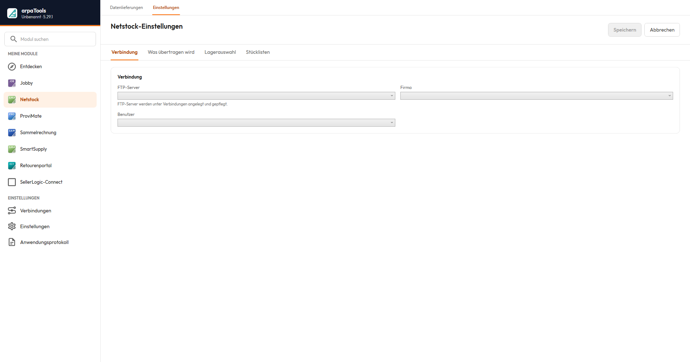
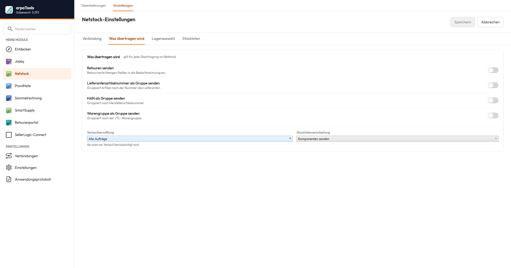
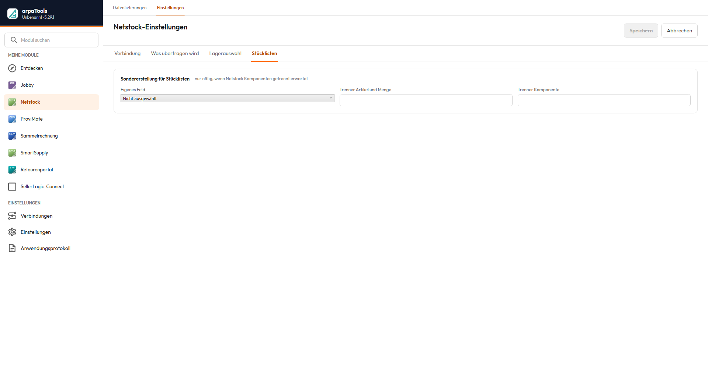

# Dokumentation arpaTools Netstock

## Einleitung

Netstock ist eine App im arpaTools Client und verbindet Ihre JTL-Wawi mit dem externen
Bestandsplanungssystem Netstock. Netstock berechnet auf Basis Ihrer Artikel-, Bestands- und
Verkaufsdaten Bedarfs- und Bestellvorschläge. arpaTools übernimmt dabei den Datenaustausch in beide
Richtungen:

- **Senden:** arpaTools exportiert Artikel-, Bestands-, Verkaufs- und weitere Daten aus JTL-Wawi und
  lädt sie per FTP zu Netstock hoch.
- **Empfangen:** arpaTools lädt die von Netstock berechneten Bestellvorschläge per FTP herunter und
  kann sie wahlweise in die JTL-Einkaufsliste oder direkt als Lieferantenbestellung importieren.

Der Datenaustausch lässt sich manuell über die Netstock-Ansicht anstoßen oder automatisiert über eine
Jobby-Aktion (siehe [Jobby-Dokumentation](/doku/jobby), Abschnitt „Netstock"). Für automatisierte Abläufe
empfehlen wir die Jobby-Aktion. Die Ansicht gliedert sich in **Datenlieferungen** (Tabelle und Versand)
und **Einstellungen**.

① Herunterladen — ruft Bestellvorschläge von Netstock ab (siehe „Daten empfangen"). ② Alles senden —
überträgt sämtliche Datenpakete der Tabelle. ③ Auswahl senden — überträgt nur die markierten Zeilen.
④ Stammdaten senden — Schnellzugriff für die Gruppe Stammdaten. ⑤ Verkauf & Verbrauch senden —
Schnellzugriff für die Bewegungsdaten.

## Voraussetzungen

- Eine FTP-Verbindung zu Netstock, eingerichtet unter Verbindungen (siehe
  [Jobby-Dokumentation](/doku/jobby), Abschnitt „Verbindungen", Registerkarte FTP-Server). Die
  Zugangsdaten erhalten Sie von Netstock.
- Eine gültige Netstock-Lizenz in arpaTools.

## Daten senden

Die Tabelle in **Datenlieferungen** listet alle Datenpakete, gruppiert nach Stammdaten, Bestände und
Bewegungsdaten. Je Paket zeigt sie, ob es benötigt, gewünscht oder optional ist, den aktuellen Zustand
und wann es zuletzt gesendet wurde. Folgende Datenpakete stehen zur Verfügung:

| Datenpaket | Beschreibung |
|---|---|
| Lager/Filialen | Stammdaten Ihrer Lager. |
| Lieferanten | Ihre Lieferantenstammdaten. |
| Artikelstamm | Artikel-Stammdaten. |
| Bestand je Lagerort | Aktueller Lagerbestand, aufgeschlüsselt je Lager. |
| Chargen | Chargeninformationen. |
| Artikelgruppen | Ihre Warengruppen. |
| Verkauf & Verbrauch | Verkaufs- und Verbrauchsdaten als Grundlage der Bedarfsplanung. |
| Offene Lieferanten- oder Produktionsbestellungen | Noch nicht abgeschlossene Bestellungen. |
| Offene Kundenbestellungen | Noch nicht abgeschlossene Kundenaufträge. |
| Offene Artikeltransfers | Umlagerungen zwischen Lagern, die noch nicht abgeschlossen sind. |
| Abgeschlossene Einkaufsbestellungen | Historische Einkaufsbestellungen. |
| Meta Daten ('Trigger'-File) | Steuerdatei, die Netstock signalisiert, dass ein Übertragungslauf abgeschlossen ist. Wird immer zuletzt gesendet. |
| Stücklisten | Stücklisteninformationen. |

Die Tabelle zeigt aktuell 13 Datenpakete (siehe Zähler „Nie gesendet" im Screenshot). Zwei zuvor
dokumentierte Pakete, Nachfolgeartikel und Zusätzliche Daten/Optionale Felder, erscheinen darin nicht
mehr.

> nur in diesem Profil (ohne eingerichtete Firma) nicht angezeigt werden.

Markieren Sie eine oder mehrere Zeilen und klicken Sie auf **Auswahl senden**, um genau diese Pakete zu
übertragen. Für die üblichen Fälle stehen zusätzlich Schnellzugriffe bereit, die eine ganze Gruppe in
einem Schritt senden: **Stammdaten senden** für die Gruppe Stammdaten und **Verkauf & Verbrauch
senden** für die Bewegungsdaten. **Alles senden** überträgt sämtliche Pakete der Tabelle.

> senden" ist nicht bestätigt; vermutlich der Zeitraum der übertragenen Verkaufsdaten.

## Daten empfangen

Am oberen Rand von **Datenlieferungen** stehen drei Schaltflächen für die von Netstock berechneten
Bestellvorschläge:

- **Herunterladen:** lädt die Datei nur in ein Zielverzeichnis herunter, ohne sie weiter zu verarbeiten.
- **Auf Einkaufsliste:** importiert die Bestellvorschläge direkt in die JTL-Einkaufsliste.
- **Als Lieferantenbestellung:** importiert die Bestellvorschläge über JTL-Ameise direkt als Lieferantenbestellung.

## Einstellungen

Die Netstock-Einstellungen gliedern sich in vier Registerkarten: **Verbindung**, **Was übertragen
wird**, **Lagerauswahl** und **Stücklisten**.

Auf **Verbindung** legen Sie fest, welcher FTP-Server (siehe [Jobby-Dokumentation](/doku/jobby),
Abschnitt „Verbindungen"), welche Firma und welcher Benutzer für den Datenaustausch verwendet werden.

Auf **Was übertragen wird**:

- **Retouren senden:** retournierte Mengen fließen in die Bedarfsrechnung ein.
- **Lieferantenartikelnummer als Gruppe senden:** gruppiert Artikel nach der Nummer des Lieferanten.
- **HAN als Gruppe senden:** gruppiert nach der Herstellerartikelnummer.
- **Warengruppe als Gruppe senden:** gruppiert nach der JTL-Warengruppe.
- **Verkaufsermittlung:** ab wann ein Verkauf berücksichtigt wird, z. B. **Alle Aufträge**.
- **Stücklistenverarbeitung:** z. B. **Komponenten senden** (die einzelnen Bestandteile werden übertragen) statt die Stückliste als einen Artikel zu behandeln.

Auf **Lagerauswahl** wählen Sie je Lager, welchem Warenlager es zugeordnet ist, ob es Bestellvorschläge
erhält und in welcher Gruppe es steht, dazu optional eigene Warenlager für FBA EU und FBA GB.

Auf **Stücklisten** tragen Sie nur bei einer Sondererstellung ein eigenes Artikel-Feld ein, aus dem
Komponenten und Mengen gelesen werden, inklusive **Trenner Artikel und Menge** und **Trenner
Komponente** zur Aufteilung des Feldinhalts. Nötig ist das nur, wenn Netstock die Komponenten getrennt
erwartet.

## Automatisierung über Jobby

Für einen regelmäßigen, automatischen Datenaustausch richten Sie in Jobby einen Job mit der Aktion
**Netstock** ein. Die Aktion sendet die konfigurierten Datenpakete automatisch, zeitgesteuert über den
arpaTools Worker. Details zur Jobby-Aktion und zu den Grundlagen von Jobby in der
[Jobby-Dokumentation](/doku/jobby).

Für den Download-Weg richten Sie stattdessen einen Job mit den Aktionen **Download vom FTP-Server** und
**Auf Einkaufsliste schreiben** ein.

### Job auf Wunsch automatisch anlegen lassen

Sie müssen diese Jobs nicht von Hand erstellen. Nach einem manuellen Lauf in der Netstock-Ansicht fragt
arpaTools jeweils, ob der passende Jobby-Job automatisch angelegt werden soll, in **beide Richtungen**:

- **Nach dem Senden:** Sie werden gefragt, ob ein Sende-Job angelegt werden soll. Bei „Ja" entsteht ein
  Job mit der gebündelten Aktion **Netstock**, der Ihre Datenpakete künftig automatisch überträgt.
- **Nach dem Herunterladen:** Sie werden gefragt, ob ein Download-Job angelegt werden soll. Bei „Ja"
  entsteht ein Job mit den Aktionen **Download vom FTP-Server** und **Auf Einkaufsliste schreiben**.

Bestätigen Sie die Abfrage mit „Ja", legt arpaTools den Job an. Sie können ihn danach in Jobby prüfen und
den Zeitplan anpassen.

> **Hinweis:** Die automatische Anlage des Download-Jobs erstellt nur den Weg **auf die Einkaufsliste**.
> Möchten Sie die Bestellvorschläge stattdessen direkt **als Lieferantenbestellung** importieren, richten
> Sie diesen Job derzeit von Hand in Jobby ein.