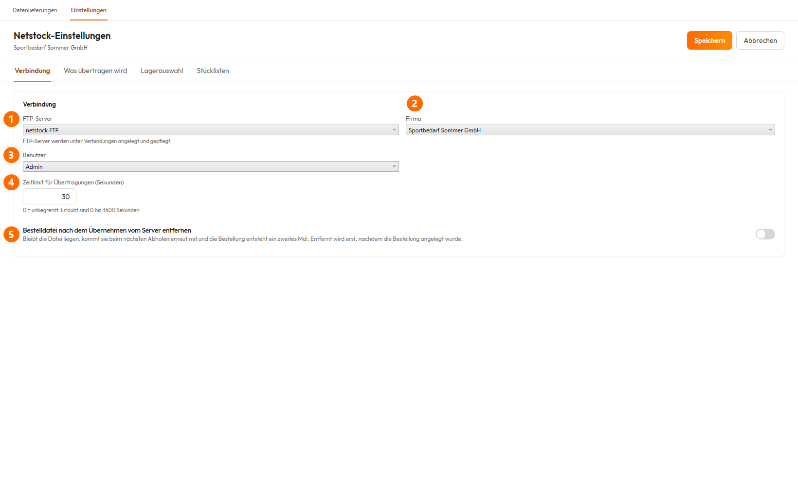
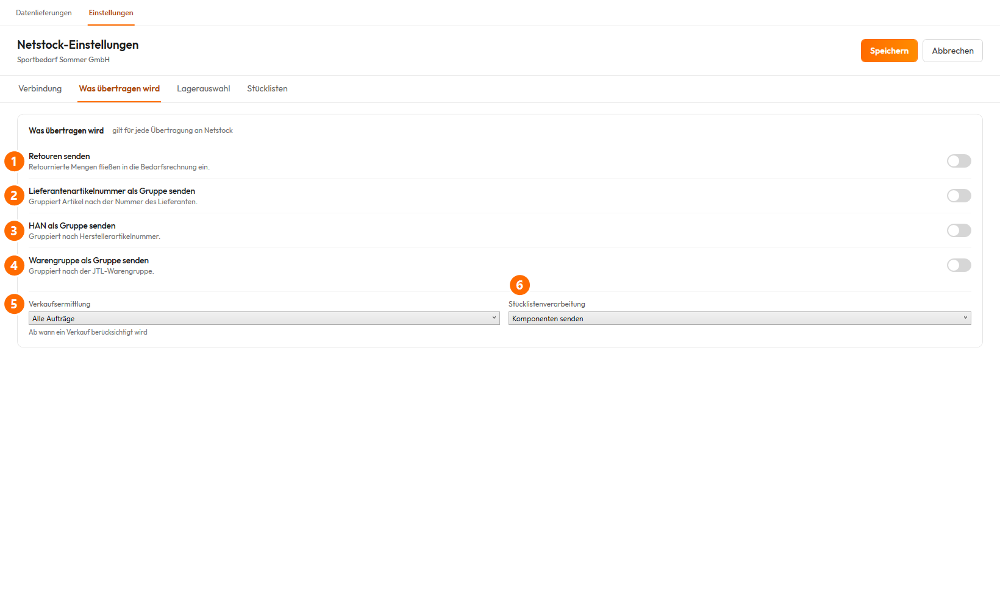
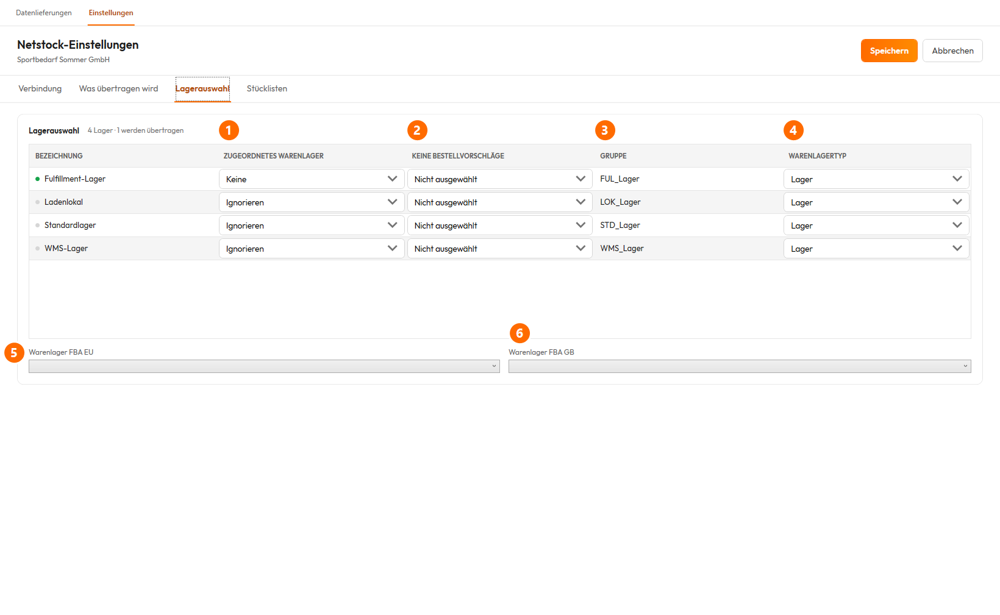
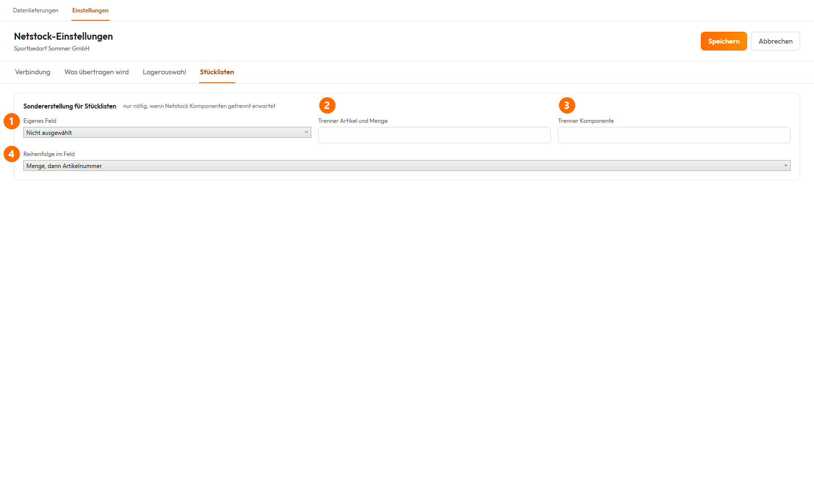

# Dokumentation arpaTools Netstock

## Einleitung

Netstock ist eine App im arpaTools Client und verbindet Ihre JTL-Wawi mit dem externen
Bestandsplanungssystem Netstock. Netstock berechnet auf Basis Ihrer Artikel-, Bestands- und
Verkaufsdaten Bedarfs- und Bestellvorschläge. arpaTools übernimmt dabei den Datenaustausch in beide
Richtungen:

- **Senden:** arpaTools exportiert Artikel-, Bestands-, Verkaufs- und weitere Daten aus JTL-Wawi und
  lädt sie per FTP zu Netstock hoch.
- **Empfangen:** arpaTools lädt die von Netstock berechneten Bestellvorschläge per FTP herunter und
  übernimmt sie wahlweise in die JTL-Einkaufsliste oder direkt als Lieferantenbestellung.

Der Datenaustausch lässt sich manuell in der Netstock-Ansicht anstoßen oder automatisiert über Jobby
(siehe [Automatisierung über Jobby](#automatisierung-über-jobby)). Für regelmäßige Abläufe empfehlen
wir Jobby. Die Ansicht hat zwei Reiter: **Datenlieferungen** mit der Tabelle und den Schaltflächen zum
Senden und Empfangen, und **Einstellungen**.

① **Herunterladen:** holt die Bestellvorschläge von Netstock und legt die Datei in einem Ordner ab.
② **Auf Einkaufsliste:** übernimmt die Bestellvorschläge in die JTL-Einkaufsliste.
③ **Als Lieferantenbestellung:** legt aus den Bestellvorschlägen Lieferantenbestellungen an.
④ **Alles senden:** überträgt sämtliche Datenpakete der Tabelle.
⑤ **Auswahl senden:** überträgt nur die markierten Zeilen. Die Schaltfläche wird aktiv, sobald Sie
mindestens eine Zeile markiert haben.
⑥ **Stammdaten senden:** Schnellzugriff für die Grunddaten, die Netstock zuerst braucht.
⑦ **Verkaufszeitraum in Monaten:** wie weit die übertragenen Verkäufe zurückreichen.
⑧ **Verkauf & Verbrauch senden:** Schnellzugriff für Verkäufe und Bestände.

Die einzelnen Punkte sind in den folgenden Abschnitten beschrieben.

## Voraussetzungen

Bevor die ersten Daten zu Netstock gehen, braucht es ein paar Dinge. Die ersten beiden klären Sie mit
Netstock, die übrigen richten Sie in arpaTools ein. Gehen Sie die Liste am besten der Reihe nach
durch, dann greift ein Schritt in den nächsten.

**Bei Netstock**

1. **Ein eigenes Netstock-Abonnement bei Netstock.** arpaTools ist die Schnittstelle und liefert die
   Daten, gerechnet und geplant wird bei Netstock selbst. Dafür brauchen Sie ein aktives Abonnement
   direkt bei Netstock. Unsere arpaTools-Lizenz für das Modul Netstock ersetzt es nicht, Sie brauchen
   beides. Informationen und Kontakt finden Sie auf der Website von Netstock:
   [www.netstock.com/de](https://www.netstock.com/de/).
2. **FTP-Zugangsdaten von Netstock.** Über diesen Zugang tauschen arpaTools und Netstock die Dateien
   aus. Die Zugangsdaten bekommen Sie von Netstock. Für arpaTools brauchen Sie daraus den Server, den
   Port, den Benutzernamen, das Passwort und die Angabe, ob FTP oder SFTP verwendet wird. Fehlt Ihnen
   davon etwas, fragen Sie bei Netstock am besten gleich nach.

**In arpaTools**

3. **Den FTP-Zugang anlegen.** Tragen Sie die Zugangsdaten von Netstock einmal unter **Verbindungen**
   ein. Wie das geht, steht Schritt für Schritt unter
   [FTP-Zugang anlegen](/doku/arpatools#ftp-zugang-anlegen). Testen Sie den Zugang dort gleich mit
   **Prüfen**, dann wissen Sie sicher, dass die Verbindung steht.
4. **Den Zugang mit Netstock verknüpfen.** Ein angelegter Zugang allein reicht noch nicht: Erst in den
   Netstock-Einstellungen legen Sie fest, dass Netstock genau diesen Zugang verwendet. Wählen Sie auf
   der Registerkarte [Verbindung](#verbindung) unter **FTP-Server** den eben angelegten Zugang aus,
   dazu **Firma** und **Benutzer**. Auf der Registerkarte [Lagerauswahl](#lagerauswahl) stellen Sie
   mindestens ein Lager auf etwas anderes als **Ignorieren**, denn ohne Lager hätte Netstock keinen
   Bestand zum Rechnen. Danach **Speichern**.
5. **Eine gültige arpaTools-Lizenz für das Modul Netstock.** Sie schaltet die Schnittstelle in
   arpaTools frei und kommt von uns, zusätzlich zu Ihrem Abonnement bei Netstock (siehe Punkt 1).

Solange FTP-Server, Firma oder Benutzer fehlen, zeigt **Datenlieferungen** den Hinweis „Netstock ist
noch nicht eingerichtet. Hinterlegen Sie in den Moduleinstellungen einen FTP-Server, eine Firma und
einen Benutzer.", und alle Schaltflächen zum Senden und Empfangen bleiben inaktiv. Ist alles
eingerichtet, stehen unter der Überschrift die gewählte Firma und der FTP-Server.

Danach empfehlen wir, jeden Weg, den Sie nutzen möchten, einmal in der Netstock-Ansicht von Hand
auszuprobieren. arpaTools bietet Ihnen anschließend an, daraus einen Job anzulegen (siehe
[Job auf Wunsch automatisch anlegen lassen](#job-auf-wunsch-automatisch-anlegen-lassen)).

## Daten senden

### Kennzahlen

Über der Tabelle stehen drei Kennzahlen:

- **Letzte Übertragung:** wie lange die jüngste Übertragung zurückliegt, darunter Datum und Uhrzeit.
- **Veraltet:** wie viele Datenpakete älter als 7 Tage sind, gemessen an allen Paketen der Tabelle.
- **Nie gesendet:** wie viele Datenpakete noch nie übertragen wurden.

### Die Tabelle der Datenpakete

Die Tabelle listet alle Datenpakete, gruppiert nach Stammdaten, Bestände und Bewegungsdaten. Je Paket
zeigt sie:

- **Bedarf:** wie dringend Netstock das Paket braucht. **Benötigt** heißt, ohne das Paket kann Netstock
  nicht rechnen. **Erwünscht** heißt, Netstock rechnet damit genauer. **Optional** betrifft Daten, die
  nicht jede Installation hat.
- **Zustand:** **Aktuell**, **Veraltet** (älter als 7 Tage) oder **Nie gesendet**.
- **Alter in Tagen** und **Zuletzt gesendet** mit Datum und Uhrzeit.

Über das Filtersymbol im Spaltenkopf grenzen Sie die Tabelle ein, etwa auf alle veralteten Pakete.

| Gruppe | Datenpaket | Bedarf | Beschreibung |
|---|---|---|---|
| Stammdaten | Lager/Filialen | Benötigt | Stammdaten Ihrer Lager. |
| Stammdaten | Lieferanten | Benötigt | Ihre Lieferantenstammdaten, dazu der Sammeleintrag **Setartikel**. |
| Stammdaten | Artikelstamm | Benötigt | Artikel-Stammdaten. |
| Stammdaten | Artikelgruppen | Benötigt | Ihre Warengruppen. |
| Stammdaten | Meta Daten ('Trigger'-File) | Benötigt | Steuerdatei, die Netstock signalisiert, dass ein Übertragungslauf abgeschlossen ist. Ist sie dabei, geht sie immer als letzte Datei hinaus. |
| Stammdaten | Stücklisten | Optional | Stücklisteninformationen. |
| Bestände | Bestand je Lagerort | Benötigt | Aktueller Lagerbestand, aufgeschlüsselt je Lager. |
| Bestände | Chargen | Optional | Chargeninformationen. |
| Bewegungsdaten | Verkauf & Verbrauch | Benötigt | Verkaufs- und Verbrauchsdaten als Grundlage der Bedarfsplanung. |
| Bewegungsdaten | Offene Lieferanten- oder Produktionsbestellungen | Benötigt | Noch nicht abgeschlossene Bestellungen. |
| Bewegungsdaten | Offene Kundenbestellungen | Erwünscht | Noch nicht abgeschlossene Kundenaufträge. |
| Bewegungsdaten | Offene Artikeltransfers | Optional | Umlagerungen zwischen Lagern, die noch nicht abgeschlossen sind. |
| Bewegungsdaten | Abgeschlossene Einkaufsbestellungen | Erwünscht | Historische Einkaufsbestellungen. |

### Der Lieferant „Setartikel"

Stücklistenartikel haben in JTL-Wawi keinen Lieferanten. Damit sie sich in Netstock trotzdem
auswerten lassen, sendet arpaTools sie gesammelt unter dem Lieferanten **Setartikel** mit. Artikel,
die keine Stückliste sind und für die kein Standardlieferant hinterlegt ist, werden diesem
Lieferanten **nicht** zugeordnet und erscheinen in Netstock ohne Lieferantenstammsatz.

### Senden

Sie haben vier Wege, Daten zu übertragen:

- **Auswahl senden** ⑤ überträgt genau die Zeilen, die Sie in der Tabelle markiert haben. Mehrere
  Zeilen markieren Sie mit gedrückter Strg- oder Umschalttaste.
- **Stammdaten senden** ⑥ überträgt Lager/Filialen, Lieferanten, Artikelstamm und Meta Daten.
  Artikelgruppen und Stücklisten gehören nicht dazu, obwohl sie in der Gruppe Stammdaten stehen.
- **Verkauf & Verbrauch senden** ⑧ überträgt Verkauf & Verbrauch, Bestand je Lagerort und Meta Daten.
- **Alles senden** ④ überträgt alle 13 Datenpakete.

Nach dem Senden liest die Ansicht die Tabelle neu ein, Zustand und Zeitpunkt zeigen also sofort, was
gerade übertragen wurde.

### Verkaufszeitraum

Das Feld **Verkaufszeitraum in Monaten** ⑦ legt fest, wie weit die übertragenen Verkäufe
zurückreichen. Es gilt nur für **Verkauf & Verbrauch senden**. Erlaubt sind 1 bis 60 Monate. Bleibt
das Feld leer, sendet arpaTools den Standardzeitraum von 2 Monaten, ebenso bei allen anderen Wegen.

Gezählt wird ab dem Ersten des laufenden Monats: Der Wert 2 überträgt die beiden abgeschlossenen
Vormonate und den laufenden Monat. Maßgeblich ist dabei das Rechnungs- beziehungsweise Versanddatum,
nicht das Datum der Auftragserfassung, denn genau danach ordnet Netstock die Mengen den Monaten zu.
Ein Auftrag, der im Januar erfasst und im März ausgeliefert wurde, zählt also zum März.

## Daten empfangen

Oben rechts in **Datenlieferungen** stehen drei Schaltflächen für die von Netstock berechneten
Bestellvorschläge:

- **Herunterladen** ①: arpaTools fragt nach einem Zielordner und legt die Datei dort ab, ohne sie
  weiter zu verarbeiten.
- **Auf Einkaufsliste** ②: importiert die Bestellvorschläge direkt in die JTL-Einkaufsliste.
- **Als Lieferantenbestellung** ③: importiert die Bestellvorschläge über JTL-Ameise direkt als
  Lieferantenbestellung.

### Bestellvorschläge zeitgesteuert übernehmen

Alle drei Wege lassen sich als Job einrichten, damit sie ohne Zutun laufen. Nach einem erfolgreichen
Lauf über die Schaltfläche bietet arpaTools an, den passenden Job selbst anzulegen (siehe
[Job auf Wunsch automatisch anlegen lassen](#job-auf-wunsch-automatisch-anlegen-lassen)).

Von Hand fügen Sie für den Weg **Als Lieferantenbestellung** in Jobby die Aktion
**Netstock: Lieferantenbestellung** hinzu. Sie holt die Bestellvorschläge selbst ab und legt sie an.
Einzustellen ist nichts, denn Zugang und Zuordnung stehen in den Netstock-Einstellungen.

Für diesen Weg ist die eigene Aktion nötig. Netstock schreibt Lieferant und Lager als Schlüssel in die
Datei, nicht als Namen. Wer die Datei stattdessen über eine allgemeine Ameise-Vorlage einliest,
bekommt dort keine Zuordnung zustande.

### Wenn dieselbe Bestellung zweimal ankommt

Eine abgeholte Datei bleibt auf dem Server liegen und kommt beim nächsten Abholen erneut mit. Wer
zweimal übernimmt, hat die Bestellung zweimal in der Wawi.

Dagegen gibt es in den Netstock-Einstellungen auf der Registerkarte **Verbindung** den Schalter
**Bestelldatei nach dem Übernehmen vom Server entfernen**. Er ist zunächst aus, damit sich am
gewohnten Verhalten nichts ändert.

Eingeschaltet wird die Datei entfernt, sobald die Einkaufsliste oder die Lieferantenbestellung
geschrieben ist. Sie bleibt liegen, wenn dabei etwas schiefgeht, **und auch dann, wenn die Datei
keine verwertbare Zeile enthielt**. Sonst wäre die Bestellung weg, ohne dass etwas in der Wawi
angekommen ist.

Beim reinen **Herunterladen** greift der Schalter nicht: Dort ist die abgelegte Datei das Ergebnis,
und sie soll nicht verschwinden.

Der Schalter wirkt für die Schaltflächen **Auf Einkaufsliste** und **Als Lieferantenbestellung** und
für die Jobby-Aktion **Netstock: Lieferantenbestellung**. Für einen Job aus **Download von
FTP-Server** und **Einkaufsliste schreiben** gilt er nicht; dort entscheidet die Download-Aktion,
ob die Datei auf dem Server bleibt (siehe
[Bitte prüfen: Die angelegten Jobs sind Beispiele](#bitte-prüfen-die-angelegten-jobs-sind-beispiele)).

## Einstellungen

Die Netstock-Einstellungen öffnen Sie über den Reiter **Einstellungen** oben in der Ansicht. Sie
gliedern sich in vier Registerkarten: **Verbindung**, **Was übertragen wird**, **Lagerauswahl** und
**Stücklisten**. Änderungen auf allen vier Registerkarten übernimmt erst **Speichern**. **Abbrechen**
verwirft sie und zeigt wieder den gespeicherten Stand.

### Verbindung

① **FTP-Server:** der Zugang zu Netstock, also die Verknüpfung zwischen Netstock und dem FTP-Zugang,
den Sie unter **Verbindungen** angelegt haben. Die Liste zeigt alle dort angelegten Zugänge. Fehlt
Ihr Netstock-Zugang, legen Sie ihn zuerst an (siehe [FTP-Zugang anlegen](/doku/arpatools#ftp-zugang-anlegen))
und öffnen die Einstellungen danach erneut.
② **Firma:** die Firma, zu der die Lieferantenbestellungen angelegt werden.
③ **Benutzer:** der Wawi-Benutzer, der in den von arpaTools angelegten Daten eingetragen wird.
④ **Zeitlimit für Übertragungen (Sekunden):** wie lange arpaTools auf die Antwort einer einzelnen
Übertragungsabfrage wartet, bevor sie abgebrochen wird. Erlaubt sind Werte von 0 bis 3600 Sekunden,
Vorgabe ist 90. **0 bedeutet unbegrenzt.** Erhöhen Sie den Wert, wenn Übertragungen bei großen
Datenmengen mit einer Zeitüberschreitung abbrechen. Wer den Wert nie verändert hat, wird beim Update
von den früheren 30 Sekunden auf die 90 gehoben; ein selbst eingetragener Wert bleibt stehen.
⑤ **Bestelldatei nach dem Übernehmen vom Server entfernen:** verhindert, dass dieselbe Bestellung
zweimal angelegt wird (siehe [Wenn dieselbe Bestellung zweimal ankommt](#wenn-dieselbe-bestellung-zweimal-ankommt)).

### Was übertragen wird

Diese Einstellungen gelten für jede Übertragung an Netstock.

① **Retouren senden:** retournierte Mengen fließen in die Bedarfsrechnung ein.
② **Lieferantenartikelnummer als Gruppe senden:** gruppiert Artikel nach der Nummer des Lieferanten.
③ **HAN als Gruppe senden:** gruppiert nach der Herstellerartikelnummer.
④ **Warengruppe als Gruppe senden:** gruppiert nach der JTL-Warengruppe.
⑤ **Verkaufsermittlung:** ab wann ein Auftrag als Verkauf zählt.

- **Alle Aufträge:** jeder Auftrag.
- **Bezahlte Aufträge:** nur bezahlte Aufträge, dazu Aufträge mit einer Zahlungsart, die das
  Ausliefern vor der Zahlung erlaubt.
- **Gelieferte Aufträge:** nur ausgelieferte Aufträge.

⑥ **Stücklistenverarbeitung:** wie ein verkaufter Stücklistenartikel in die Verkaufsdaten eingeht.

- **Komponenten senden:** der Verkauf zählt für die einzelnen Bestandteile.
- **Stücklistenvater senden:** der Verkauf zählt für den Stücklistenartikel selbst.

### Lagerauswahl

Hier legen Sie je Lager fest, ob und wie es an Netstock geht. Die Zeile über der Tabelle zeigt, wie
viele Lager es gibt und wie viele davon übertragen werden. Ein grüner Punkt vor dem Namen markiert
ein Lager, das übertragen wird.

① **Zugeordnetes Warenlager:** was mit dem Lager geschieht.

- **Ignorieren:** das Lager wird nicht übertragen. Das ist die Vorgabe für jedes Lager, das Sie hier
  noch nicht eingestellt haben.
- **Keine:** das Lager geht als eigenes Lager an Netstock.
- **Ein anderes Lager:** Bestände, Chargen, Verkäufe, Bestellungen und Umlagerungen dieses Lagers
  werden dem gewählten Lager zugerechnet und dort zusammengefasst.

② **Keine Bestellvorschläge:** ein Eigenes Feld aus der Feldgruppe **Netstock** in JTL-Wawi. Artikel,
bei denen dieses Feld angehakt ist, meldet arpaTools für dieses Lager als nicht zu bestellen. Mit
**Nicht ausgewählt** gilt keine solche Einschränkung.
③ **Gruppe:** der Gruppenname, unter dem Netstock das Lager führt. Vorbelegt ist das Kürzel des Lagers
aus der Wawi.
④ **Warenlagertyp:** **Laden/Filiale**, **Lager** (Vorgabe) oder **Zentrallager**.
⑤ **Warenlager FBA EU** und ⑥ **Warenlager FBA GB:** die Lager, denen Verkäufe über Amazon FBA
zugerechnet werden. Nach Großbritannien versandte FBA-Verkäufe zählen für das Lager FBA GB, alle
übrigen für das Lager FBA EU. Zur Auswahl stehen nur FBA-Lager. FBA-Verkäufe werden nur übertragen,
wenn ein Warenlager FBA EU gewählt ist.

### Stücklisten

Diese Registerkarte brauchen Sie nur für eine Sondererstellung, wenn Netstock die Komponenten einer
Stückliste getrennt erwartet.

① **Eigenes Feld:** das Artikel-Feld, aus dem Komponenten und Mengen gelesen werden.
② **Trenner Artikel und Menge:** das Zeichen zwischen Artikelnummer und Menge.
③ **Trenner Komponente:** das Zeichen zwischen zwei Komponenten.
④ **Reihenfolge im Feld:** welcher der beiden Werte zuerst steht. Bei `10;MSU12002` steht die Menge
vorn (**Menge, dann Artikelnummer**), bei `MSU12002;10` die Artikelnummer (**Artikelnummer, dann
Menge**). Passt die Einstellung nicht zu Ihren gepflegten Werten, kommen falsche Mengen bei Netstock an
oder der Artikel wird übersprungen.

> **Hinweis:** Wer die Sondererstellung schon vor dem Update genutzt hat, findet die Einstellung
> danach auf **Menge, dann Artikelnummer**. Pflegen Sie Ihr Feld andersherum, stellen Sie einmalig um.

**Einträge, die nicht gelesen werden können, halten den Versand nicht auf.** Steht mitten im Feld ein
Trenner zu viel, fehlt eine Menge, steht dort statt einer Menge etwas anderes, oder gibt es eine der
genannten Artikelnummern in der Wawi nicht, wird dieser Artikel samt allen seinen Komponenten
übersprungen; die übrigen Stücklisten gehen normal an Netstock. Ein Trenner am Ende (`10;MSU12002|`)
ist dagegen unschädlich und wird einfach überlesen. Groß- und Kleinschreibung der Artikelnummer spielt
keine Rolle. Jeder übersprungene Artikel steht mit Artikelnummer, Komponente und Feldinhalt im
**Anwendungsprotokoll**, sodass Sie die betroffenen Stellen gezielt nacharbeiten können.

## Automatisierung über Jobby

Für einen regelmäßigen, automatischen Datenaustausch richten Sie in Jobby einen Job ein. Die Jobs
laufen zeitgesteuert über den arpaTools Worker. Details zu den Aktionen und zu den Grundlagen von
Jobby stehen in der [Jobby-Dokumentation](/doku/jobby).

| Zweck | Aktionen im Job |
|---|---|
| Daten an Netstock senden | **Netstock** |
| Bestellvorschläge als Lieferantenbestellung übernehmen | **Netstock: Lieferantenbestellung** |
| Bestellvorschläge auf die Einkaufsliste übernehmen | **Download von FTP-Server**, dann **Einkaufsliste schreiben** |
| Bestellvorschläge nur in einem Ordner ablegen | **Download von FTP-Server**, dann **Daten in Verzeichnis speichern** |

### Job auf Wunsch automatisch anlegen lassen

Sie müssen diese Jobs nicht von Hand erstellen. Am einfachsten geht es so: Probieren Sie den
gewünschten Weg zuerst einmal in der Netstock-Ansicht aus, zum Beispiel mit **Alles senden** oder mit
**Auf Einkaufsliste**. War der Lauf erfolgreich, fragt arpaTools im Fenster „Interaktion notwendig":

> Die Aktion können Sie mit Jobby auch automatisieren? Soll ein Beispieljob angelegt werden?

Mit **Ja** legt arpaTools den passenden Job in Jobby an, je nach Schaltfläche einen dieser Jobs:

| Schaltfläche | Angelegter Job | Aktionen |
|---|---|---|
| eine der vier Senden-Schaltflächen | Netstock Upload-Job (automatisch angelegt) | **Netstock** |
| **Herunterladen** | Netstock Download-Job (automatisch angelegt) | **Download von FTP-Server**, dann **Daten in Verzeichnis speichern** in den gewählten Ordner |
| **Auf Einkaufsliste** | Netstock Einkaufsliste-Job (automatisch angelegt) | **Download von FTP-Server**, dann **Einkaufsliste schreiben** |
| **Als Lieferantenbestellung** | Netstock Lieferantenbestellung-Job (automatisch angelegt) | **Netstock: Lieferantenbestellung** |

Eine Bestätigung erscheint danach nicht. Den neuen Job finden Sie in Jobby unter **Jobs**, erkennbar
am Zusatz „(automatisch angelegt)" im Namen.

Gibt es den passenden Job schon, fragt arpaTools nicht erneut. Nach einem fehlgeschlagenen Lauf
fragt es ebenfalls nicht.

Mit **Nicht erneut fragen** im Fragefenster blenden Sie die Frage dauerhaft aus. Das gilt getrennt für
das Senden und für das Abholen, beim Abholen aber für alle drei Schaltflächen gemeinsam.

### Bitte prüfen: Die angelegten Jobs sind Beispiele

Ein Job, den arpaTools auf diese Weise anlegt, ist ein Beispiel. Er ist ein guter Startpunkt, aber
noch nicht Ihr fertiger Ablauf: Er bildet den Weg in seiner einfachsten Form ab und kennt die
Besonderheiten Ihres Betriebs nicht. Es ist deshalb nicht sichergestellt, dass er von Anfang an genau
so läuft, wie Sie es brauchen.

Nehmen Sie sich nach dem Anlegen bitte ein paar Minuten Zeit:

1. **Ansehen:** Öffnen Sie den Job in Jobby und gehen Sie seine Aktionen durch. Worauf es je Job
   ankommt, steht in der Liste unten.
2. **Anpassen:** Stellen Sie Aktionen und Zeitplan auf Ihre Bedürfnisse ein.
3. **Einmal zur Probe ausführen:** Starten Sie den Job in Jobby mit **Starten** und sehen Sie sich das
   Ergebnis an, im **Verlauf** und dort, wo die Daten ankommen sollen: bei Netstock, auf der
   Einkaufsliste oder bei den Lieferantenbestellungen.

Diesen Probelauf empfehlen wir jedem Kunden einmal, auch wenn der Lauf über die Schaltfläche geklappt
hat. Der Job arbeitet mit eigenen Einstellungen, nicht mit denen der Schaltfläche.

**Gut zu wissen:** Der Job ist gleich nach dem Anlegen aktiv und auf einen täglichen Lauf in der
Nacht eingestellt. Ist der arpaTools Worker eingerichtet, folgt der erste Lauf meist schon kurz nach
dem Anlegen. Sehen Sie sich den Job deshalb am besten direkt im Anschluss an.

Upload-, Einkaufsliste- und Download-Job übernehmen den FTP-Zugang beim Anlegen fest aus den
Netstock-Einstellungen. Wählen Sie dort später einen anderen Zugang, stellen Sie ihn auch in den
Aktionen dieser Jobs um.

Worauf es je Job ankommt:

- **Netstock Upload-Job:** Er bringt eigene, feste Einstellungen mit. Was Sie auf den Registerkarten
  **Lagerauswahl** und **Was übertragen wird** eingestellt haben, gilt für ihn nicht; nur die Felder
  **Warenlager FBA EU** und **Warenlager FBA GB** übernimmt er. Er überträgt nur das erste Lager Ihrer
  Wawi, die Verkäufe der letzten zwei Monate samt laufendem Monat und nur einen Teil der
  Datenpakete: Chargen, offene Kundenbestellungen, offene Artikeltransfers und abgeschlossene
  Einkaufsbestellungen fehlen. Stücklisten gehen mit dem Artikelstamm mit, sobald Ihre Wawi aktive
  Stücklisten hat, und folgen dabei der Registerkarte **Stücklisten**. Dazu stehen Retouren auf aus,
  die Verkaufsermittlung auf **Alle Aufträge**, die Stücklistenverarbeitung auf **Komponenten senden**
  und alle Gruppierungen auf aus. Öffnen Sie im Job die Aktion **Netstock** und stellen Sie
  Datenpakete, Lager und Optionen so ein, wie Sie es für Netstock brauchen.
- **Netstock Einkaufsliste-Job:** Hier sind zwei Punkte besonders wichtig.
  - *Aufbau der Datei:* Die Aktion **Einkaufsliste schreiben** muss zum Aufbau der Datei von Netstock
    passen. Die Schaltfläche **Auf Einkaufsliste** liest sie so: **Startzeile** 2, denn die erste Zeile
    ist eine Kopfzeile, **Identifizierungsart** **Artikelnummer**, **Identifizierung** Spalte 7 und
    **Menge** Spalte 9. Vergleichen Sie diese Werte mit der Aktion im Job und tragen Sie sie dort ein,
    wo sie abweichen.
  - *Doppelte Einträge:* Die Aktion **Download von FTP-Server** lässt die Dateien auf dem Server
    liegen, und der Schalter **Bestelldatei nach dem Übernehmen vom Server entfernen** gilt für diesen
    Job nicht. Jeder Lauf liest deshalb alle Bestelldateien, die noch auf dem Server liegen, und trägt
    sie erneut in die Einkaufsliste ein. Legen Sie in der Download-Aktion unter **Verarbeitung** fest,
    dass die Dateien nach dem Download gelöscht werden, oder sorgen Sie auf andere Weise dafür, dass
    jede Datei nur einmal übernommen wird. Beachten Sie beim Löschen: Die Datei ist dann schon vom
    Server entfernt, bevor die Einkaufsliste geschrieben ist.
- **Netstock Download-Job:** Er legt die Dateien in dem Ordner ab, den Sie beim Herunterladen gewählt
  haben, und überschreibt dort Dateien gleichen Namens. Auch hier bleiben die Dateien auf dem Server,
  jeder Lauf holt sie also erneut. Prüfen Sie, ob Ordner und Verhalten zu Ihrem Ablauf passen.
- **Netstock Lieferantenbestellung-Job:** Er nutzt Zugang, Firma und Benutzer aus den
  Netstock-Einstellungen. Prüfen Sie gleich nach dem Anlegen den Schalter **Bestelldatei nach dem
  Übernehmen vom Server entfernen**. Ist er aus, legt der Job bei jedem Lauf auch die Bestellungen
  erneut an, deren Datei noch auf dem Server liegt, beim ersten Lauf also womöglich genau die, die Sie
  eben von Hand übernommen haben (siehe
  [Wenn dieselbe Bestellung zweimal ankommt](#wenn-dieselbe-bestellung-zweimal-ankommt)).