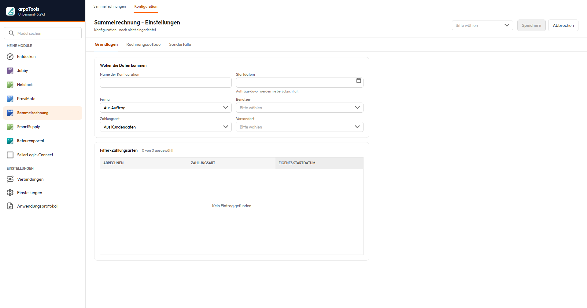
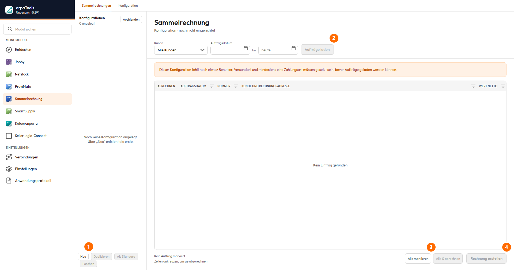

# Dokumentation arpaTools Sammelrechnung

Mit arpaTools Sammelrechnung erstellen Sie per Klick oder automatisiert Sammelrechnungen für JTL-Wawi.
Sammelrechnung ist eine App im arpaTools Client.

## Installation

Voraussetzungen:
- JTL-Wawi (ab Version 1.6.38.1)
- arpaTools Installationspaket
- eine gültige Lizenz
- Datenbank-Verbindungsparameter
- Port 21500 TCP in der Firewall freigegeben
- installiertes .NET Framework 4.8.1

Nach dem Kauf erhalten Sie eine E-Mail mit dem Downloadpaket und einem Lizenzschlüssel. Der
Lizenzschlüssel ist nur in Verbindung mit der bei der Bestellung angegebenen Mailadresse gültig. Je
Mandant wird eine eigene Lizenz benötigt; für einen weiteren Mandanten wird arpaTools in ein weiteres
Verzeichnis entpackt.

## Konfiguration

Starten Sie den arpaTools Client und öffnen Sie die App Sammelrechnung. Beim ersten Start bestätigen
Sie die Lizenzbestimmungen. Anschließend konfigurieren Sie die App für den laufenden Betrieb.

### Datenbankeinstellungen

Öffnen Sie oben rechts **Einstellungen** und den Menüpunkt **Datenbank**.

- **Server:** Pfad zum Datenbankserver. Gehostet: `Host\Instanzname` (z. B. `localhost\JTLWAWI`). Lokal oder im Netzwerk: `Host\Instanzname,Port` (z. B. `xxxx.private.ecomdata.cloud\JTLWAWI,50000`).
- **Benutzername:** Datenbankbenutzer mit Lese- und Schreibrechten.
- **Passwort:** das zugehörige Passwort.

Klicken Sie auf **Mandanten laden**, wählen Sie im Dropdown **Datenbank** eine Datenbank, prüfen Sie
mit **Einstellungen prüfen** und bestätigen Sie mit **Speichern**.

### Lizenz

Unter **Einstellungen** und **Lizenz** tragen Sie **Lizenz-Mailadresse** (die Mailadresse aus der
Bestellung) und **Lizenzschlüssel** ein. Schlägt **Lizenz prüfen** fehl, prüfen Sie zuerst, ob Port
21500 in der Firewall freigegeben ist.

### Programmeinstellungen

Unter **Konfiguration**, Registerkarte **Grundlagen**:

- **Startdatum verwenden:** legt fest, ab welchem Zeitpunkt Sammelrechnung beginnt. Setzen Sie dieses Datum, wenn Sie von einer anderen Abrechnungsart umsteigen.
- **Zahlungsart:** hat mehrere Auswirkungen:
  - wird zur Erstellung der Sammelrechnung verwendet,
  - für kundenabhängig unterschiedliche Zahlungsarten wählen Sie „Aus Kundendaten" und hinterlegen die Zahlungsart je Kunde,
  - nach Erstellung werden alle zusammengefassten Aufträge als bezahlt markiert (Zahlart aus der Konfiguration), jede Zahlung erhält die Anmerkung „Abgerechnet über Sammelrechnung <Rechnungsnummer>",
  - abgerechnete Aufträge gelten als extern abgerechnet; für sie kann keine Rechnung mehr erzeugt werden.

### Versandart

Bei der Erstellung wird in JTL-Wawi ein Sammelauftrag und eine Sammelrechnung angelegt. Die im Dropdown
gewählte **Versandart** wird den neuen Vorgängen zugewiesen.

### Benutzer

Der im Dropdown gewählte **Benutzer** wird den neu erstellten Vorgängen zugewiesen.

### Firma

Die im Dropdown gewählte **Firma** wird den neuen Vorgängen zugewiesen. Mit der Option **Firma aus
Auftrag** wird die Firma aus den Ursprungsaufträgen übernommen.

> Beachten Sie: „Firma aus Auftrag" funktioniert nur korrekt, wenn alle Ursprungsaufträge dieselbe Firma haben. Andernfalls wird pro Firma eine eigene Sammelrechnung erstellt.

### Positionsnamen bearbeiten

Steuert die Positionsbezeichnungen in der Sammelrechnung. Auswahl:
- Nein
- Ja, Auftrag und Retoure
- Ja, nur Auftrag
- Ja, nur Retoure

Die Inhalte beziehen sich auf den Ursprungsauftrag. Für die Bezeichnung stehen zur Verfügung:
Auftragsnummer, Auftragsdatum, Positionsnummer, Artikelnummer, Positionsname, alle eigenen Felder des
Auftrags, Freitext. Ein Doppelklick auf das jeweilige Feld fügt die Variable an der Cursorposition ein.

### Versandposition übernehmen

„Nein" überträgt die Versandkostenposition nicht in die Sammelrechnung. „Ja" übernimmt die Versandkosten
des ursprünglichen Auftrags.

### Lieferungen abrechnen

„Ja" verrechnet den Preis der Versandkosten des Ursprungsauftrags mit der Anzahl der Sendungen (Pakete).

### Retouren verarbeiten

Aufträge, die nach Erstellung einer Sammelrechnung retourniert wurden, werden bei der nächsten
Sammelrechnung berücksichtigt und zum Abzug gebracht. Da es für einen Ursprungsauftrag keine Rechnung
gibt, kann keine Rechnungskorrektur angelegt werden. Damit dennoch erstattet werden kann, werden die
Retourenpositionen zum Ursprungsauftrag in der Sammelrechnung abgezogen. Das sorgt für einen sauberen
buchhalterischen Prozess.

### Retourenstatus

Im Feld **Retourenstatus** legen Sie fest, in welchem Status eine Retoure sein muss, um in der nächsten
Sammelrechnung erfasst zu werden.

> Tipp: Legen Sie mehrere Retourenstatus an, um zu unterscheiden, ob eine Retoure abgezogen werden soll. Retouren, die erstattet werden sollen, erhalten den in der Konfiguration hinterlegten Status; alle anderen bleiben unberücksichtigt. Den Status können Sie jederzeit ändern.

### Rechnung erstellen

Legt global fest, ob beim Erstellen eines Sammelrechnungsauftrags sofort eine Rechnung erzeugt wird,
ohne JTL-Workflow.

### Abrechnungsart

Wie detailliert die Sammelrechnungsaufträge erstellt werden:
- **Positionen auflisten** (Standard): jede einzelne Position mit Menge erscheint in der Sammelrechnung.
- **Aufträge abrechnen:** nur die Kosten je versendetem Auftrag werden aufgenommen.
- **Einzelaufstellung als CSV-Datei:** im Sammelrechnungsauftrag erscheint nur eine Position, und es wird eine CSV-Datei mit der Auftragsnummer als Dateinamen erzeugt. Ablage: `%AppData%\arpaTools\Sammelrechnung\Profile1\Export`. Bei mehreren Profilen ist der Profilname im Pfad anzupassen.

Da die CSV die Auftragsnummer als Namen trägt, kann sie über einen JTL-Workflow per Mail versendet
werden. Beispielpfad für den Anhang:
`C:\Users\<Benutzer>\AppData\Roaming\arpaTools\Sammelrechnung\Profile1\Export\{{ Vorgang.Stammdaten.Auftragsnummer }}.csv`.
`{{ Vorgang.Stammdaten.Auftragsnummer }}` ist die DotLiquid-Variable der Auftragsnummer.

### Unteroption „Kostenfreie Positionen"

Optionen: Auflisten (Standard) oder Nicht auflisten. Nur aktiv, wenn die Abrechnungsart
„Einzelaufstellung als CSV" gewählt ist. Steuert, ob Positionen mit einem Betrag von 0 € in der
CSV-Datei erscheinen.

### Ohne Versand abgeschlossene Aufträge

Aufträge, die ohne Versand abgeschlossen sind, können optional mit abgerechnet werden.

> Vorsicht: Wenn Sie bei Abrechnen „Alle" wählen, werden alle ohne Versand abgeschlossenen Aufträge aufgeführt, für die keine Rechnung erstellt wurde und die auf die Zahlungsfilter passen. Im Zweifel nur eingeschränkt abrechnen und das aktuelle Datum einstellen.

### Filter-Zahlungsarten

Die ausgewählten Zahlungsarten werden zur Suche der Aufträge herangezogen. Die JTL-Option „Auslieferung
vor Zahlungseingang möglich" muss aktiviert sein. Optional kann jede Zahlungsart ab einem bestimmten
Datum aktiviert werden, sodass ältere Aufträge nicht abgerechnet werden.

**Auslieferung vor Zahlungseingang möglich:** ermöglicht in JTL-Wawi den Versand nicht bezahlter
Aufträge. In JTL-Wawi unter Zahlungen und Zahlungsarten eine Zahlungsart (z. B. „Sammelrechnung")
anlegen und die Option aktivieren.

> Es werden nur Zahlungsarten mit der Option „Auslieferung vor Zahlungseingang möglich" angezeigt und verwendet.

## Eigene Felder

Für den Betrieb werden eigene Felder für Aufträge und Kunden angelegt.

### Eigenes Feld im Kundenstamm

**arpa_intervall:** legt je Kunde fest, in welchem Intervall automatisch Sammelrechnungen erzeugt werden.
Verfügbare Intervalle:
- Manuell (keine automatische Erzeugung)
- Täglich
- Jeden Freitag
- 10. des Monats
- 20. des Monats
- Ende des Monats

Die automatische Erzeugung übernimmt heute die **Jobby-Aktion Sammelrechnung** (siehe
[Jobby-Dokumentation](/doku/jobby)). Sie prüft je Kunde das eingestellte Intervall und erzeugt fällige
Sammelrechnungen. Ein separater Aufruf einer eigenständigen Anwendung ist dafür nicht mehr nötig.

> Tipp: Über die Oberfläche lassen sich Sammelrechnungen jederzeit und ohne Rücksicht auf das Intervall erzeugen.

### Eigenes Feld im Auftrag

- **arpa_rechnungsnummer:** nach Erzeugen einer Sammelrechnung wird in allen Ursprungsaufträgen die Rechnungsnummer der Sammelrechnung hinterlegt. Ist das Feld gefüllt, wird der Auftrag bei neuen Sammelrechnungen nicht mehr berücksichtigt. Leeren Sie das Feld, wird er wieder berücksichtigt.
- **arpa_ist_sammelrechnung:** Checkbox, die gesetzt wird, wenn es sich um eine Sammelrechnung handelt.

## Plattform Sammelrechnung

Nach der Installation wird eine Plattform namens `arpa_Sammelrechnung` angelegt. Über sie finden Sie
Sammelaufträge und Sammelrechnungen schnell wieder und können in der JTL-Statistik danach filtern.

## Programmablauf

Öffnen Sie die App Sammelrechnung. Links zeigt **Konfigurationen**, wie viele Konfigurationen angelegt
sind; über **Neu** entsteht die erste, **Duplizieren** übernimmt eine bestehende als Vorlage,
**Als Standard** legt die Vorauswahl fest, **Löschen** entfernt eine Konfiguration.

Standardmäßig ist im Dropdown **Alle Kunden** gewählt; angezeigt werden alle Kunden mit der in der
Konfiguration festgelegten Zahlungsart. Für einen bestimmten Kunden wählen Sie diesen aus. Sie können
die Aufträge zusätzlich auf einen Zeitraum begrenzen; ein konfiguriertes Startdatum wird übernommen.
Klicken Sie auf **Aufträge laden**.

- **Alle markieren:** markiert alle angezeigten Aufträge.
- **Rechnung erstellen:** erstellt Sammelrechnungen für die markierten Aufträge.

> nicht bestätigt; vermutlich ein Schnellweg, der markieren und erstellen in einem Schritt zusammenfasst.

In der Liste erscheinen alle Aufträge, die infrage kommen. Bedingungen: die konfigurierte Zahlungsart,
der Status **Verpackt und Versendet**, und das leere Feld `arpa_rechnungsnummer`. Andere Lieferstatus
(Teilgeliefert, Ausstehend, Lieferschein erstellt) werden nicht berücksichtigt.

Beim Erzeugen werden mehrere Schritte ausgeführt:
1. Alle Auftragspositionen der infrage kommenden Aufträge werden ermittelt.
2. Retouren zu früheren Aufträgen werden ermittelt (abhängig vom konfigurierten Retourenstatus).
3. Auftrags- und abzuziehende Retourenpositionen werden in einen neuen Auftrag zusammengefasst.
4. Der neue Auftrag erhält den Lieferstatus „Ohne Versand abgeschlossen".
5. Zum neuen Auftrag wird eine Rechnung erzeugt.
6. Alle Ursprungsaufträge erhalten im Feld `arpa_rechnungsnummer` die neue Rechnungsnummer.
7. Alle Ursprungsaufträge werden mit der konfigurierten Zahlart als bezahlt markiert, mit Anmerkung „Mit Sammelrechnung <Rechnungsnummer> verrechnet".

Eine Sammelrechnung wird nach diesen Kriterien zusammengefasst: Firma, Versandland, USt-IdNr.,
Kunden-ID, Sprache, Währung, Rechnungsadresse. Unterscheiden sich diese bei markierten Aufträgen eines
Kunden, werden getrennte Sammelrechnungen erstellt.

> Hinweis zur Technik: Ab JTL-Wawi 2.0 wird die Sammelrechnung direkt in der Datenbank erzeugt. Bis JTL-Wawi 1.11 erfolgt die Erstellung über die Komponente JtlWawiExtern.dll, die dafür vorhanden sein muss.

① Neu — legt die erste Konfiguration an. ② Aufträge laden — zeigt die passenden Aufträge im
gewählten Zeitraum. ③ Alle markieren — markiert alle angezeigten Aufträge. ④ Rechnung erstellen —
erstellt Sammelrechnungen für die markierten Aufträge.