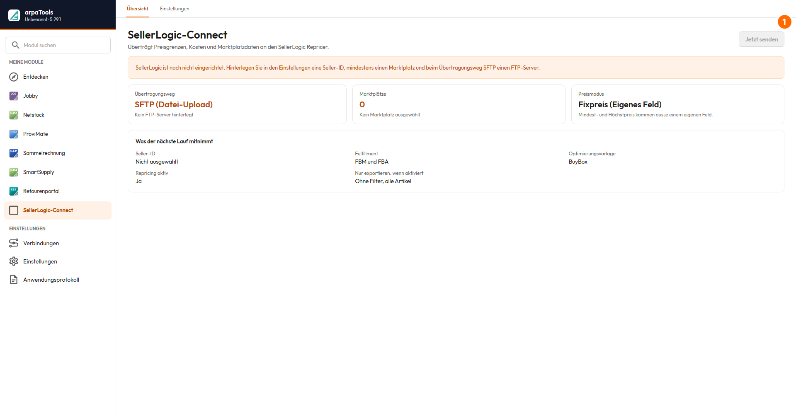
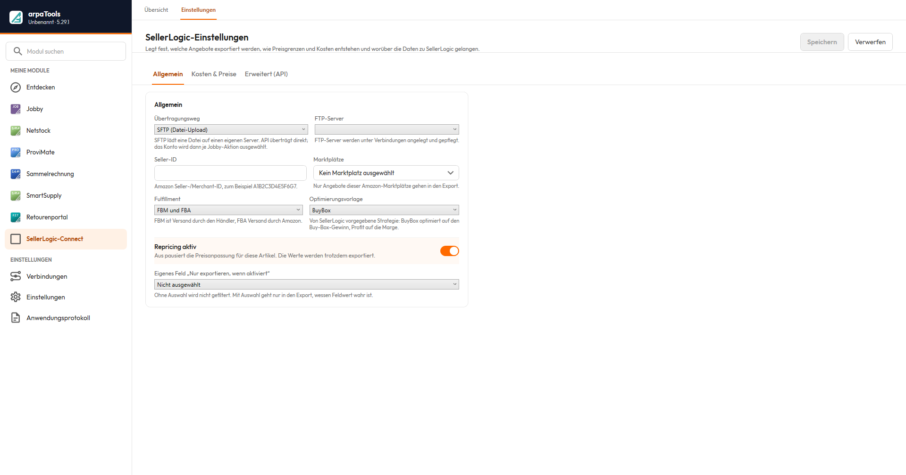
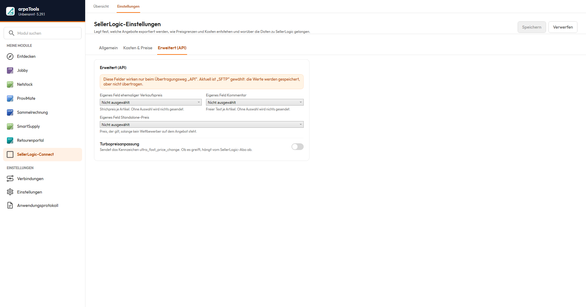

# Dokumentation arpaTools SellerLogic

## Einleitung

SellerLogic ist eine App im arpaTools Client und verbindet Ihre JTL-Wawi mit dem
Amazon-Repricing-Dienst SellerLogic. SellerLogic passt Ihre Amazon-Verkaufspreise automatisch an
und hält sie innerhalb einer von Ihnen vorgegebenen Preisspanne (Mindest- bis Höchstpreis).
arpaTools liefert dafür die nötigen Daten aus JTL-Wawi:

- **Senden:** arpaTools exportiert je Amazon-Angebot den Mindest- und Höchstpreis (und optional
  den Einkaufspreis) und lädt die Datei per FTP zu SellerLogic hoch.
- SellerLogic berechnet daraus den optimalen Amazon-Preis. Das Repricing selbst findet in
  SellerLogic statt.

Der Datenexport lässt sich manuell über die SellerLogic-Ansicht anstoßen oder automatisiert über
eine Jobby-Aktion (siehe [Jobby-Dokumentation](/doku/jobby)). Für den regelmäßigen Betrieb empfehlen
wir die Jobby-Aktion.

① Jetzt senden — stößt den Export sofort an, mit den aktuell gespeicherten Einstellungen.

## Voraussetzungen

- Eine FTP-Verbindung zu SellerLogic, eingerichtet unter Verbindungen (siehe
  [Jobby-Dokumentation](/doku/jobby), Abschnitt „Verbindungen", Registerkarte FTP-Server). Die
  Zugangsdaten und Ihre Seller-ID erhalten Sie von SellerLogic.
- Eine gültige SellerLogic-Lizenz in arpaTools.
- Gepflegte Amazon-Angebote in JTL-Wawi (die Zuordnung von Artikel zu Amazon-SKU nutzt arpaTools
  automatisch).

## Daten senden

In der SellerLogic-Ansicht starten Sie den Export per Knopfdruck. arpaTools erzeugt eine Datei
mit einer Zeile je Amazon-SKU und Marktplatz und lädt sie zu SellerLogic hoch. Übertragen werden
Mindestpreis, Höchstpreis, optional der Einkaufspreis, der Marktplatz, Ihre Seller-ID sowie die
gewählte Optimierungsvorlage.

## Mindest- und Höchstpreis festlegen

Der **Mindestpreis** ist die Untergrenze, die SellerLogic nie unterschreitet, er muss Ihre Kosten
decken. Sie legen fest, wie arpaTools ihn je Artikel bestimmt:

1. **Eigenes Feld direkt:** Sie pflegen den Mindestpreis selbst in ein eigenes Feld am Artikel.
   arpaTools übernimmt ihn unverändert.
2. **Aus dem Einkaufspreis:** arpaTools rechnet den Einkaufspreis des Artikels plus Zusatzkosten
   plus Ihren Aufschlag (Marge).
3. **Aus dem Standardlieferanten:** wie 2., aber auf Basis des Einkaufspreises Ihres
   Standardlieferanten.
4. **Kombiniert:** zuerst das eigene Feld, sonst der Artikel-Einkaufspreis, sonst der
   Standardlieferant. So bleibt der Mindestpreis auch bei lückenhafter Pflege belastbar.

Der **Höchstpreis** kann aus einem eigenen Feld, aus dem UVP oder als Mindestpreis plus festem
Abstand bestimmt werden. Der Höchstpreis wird nie kleiner als der Mindestpreis.

**Brutto:** SellerLogic arbeitet mit Bruttopreisen. Bei den EK-basierten Strategien rechnet
arpaTools deshalb die Umsatzsteuer auf. Der Steuersatz wird **je Artikel aus der JTL-Steuerklasse**
gezogen, sodass auch ermäßigt besteuerte Artikel (7%) korrekt behandelt werden. Der in den
Einstellungen hinterlegte Satz (Standard 19%) dient nur als Rückfallwert, falls für einen Artikel
kein Steuersatz ermittelt werden kann. Preise, die Sie selbst in eigenen Feldern pflegen, und der
UVP gelten als bereits brutto und werden nicht erneut besteuert.

**Globaler Fallback (optional):** Sie können einen Fallback-Faktor hinterlegen (zum Beispiel
1,5). Wenn die gewählte Strategie für ein Produkt keinen Mindestpreis liefert, aber ein
Einkaufspreis vorhanden ist, berechnet arpaTools den Mindestpreis als Einkaufspreis × Faktor
(brutto). So fällt kein Produkt unbeabsichtigt durchs Raster.

> Hinweis „Automatik lässt SellerLogic beide aus dem Einkaufspreis errechnen". Ob dahinter weiterhin
> die vier Strategien oben stehen oder der Modus vereinfacht wurde, ist nicht bestätigt.

## Produkte ein- oder ausschließen

Standardmäßig exportiert arpaTools nur Produkte, die sauber kalkulierbar sind:

- **Produkte ohne Einkaufspreis** werden standardmäßig ausgeschlossen.
- **Produkte ohne gepflegten Mindest-/Höchstpreis** werden standardmäßig ausgeschlossen.

Beides können Sie in den Einstellungen bewusst einschalten, wenn Sie diese Produkte trotzdem
übertragen möchten (idealerweise zusammen mit dem globalen Fallback, damit sie einen Preis
bekommen).

## Zusatzkosten je Produkt

arpaTools kennt fünf Kostenarten: **Versandkosten, Pick, Pack, Kartonage und sonstige Kosten**.
Sie fließen in die Kalkulation ein, damit SellerLogic nicht unter Ihre echten Kosten geht. Die
Versandkosten werden separat übertragen, die übrigen vier je Artikel zu einem Sammelwert addiert.

Für jede der fünf Kostenarten entscheiden Sie getrennt zwischen zwei Wegen:

- **Fester Betrag:** ein Betrag, der für alle Produkte gleich gilt, zum Beispiel eine pauschale
  Bearbeitungsgebühr.
- **Eigenes Feld:** ein eigenes Feld aus JTL, aus dem arpaTools den Wert je Artikel liest, zum
  Beispiel individuell hinterlegte Versandkosten.

Die beiden Wege schließen sich aus. Sobald Sie für eine Kostenart ein eigenes Feld wählen, zählt
allein dieses Feld. Hat ein Artikel dort keinen Wert, wird für ihn diese Kostenart nicht
angerechnet, der feste Betrag springt dann **nicht** ersatzweise ein. So überträgt arpaTools genau
das, was in Ihren Artikeldaten gepflegt ist. Wollen Sie einen Wert für alle Artikel garantieren,
wählen Sie für diese Kostenart den festen Betrag.

Alle Werte müssen als **Dezimalwerte** vorliegen.

Keine der fünf Kostenarten ist Pflicht. Lassen Sie eine leer, wird sie nicht übertragen.

## Marktplätze wählen

arpaTools liest automatisch alle **aktiven Amazon-Marktplätze mit Angeboten** aus Ihrer Wawi und
zeigt sie zur Auswahl an (zum Beispiel Amazon DE, FR, IT, ES, NL, BE). Sie haken die Marktplätze
an, die zu SellerLogic übertragen werden sollen.

## FBM, FBA oder beides

Sie legen fest, welche Versandart repriced werden soll:

- **FBM** (Versand durch Händler),
- **FBA** (Versand durch Amazon),
- **Beides**.

arpaTools exportiert dann nur die passenden Angebote.

## Weitere Einstellungen

Das Einstellungsfenster ist in drei Registerkarten geteilt:

- **Allgemein:** Übertragungsweg, FTP-Server, Seller-ID, Marktplätze, Fulfillment, Optimierungsvorlage,
  Repricing aktiv/inaktiv und ein eigenes Feld, das die Übertragung je Artikel filtert.
- **Kosten & Preise:** Preismodus, die fünf Kostenarten und ob Artikel ohne Mindest-/Höchstpreis mitgesendet werden.
- **Erweitert (API):** Felder, die nur beim Übertragungsweg API wirken. Haben Sie SFTP gewählt,
  bleiben die Felder sichtbar und ein Hinweis oben sagt Ihnen, dass Ihre Eingaben zwar gespeichert,
  aber nicht übertragen werden.

Einzelne Einstellungen darin:

- **Optimierungsvorlage:** BuyBox oder Profit.
- **Repricing aktiv/inaktiv:** steuert, ob SellerLogic die übertragenen Angebote optimiert. Aus pausiert die Preisanpassung; die Werte werden trotzdem exportiert.
- **Eigene Felder für Mindest- und Höchstpreis:** Name der Felder, aus denen arpaTools die Werte
  liest.
- **FTP-Server und Seller-ID:** die Verbindung zu SellerLogic.

> der Registerkarte Allgemein aber nicht gefunden; eventuell unter Kosten & Preise oder entfallen.

### Erweitert (API): weitere Felder

Auf der neuen Oberfläche zusätzlich sichtbar, in der bisherigen Fassung nicht dokumentiert:

- **Eigenes Feld ehemaliger Verkaufspreis:** Strichpreis je Artikel. Ohne Auswahl wird nichts gesendet.
- **Eigenes Feld Kommentar:** freier Text je Artikel. Ohne Auswahl wird nichts gesendet.
- **Eigenes Feld Standalone-Preis:** Preis, der gilt, solange kein Wettbewerber auf dem Angebot steht.
- **Turbopreisanpassung:** sendet das Kennzeichen `ultra_fast_price_change`. Ob es wirkt, hängt vom SellerLogic-Abo ab.

## Automatisierung über Jobby

Für einen regelmäßigen, automatischen Export richten Sie in Jobby einen Job mit der Aktion
**SellerLogic** ein. Die Aktion sendet die Daten zeitgesteuert über den arpaTools Worker, mit den
in der SellerLogic-Ansicht gespeicherten Einstellungen. Details zu Jobby in der
[Jobby-Dokumentation](/doku/jobby). Auf Wunsch legt die SellerLogic-Ansicht diesen Job nach einem
manuellen Export automatisch für Sie an.